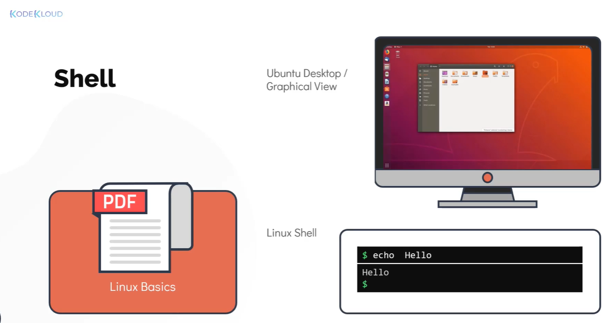
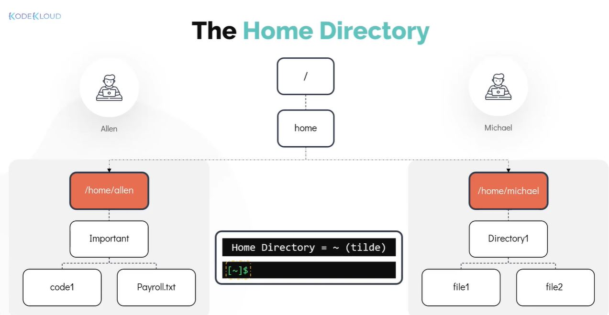
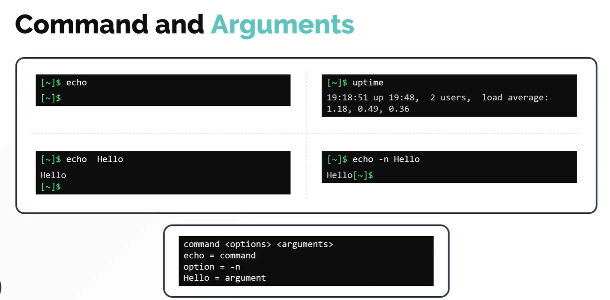
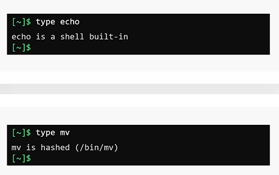

# Working with the Shell - I
# Shell 基础操作（第一部分）

### Introduction to Shell
### Shell 简介

- Take me to the [Video Tutorial](https://kodekloud.com/topic/introduction-to-shell/)

In this section, we will take a look at the Linux shell in detail. We will learn how to use Linux commands, understand how to work with files and directories, explore different ways to get help with Linux commands, and finally learn about different types of shells used in Linux (particularly focusing on the Bash shell).

在本节中，我们将深入了解 Linux Shell。我们将学习如何使用 Linux 命令、如何操作文件和目录、如何获取命令帮助，以及 Linux 中不同类型的 Shell（重点介绍 Bash Shell）。

---

## Linux Shell
## Linux Shell 概述



The command line interface (CLI) enables you to effectively work on a Linux laptop, server, or virtual machine. While the graphical user interface (GUI) may seem more appealing to beginners, it can be limited in functionality and is often unavailable on servers. This is where the Linux command line — commonly known as the **Linux Shell** — truly shines.

命令行界面（CLI）能让你高效地操作 Linux 笔记本、服务器或虚拟机。图形界面（GUI）对新手来说更直观，但其功能有限，且在服务器环境中往往不可用。这正是 **Linux Shell** 的用武之地。

### What is a Shell?
### 什么是 Shell？

The Linux shell is a program that allows text-based interaction between the user and the operating system. This interaction is carried out by typing commands into the interface and receiving responses in the same way. Think of the shell as a translator between you and the Linux kernel — you type human-readable commands, and the shell converts them into instructions the operating system can understand.

Linux Shell 是一个允许用户与操作系统进行文本交互的程序。用户通过输入命令来操作系统，系统以文本形式返回结果。可以把 Shell 理解为你和 Linux 内核之间的"翻译官"——你输入人类可读的命令，Shell 将其转换为操作系统能够理解的指令。

The Linux shell is a powerful tool with which you can navigate between different locations within the system. When you first log in, the shell places you in your **home directory**.

Linux Shell 是一个强大的工具，可以让你在系统中自由导航。首次登录时，Shell 会将你带到你的**家目录（Home Directory）**。

> **Extended Knowledge / 扩展知识**
>
> The shell operates in two modes:
> - **Interactive mode**: You type commands one at a time and get immediate feedback. This is the normal terminal session.
> - **Script mode**: Commands are written in a file (shell script) and executed as a batch. This enables automation.
>
> Shell 有两种工作模式：
> - **交互模式**：逐条输入命令，立即获得反馈，即日常终端会话。
> - **脚本模式**：将命令写入文件（Shell 脚本）批量执行，实现自动化。

---

## The Home Directory
## 家目录



A user `michael` has a home directory located at `/home/michael`. The `/home` directory is a system-created directory that contains the home directories for almost all regular users in the Linux system. The name of the home directory is, by default, identical to the username — so `michael`'s home directory is `/home/michael`.

用户 `michael` 的家目录位于 `/home/michael`。`/home` 是系统为普通用户创建的父目录，几乎所有普通用户的家目录都在此下面。家目录名称默认与用户名相同，因此 `michael` 的家目录就是 `/home/michael`。

Remember that the home directory is **unique for each user**. Another user called `allen` will have a different home directory at `/home/allen`.

记住，每个用户的家目录是**独立且唯一**的。另一个用户 `allen` 的家目录位于 `/home/allen`，两者互不干扰。

### Why Do We Need a Home Directory?
### 为什么需要家目录？

- The home directory allows users to store their personal data in the form of files and directories.
- Each user gets their own unique home directory with complete access to it (save, retrieve, delete data).
- Think of it as a **dedicated locker** assigned to you — only you have the key.
- Other users cannot access your files and folders within your home directory (only you and the root user can).

- 家目录允许用户以文件和目录的形式存储个人数据。
- 每个用户都有自己独有的家目录，并对其拥有完全的控制权（保存、读取、删除数据）。
- 可以把它理解为分配给你的**专属储物柜**——只有你拥有钥匙。
- 其他普通用户无法访问你家目录中的文件（只有你本人和 root 用户可以）。

> **Note / 注意**: The home directory is represented by the `~` (tilde) symbol. So `~/Documents` is equivalent to `/home/michael/Documents`.
>
> 家目录用 `~`（波浪号）表示。因此 `~/Documents` 等同于 `/home/michael/Documents`。

> **Special cases / 特殊情况**:
> - The `root` user's home directory is `/root`, not `/home/root`.
> - System accounts (like `www-data`, `daemon`) often have home directories in `/var` or `/usr`, or no home directory at all.
>
> - `root` 用户的家目录是 `/root`，而不是 `/home/root`。
> - 系统账号（如 `www-data`、`daemon`）的家目录通常在 `/var` 或 `/usr` 下，甚至没有家目录。

---

## Command Prompt
## 命令提示符

The command prompt is what you see waiting for your input in the terminal. It can be customized to display useful information such as the **hostname**, **current date/time**, **username**, and **current working directory**.

命令提示符是终端中等待你输入的那一行文字。它可以被自定义，显示**主机名**、**当前日期/时间**、**用户名**和**当前工作目录**等有用信息。

By default, the `~` symbol in the prompt represents the home directory. When you navigate to another directory, the prompt updates to show the current location.

默认情况下，提示符中的 `~` 符号代表家目录。当你切换到其他目录时，提示符会自动更新显示当前位置。

A typical default prompt looks like:

典型的默认提示符如下：

```
michael@hostname:~$
```

- `michael` — current username / 当前用户名
- `hostname` — machine name / 主机名
- `~` — current directory (home) / 当前目录（家目录）
- `$` — indicates a regular user (`#` indicates root) / 普通用户标志（`#` 表示 root）

---

## Commands and Arguments
## 命令与参数

To interact with the Linux system using the shell, a user types **commands**. When a command is run, it executes a program to achieve a specific task.

要通过 Shell 与 Linux 系统交互，用户需要输入**命令**。执行命令时，系统会运行相应的程序来完成特定任务。

### Basic syntax / 基本语法

```
command  [options]  [arguments]
命令      [选项]     [参数]
```

### Examples / 示例

**Command without arguments / 无参数命令:**
```bash
$ echo
```
The `echo` command prints text to the screen. Without arguments, it prints a blank line.

`echo` 命令用于在屏幕上打印文本。不带参数时，打印一个空行。

**Command with an argument / 带参数的命令:**
```bash
$ echo hello
```
`hello` is the **argument** — the input passed to the command.

`hello` 是**参数**，即传递给命令的输入内容。

**Command without arguments (standalone) / 独立运行的命令:**
```bash
$ uptime
```
The `uptime` command prints how long the system has been running since the last reboot, along with load averages. It does not require any argument.

`uptime` 命令打印系统自上次重启以来的运行时长及负载平均值，不需要任何参数。

**Command with an option/flag / 带选项/标志的命令:**
```bash
$ echo -n hello
```
The `-n` flag tells `echo` not to print a trailing newline. Options (also called **switches** or **flags**) modify a command's behavior.

`-n` 标志告诉 `echo` 不打印末尾的换行符。选项（也称为**开关**或**标志**）用于改变命令的默认行为。



> **Extended Knowledge / 扩展知识**
>
> Options come in two forms:
> - **Short form**: a single dash followed by a single letter, e.g., `-l`, `-a`, `-n`
> - **Long form**: two dashes followed by a word, e.g., `--help`, `--all`, `--no-newline`
>
> Short options can often be combined: `ls -l -a` is the same as `ls -la`.
>
> 选项有两种形式：
> - **短格式**：单破折号 + 单字母，例如 `-l`、`-a`、`-n`
> - **长格式**：双破折号 + 单词，例如 `--help`、`--all`、`--no-newline`
>
> 短选项通常可以合并：`ls -l -a` 等同于 `ls -la`。

---

## Command Types
## 命令类型

Commands in Linux can be generally categorized into two types:

Linux 中的命令通常分为两类：

### 1. Internal (Built-in) Commands / 内置命令

Internal commands are **part of the shell itself**. They are bundled with the shell and do not require an external executable file. There are about 30 such commands in Bash.

内置命令是 **Shell 本身的一部分**，无需外部可执行文件，直接由 Shell 解释执行。Bash 中大约有 30 个内置命令。

**Examples / 示例**: `echo`, `cd`, `pwd`, `set`, `alias`, `export`, `history`, `type`, `kill`, `jobs`

Advantages of built-in commands:
- Faster execution (no process creation needed)
- Available even in minimal environments

内置命令的优点：
- 执行速度更快（无需创建新进程）
- 在最小化环境中也可用

### 2. External Commands / 外部命令

External commands are **binary programs or scripts** located in files on the system (typically in directories like `/bin`, `/usr/bin`, `/sbin`). They come pre-installed with the distribution, or can be installed/created by the user.

外部命令是位于系统文件中的**二进制程序或脚本**（通常在 `/bin`、`/usr/bin`、`/sbin` 等目录下）。它们随发行版预装，或由用户安装/创建。

**Examples / 示例**: `mv`, `date`, `uptime`, `cp`, `ls`, `grep`, `find`, `python3`

### How to determine command type / 如何判断命令类型

Use the **`type`** command to determine whether a command is internal or external:

使用 **`type`** 命令来判断一个命令是内置的还是外部的：

```bash
$ type echo
echo is a shell builtin

$ type mv
mv is /bin/mv

$ type ls
ls is aliased to `ls --color=auto'
```



> **Extended Knowledge / 扩展知识**
>
> You can also use `which` to find the full path of an external command:
> ```bash
> $ which date
> /bin/date
> ```
> If `which` returns nothing, the command is likely a shell built-in.
>
> 还可以用 `which` 找到外部命令的完整路径：
> ```bash
> $ which date
> /bin/date
> ```
> 如果 `which` 没有输出，该命令可能是 Shell 内置命令。

---

## Summary
## 小结

| Concept / 概念 | Key Point / 要点 |
|---|---|
| Shell | Text interface between user and OS / 用户与操作系统之间的文本接口 |
| Home Directory | `/home/<username>`, represented by `~` / 用 `~` 表示 |
| Command Prompt | Shows user, host, directory; `$` = regular user, `#` = root / 显示用户、主机、目录 |
| Arguments | Input passed to a command / 传给命令的输入 |
| Options/Flags | Modify command behavior; `-x` short, `--word` long / 修改命令行为 |
| Built-in Commands | Part of shell, ~30 in Bash / Shell 自带，约 30 个 |
| External Commands | Programs on disk, found via `$PATH` / 磁盘上的程序，通过 `$PATH` 查找 |
| `type` command | Identifies whether a command is built-in or external / 判断命令类型 |
