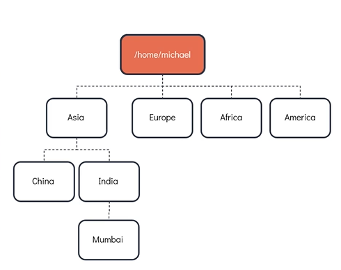
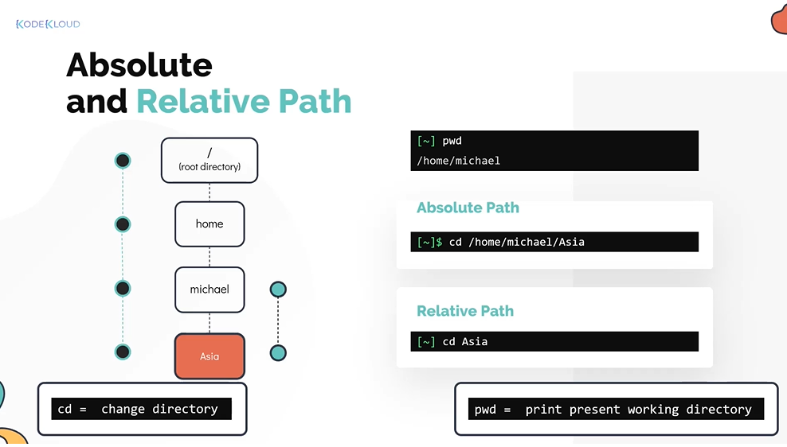
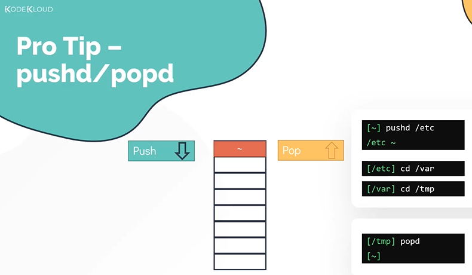
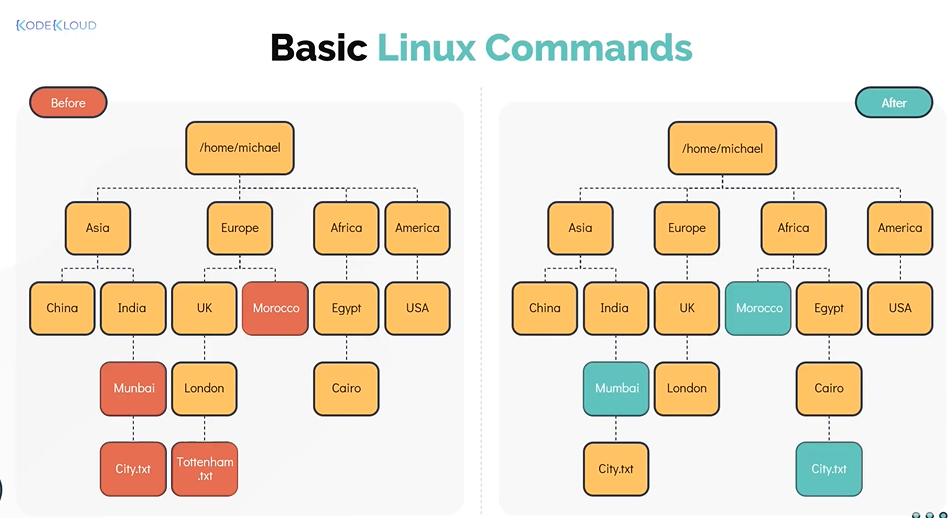

# Basic Linux Commands
# Linux 基本命令

- Take me to the [Video Tutorial](https://kodekloud.com/topic/basic-linux-commands-3/)

In this section, we will take a look at basic Linux commands, specifically related to **navigation** and **creating/managing files and directories**. We will accomplish this by completing a practical task using the Linux shell.

在本节中，我们将学习 Linux 基本命令，重点关注**目录导航**以及**文件和目录的创建与管理**。我们将通过在 Linux Shell 中完成一个实际任务来掌握这些命令。

**Goal / 目标**: Create the directory structure shown below. The top-most directory `/home/michael` already exists as the home directory — everything else needs to be created.

**目标**：创建如下所示的目录结构。最顶层的 `/home/michael` 已作为家目录存在，其余部分需要手动创建。



---

## Navigation Commands
## 导航命令

### `pwd` — Print Working Directory / 打印当前工作目录

The `pwd` command shows your current location in the filesystem. It always prints the **absolute path** from the root `/`.

`pwd` 命令显示你在文件系统中的当前位置，始终打印从根目录 `/` 开始的**绝对路径**。

```bash
$ pwd
/home/michael
```

> **When to use / 使用场景**: Whenever you are unsure of your current location in the filesystem, run `pwd` to confirm.
>
> 当你不确定自己在文件系统中的位置时，运行 `pwd` 进行确认。

---

### `ls` — List Directory Contents / 列出目录内容

The `ls` command lists files and directories in the current directory (or a specified path).

`ls` 命令列出当前目录（或指定路径）中的文件和目录。

```bash
$ ls
```

**Common options / 常用选项:**

| Command / 命令 | Description / 说明 |
|---|---|
| `ls -l` | Long format: shows permissions, owner, size, date / 长格式：显示权限、所有者、大小、日期 |
| `ls -a` | Show all files including hidden (starting with `.`) / 显示所有文件，包括隐藏文件（以 `.` 开头） |
| `ls -la` | Long format + all files / 长格式 + 所有文件 |
| `ls -lt` | Sort by modification time, newest first / 按修改时间排序，最新在前 |
| `ls -ltr` | Sort by modification time, oldest first / 按修改时间排序，最旧在前 |
| `ls -lh` | Long format with human-readable file sizes (KB, MB) / 长格式，文件大小以易读格式显示 |

```bash
$ ls -l
total 0
drwxr-xr-x 2 michael michael 6 Mar 28 10:00 Asia
drwxr-xr-x 2 michael michael 6 Mar 28 10:00 Europe

$ ls -la
total 4
drwxr-xr-x 4 michael michael  60 Mar 28 10:00 .
drwxr-xr-x 3 root    root    20 Mar 28 09:00 ..
-rw-r--r-- 1 michael michael 220 Mar 28 09:00 .bash_logout
drwxr-xr-x 2 michael michael   6 Mar 28 10:00 Asia

$ ls -lt
$ ls -ltr
```

> **Understanding `ls -l` output / 理解 `ls -l` 输出:**
> ```
> drwxr-xr-x 2 michael michael 4096 Mar 28 10:00 Asia
> │          │ │       │       │    │              └── filename
> │          │ │       │       │    └── last modified time
> │          │ │       │       └── file size in bytes
> │          │ │       └── group owner
> │          │ └── user owner
> │          └── number of hard links
> └── file type + permissions (d=directory, -=file, l=symlink)
> ```

---

### `cd` — Change Directory / 切换目录

The `cd` command changes your current working directory.

`cd` 命令用于切换当前工作目录。

```bash
# Go into a subdirectory / 进入子目录
$ cd Asia

# Go up one level / 返回上一级目录
$ cd ..

# Go up two levels / 返回上两级目录
$ cd ../..

# Go directly to your home directory from anywhere / 从任何位置直接回到家目录
$ cd
$ cd ~

# Go to the previous directory (toggle between two directories) / 切换到上一个目录
$ cd -
```

**Absolute vs. Relative paths / 绝对路径 vs. 相对路径:**



| Type / 类型 | Definition / 定义 | Example / 示例 |
|---|---|---|
| **Absolute Path** / 绝对路径 | Always starts from root `/`; does not depend on current location / 始终从根 `/` 开始，与当前位置无关 | `cd /home/michael/Asia` |
| **Relative Path** / 相对路径 | Relative to the current working directory / 相对于当前工作目录 | `cd Asia` (if already in `/home/michael`) |

```bash
# Absolute path / 绝对路径
$ cd /home/michael/Asia/India

# Relative path (from /home/michael) / 相对路径（从 /home/michael 出发）
$ cd Asia/India
```

---

### `pushd` / `popd` — Stack-based Directory Navigation / 基于栈的目录导航

`pushd` and `popd` provide an alternative to `cd` that maintains a **stack** of visited directories, allowing you to return to previous locations easily.

`pushd` 和 `popd` 是 `cd` 的替代方案，它们维护一个已访问目录的**栈**，方便你快速返回之前的位置。



```bash
# Push current directory onto stack and go to /etc
# 将当前目录压入栈并跳转到 /etc
$ pushd /etc

# Continue navigating — each pushd adds to the stack
# 继续导航，每次 pushd 都会向栈中添加一条记录
$ pushd /var
$ pushd /tmp

# View the directory stack / 查看目录栈
$ dirs
/tmp /var /etc /home/michael

# Pop the top of the stack (return to /var) / 弹出栈顶（返回 /var）
$ popd

# Keep popping to go further back / 继续弹出返回更早的目录
$ popd   # returns to /etc
$ popd   # returns to /home/michael
```

> **When to use `pushd`/`popd` / 使用场景**: When you need to temporarily jump to another directory and then return, `pushd`/`popd` is more reliable than relying on `cd -` which only remembers one previous location.
>
> 当你需要临时跳转到另一个目录后再返回时，`pushd`/`popd` 比只能记住一个上一目录的 `cd -` 更可靠。

---

## Directory Management Commands
## 目录管理命令

### `mkdir` — Make Directory / 创建目录

```bash
# Create a single directory / 创建单个目录
$ mkdir Asia

# Create multiple directories at once / 一次创建多个目录
$ mkdir Europe Africa America

# Create nested directories with -p flag (creates intermediate dirs) / 使用 -p 递归创建嵌套目录
$ mkdir -p India/Mumbai
$ mkdir -p Asia/India/Mumbai/Suburbs

# Create directory with specific permissions / 创建时指定权限
$ mkdir -m 755 mydir
```

> **The `-p` flag is essential / `-p` 标志非常重要**: Without `-p`, `mkdir Asia/India/Mumbai` will fail if `Asia/India` doesn't exist yet. With `-p`, all intermediate directories are created automatically.
>
> 没有 `-p` 时，如果 `Asia/India` 不存在，`mkdir Asia/India/Mumbai` 会失败。加上 `-p` 后，所有中间目录都会被自动创建。

---

## File Management Commands
## 文件管理命令

Now let's look at more commands for managing files. The goal is to transform the directory structure from "before" to "after" as shown below:

现在来看更多文件管理命令。目标是将目录结构从"之前"变为"之后"，如下图所示：



---

### `mv` — Move or Rename / 移动或重命名

```bash
# Move a file or directory (absolute path) / 移动文件或目录（绝对路径）
$ mv /home/michael/Europe/Morocco /home/michael/Africa/

# Move using relative path / 使用相对路径移动
$ mv Europe/Morocco Africa/

# Rename a file or directory / 重命名文件或目录
$ mv Asia/India/Munbai Asia/India/Mumbai

# Move multiple files to a directory / 将多个文件移动到目录
$ mv file1.txt file2.txt /home/michael/backup/
```

> **`mv` renames AND moves / `mv` 既能重命名也能移动**: If source and destination are in the same directory, `mv` renames. If they are in different directories, it moves (and optionally renames at the same time).
>
> 如果源和目标在同一目录下，`mv` 执行重命名；如果在不同目录下，则执行移动（同时可以重命名）。

---

### `cp` — Copy / 复制

```bash
# Copy a file to a directory / 将文件复制到目录
$ cp Asia/India/Mumbai/City.txt Africa/Egypt/Cairo/

# Copy and rename at the same time / 复制并重命名
$ cp City.txt City_backup.txt

# Copy a directory recursively (-r flag required) / 递归复制目录（必须使用 -r 标志）
$ cp -r Europe/UK Europe/UnitedKingdom

# Copy while preserving timestamps, permissions, etc. / 复制时保留时间戳、权限等属性
$ cp -rp /source/dir /destination/dir
```

> **Always use `-r` for directories / 复制目录必须用 `-r`**: Without `-r`, `cp` will refuse to copy a directory and report an error.
>
> 不加 `-r` 时，`cp` 拒绝复制目录并报错。

---

### `rm` — Remove / 删除

```bash
# Delete a file / 删除文件
$ rm Europe/UK/London/Tottenham.txt

# Delete multiple files / 删除多个文件
$ rm file1.txt file2.txt file3.txt

# Delete a directory and all its contents recursively / 递归删除目录及其所有内容
$ rm -r Europe/OldCountry/

# Force delete without confirmation (use with caution!) / 强制删除，不提示确认（谨慎使用！）
$ rm -rf /path/to/directory
```

> **WARNING / 警告**: `rm -rf` is **irreversible** — there is no trash/recycle bin in the Linux terminal. Always double-check your path before running it.
>
> `rm -rf` 是**不可逆的**操作——Linux 终端没有回收站。执行前务必仔细确认路径。

---

## File Content Commands
## 文件内容命令

### `cat` — Concatenate and Print / 查看与写入文件

```bash
# Print the content of a file / 打印文件内容
$ cat Asia/India/Mumbai/City.txt

# Print with line numbers / 显示行号
$ cat -n Asia/India/Mumbai/City.txt

# Write content to a file (overwrites existing content) / 向文件写入内容（覆盖已有内容）
$ cat > Africa/Egypt/Cairo/City.txt
Cairo
^D    # Press Ctrl+D to save and exit / 按 Ctrl+D 保存并退出

# Append content to an existing file / 向已有文件追加内容
$ cat >> Africa/Egypt/Cairo/City.txt
More content here
^D

# Concatenate multiple files / 合并多个文件
$ cat file1.txt file2.txt > combined.txt
```

---

### `touch` — Create Empty File or Update Timestamp / 创建空文件或更新时间戳

```bash
# Create an empty file / 创建一个空文件
$ touch /home/michael/Asia/China/Country.txt

# Create multiple files at once / 一次创建多个文件
$ touch file1.txt file2.txt file3.txt

# Update the timestamp of an existing file (without changing content) / 更新已有文件的时间戳（不修改内容）
$ touch existing_file.txt
```

> **Common use case / 常见用途**: `touch` is frequently used in scripts to create placeholder files or to mark that a task has been completed.
>
> `touch` 常用于脚本中创建占位文件，或标记某个任务已完成。

---

### `more` and `less` — Paging Through File Content / 分页查看文件内容

Both commands let you scroll through file contents one screen at a time — useful for large files.

这两个命令都允许你逐屏滚动查看文件内容，适合查看大文件。

```bash
# View file content page by page (basic, forward-only) / 逐页查看文件内容（基础，只能向前翻页）
$ more new_file.txt

# View file content with full navigation / 查看文件内容，支持完整导航
$ less new_file.txt
```

**Navigation keys for `less` / `less` 的导航快捷键:**

| Key / 按键 | Action / 操作 |
|---|---|
| `Space` / `f` | Scroll down one page / 向下翻一页 |
| `b` | Scroll up one page / 向上翻一页 |
| `↑` / `↓` | Scroll line by line / 逐行滚动 |
| `g` | Go to beginning of file / 跳到文件开头 |
| `G` | Go to end of file / 跳到文件末尾 |
| `/keyword` | Search forward for keyword / 向后搜索关键词 |
| `?keyword` | Search backward for keyword / 向前搜索关键词 |
| `n` | Next search match / 下一个匹配项 |
| `q` | Quit / 退出 |

> **`less` vs `more` / 区别**: `less` is more powerful — it supports backward scrolling, searching, and doesn't load the entire file into memory. Prefer `less` for large files.
>
> `less` 功能更强大，支持向上翻页、搜索，且不会将整个文件加载到内存。处理大文件时优先使用 `less`。

---

## Quick Reference
## 快速参考

| Command / 命令 | Purpose / 用途 | Example / 示例 |
|---|---|---|
| `pwd` | Show current directory / 显示当前目录 | `pwd` |
| `ls` | List contents / 列出内容 | `ls -la` |
| `cd` | Change directory / 切换目录 | `cd /home/michael` |
| `mkdir` | Create directory / 创建目录 | `mkdir -p Asia/India` |
| `pushd` / `popd` | Stack-based navigation / 栈式导航 | `pushd /etc` |
| `mv` | Move or rename / 移动或重命名 | `mv old.txt new.txt` |
| `cp` | Copy / 复制 | `cp -r src/ dst/` |
| `rm` | Delete / 删除 | `rm -rf dirname/` |
| `cat` | View/write file content / 查看/写入文件 | `cat file.txt` |
| `touch` | Create empty file / 创建空文件 | `touch file.txt` |
| `more` | Paginate file (basic) / 分页查看（基础）| `more largefile.txt` |
| `less` | Paginate file (full) / 分页查看（完整）| `less largefile.txt` |
