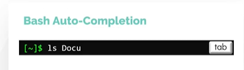
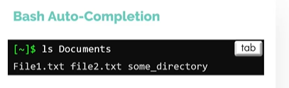
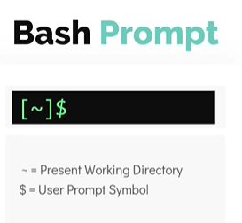
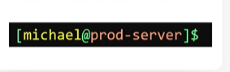
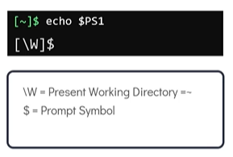
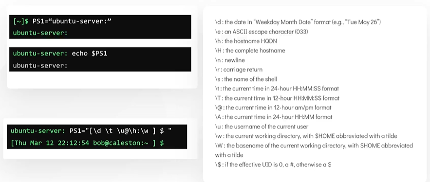

# Bash Shell
# Bash Shell 详解

- Take me to the [Video Tutorial](https://kodekloud.com/topic/bash-shell/)

---

## Different Types of Shells
## 不同类型的 Shell

In this section, we will take a look at different types of shells available in Linux and then dive deep into the **Bash shell** — the most widely used shell in Linux today.

在本节中，我们将了解 Linux 中可用的不同类型的 Shell，然后深入学习**Bash Shell**——目前 Linux 中使用最广泛的 Shell。

There are different types of shells in Linux. Some of the most popular ones are:

Linux 中有多种类型的 Shell，以下是最流行的几种：

| Shell | Full Name / 全称 | Notes / 说明 |
|---|---|---|
| `sh` | Bourne Shell | The original Unix shell (1979); POSIX-compliant / 原始 Unix Shell（1979年）；符合 POSIX 标准 |
| `csh` / `tcsh` | C Shell / TENEX C Shell | C-like syntax; popular in BSD systems / 类 C 语法；在 BSD 系统中流行 |
| `ksh` | Korn Shell | Combines features of Bourne and C shells / 结合了 Bourne 和 C Shell 的特性 |
| `bash` | Bourne Again Shell | Default on most Linux distros; superset of `sh` / 大多数 Linux 发行版的默认 Shell；是 `sh` 的超集 |
| `zsh` | Z Shell | Extended Bash with better completion and plugins; default on macOS / 扩展的 Bash，具有更好的补全和插件支持；macOS 的默认 Shell |
| `fish` | Friendly Interactive Shell | User-friendly with auto-suggestions; not POSIX-compatible / 用户友好，带自动建议；不兼容 POSIX |

**Check the current shell / 检查当前 Shell:**
```bash
$ echo $SHELL
/bin/bash
```

> **Note / 注意**: `$SHELL` shows the **default login shell**, not necessarily the shell currently running. To see the currently running shell:
> ```bash
> $ echo $0
> bash
> # or / 或者
> $ ps -p $$
> ```
> `$SHELL` 显示的是**默认登录 Shell**，不一定是当前正在运行的 Shell。

**Change the default shell / 更改默认 Shell:**
```bash
$ chsh
# You will be prompted for your password, then enter the new shell path
# 系统会提示你输入密码，然后输入新 Shell 的路径
# e.g., /bin/zsh  or  /bin/sh

# Change shell directly (no prompt) / 直接指定新 Shell（无交互提示）
$ chsh -s /bin/zsh

# Change another user's shell (requires root) / 更改其他用户的 Shell（需要 root）
$ sudo chsh -s /bin/bash bob
```

> **Important / 重要**: You must log out and log back in (or open a new terminal session) for the shell change to take effect.
>
> 更改 Shell 后，必须**注销并重新登录**（或打开新的终端会话）才能生效。

---

## Bash Shell Features
## Bash Shell 特性

### 1. Tab Completion / Tab 自动补全

Bash can auto-complete commands, file paths, and more when you press the `Tab` key. This saves typing and prevents errors.

在 Bash 中按 `Tab` 键可以自动补全命令、文件路径等内容，既节省输入又能防止错误。




```bash
# Type partial command and press Tab / 输入命令前几个字母后按 Tab
$ mk[Tab]          # completes to 'mkdir' / 补全为 'mkdir'
$ cd /home/mi[Tab] # completes to '/home/michael' / 补全为 '/home/michael'

# Press Tab twice to see all possible completions / 按两次 Tab 查看所有可能的补全选项
$ mk[Tab][Tab]
mkdir    mkfifo   mknod    mkswap   mktemp
```

> **Extended tip / 扩展技巧**: Tab completion also works for:
> - Command options: `ls --[Tab]` shows all `--` options / 命令选项
> - Usernames: `cd ~[Tab]` / 用户名
> - Hostnames: `ssh user@[Tab]` (requires `/etc/hosts` entries) / 主机名
> - Variables: `echo $HO[Tab]` completes to `$HOME` / 变量名

---

### 2. Aliases / 别名

Aliases allow you to create custom shortcuts for commands. They are especially useful for long or frequently-used commands.

别名允许你为命令创建自定义快捷方式，特别适合长命令或常用命令。

```bash
# Create a temporary alias (only valid in current session) / 创建临时别名（仅在当前会话中有效）
$ alias dt=date
$ dt
Sat Mar 28 10:00:00 UTC 2026

# Create aliases for common tasks / 为常见任务创建别名
$ alias ll='ls -la'
$ alias la='ls -A'
$ alias grep='grep --color=auto'
$ alias ..='cd ..'
$ alias ...='cd ../..'
$ alias cls='clear'

# List all current aliases / 列出所有当前别名
$ alias

# Remove an alias / 删除别名
$ unalias dt
```

**Make aliases permanent / 使别名永久生效:**

Add aliases to `~/.bashrc` (for interactive shells) or `~/.bash_profile` (for login shells):

将别名添加到 `~/.bashrc`（交互式 Shell）或 `~/.bash_profile`（登录 Shell）：

```bash
$ echo "alias ll='ls -la'" >> ~/.bashrc
$ echo "alias dt=date" >> ~/.bashrc

# Reload to apply changes in the current session / 重新加载以在当前会话中应用更改
$ source ~/.bashrc
```

> **Note on alias quoting / 别名引号注意事项**: Use single quotes `'...'` in aliases to prevent the shell from expanding variables at definition time. Use double quotes `"..."` only when you *want* variable expansion.
>
> 在别名中使用单引号 `'...'` 可防止 Shell 在定义时展开变量。只有在*需要*变量展开时才使用双引号。

---

### 3. Command History / 命令历史

Bash maintains a history of commands you have run, allowing you to quickly recall and reuse previous commands.

Bash 维护着你运行过的命令历史，让你能快速调用和重用之前的命令。

```bash
# View all command history / 查看所有命令历史
$ history

# View last N commands / 查看最近 N 条命令
$ history 20

# Search history interactively (press Ctrl+R and type) / 交互式搜索历史（按 Ctrl+R 然后输入）
Ctrl+R

# Re-run the last command / 重新运行上一条命令
$ !!

# Run a specific command by history number / 按历史编号运行特定命令
$ !42

# Run the last command starting with 'git' / 运行以 'git' 开头的最近一条命令
$ !git

# Clear all history / 清除所有历史
$ history -c
```

**History keyboard shortcuts / 历史记录键盘快捷键:**

| Shortcut / 快捷键 | Action / 操作 |
|---|---|
| `↑` / `↓` | Navigate through history / 在历史记录中导航 |
| `Ctrl+R` | Reverse search history / 反向搜索历史 |
| `Ctrl+G` | Cancel search / 取消搜索 |
| `!!` | Repeat last command / 重复上一条命令 |
| `!n` | Run history entry number n / 运行第 n 条历史命令 |
| `!string` | Run last command starting with string / 运行以指定字符串开头的最近命令 |

**History configuration / 历史配置:**
```bash
# History file location / 历史文件位置
$ cat ~/.bash_history

# Set history size (number of commands to remember) / 设置历史记录大小
$ export HISTSIZE=10000       # in-memory history / 内存中的历史条数
$ export HISTFILESIZE=20000   # on-disk history / 磁盘上保存的历史条数

# Avoid saving duplicate entries / 避免保存重复条目
$ export HISTCONTROL=ignoredups

# Ignore commands starting with a space / 忽略以空格开头的命令
$ export HISTCONTROL=ignorespace
```

---

## Bash Environment Variables
## Bash 环境变量

Environment variables are **named values** stored in the shell's environment that programs can read. They are used to configure behavior, pass information between processes, and store system settings.

环境变量是存储在 Shell 环境中的**命名值**，程序可以读取它们。它们用于配置行为、在进程间传递信息以及存储系统设置。

### Viewing Variables / 查看变量

```bash
# Print the value of a specific variable / 打印特定变量的值
$ echo $SHELL
/bin/bash

$ echo $HOME
/home/michael

$ echo $USER
michael

$ echo $LOGNAME
michael

# List ALL environment variables / 列出所有环境变量
$ env

# List all shell variables (including non-exported ones) / 列出所有 Shell 变量（包括未导出的）
$ set | head -30
```

**Common environment variables / 常用环境变量:**

| Variable / 变量 | Meaning / 含义 |
|---|---|
| `$HOME` | Current user's home directory / 当前用户的家目录 |
| `$USER` | Current username / 当前用户名 |
| `$SHELL` | Path to the default login shell / 默认登录 Shell 的路径 |
| `$PATH` | Colon-separated list of directories to search for commands / 搜索命令的目录列表（冒号分隔） |
| `$PWD` | Current working directory / 当前工作目录 |
| `$OLDPWD` | Previous working directory / 上一个工作目录 |
| `$HOSTNAME` | Machine hostname / 主机名 |
| `$TERM` | Terminal type / 终端类型 |
| `$LANG` | System language and locale / 系统语言和区域设置 |
| `$EDITOR` | Default text editor / 默认文本编辑器 |
| `$LOGNAME` | Login name of the current user / 当前用户的登录名 |

### Setting Variables / 设置变量

```bash
# Set a shell variable (NOT exported — child processes cannot see it) / 设置 Shell 变量（未导出——子进程不可见）
$ OFFICE=caleston
$ echo $OFFICE
caleston

# Export a variable so child processes can inherit it / 导出变量，使子进程可以继承
$ export OFFICE=caleston

# Verify / 验证
$ env | grep OFFICE
OFFICE=caleston
```

> **Shell variable vs Environment variable / Shell 变量 vs 环境变量**:
> - A **shell variable** (`VAR=value`) exists only in the current shell / **Shell 变量**只存在于当前 Shell
> - An **environment variable** (`export VAR=value`) is passed to all child processes (subshells, programs) / **环境变量**会传递给所有子进程
>
> 当你运行一个脚本或程序时，它是在**子进程**中运行的，只能继承已导出的变量。

### Making Variables Persistent / 使变量持久化

Variables set in the terminal are **lost when the session ends**. To make them persistent:

终端中设置的变量在**会话结束后会丢失**。要使其持久化：

```bash
# Add to ~/.profile (for login shells) / 添加到 ~/.profile（用于登录 Shell）
$ echo "export OFFICE=caleston" >> ~/.profile

# Add to ~/.bashrc (for interactive non-login shells) / 添加到 ~/.bashrc（用于交互式非登录 Shell）
$ echo "export OFFICE=caleston" >> ~/.bashrc

# Apply immediately in current session / 立即在当前会话中应用
$ source ~/.bashrc
```

**Understanding shell startup files / 理解 Shell 启动文件:**

| File / 文件 | When loaded / 何时加载 |
|---|---|
| `~/.profile` | Login shell (SSH, console login) / 登录 Shell（SSH、控制台登录） |
| `~/.bashrc` | Every new interactive Bash session / 每个新的交互式 Bash 会话 |
| `~/.bash_profile` | Login shell (Bash-specific, overrides `.profile`) / Bash 登录 Shell（Bash 专用，覆盖 `.profile`） |
| `/etc/environment` | System-wide, all users, all shells / 系统级，适用于所有用户和所有 Shell |
| `/etc/profile` | System-wide login shell settings / 系统级登录 Shell 设置 |

---

## PATH Variable
## PATH 变量

The `$PATH` variable is one of the most important environment variables. When you type a command, the shell searches each directory listed in `$PATH` (in order) to find the executable.

`$PATH` 变量是最重要的环境变量之一。当你输入命令时，Shell 会按顺序搜索 `$PATH` 中列出的每个目录来查找可执行文件。

```bash
# View current PATH / 查看当前 PATH
$ echo $PATH
/usr/local/sbin:/usr/local/bin:/usr/sbin:/usr/bin:/sbin:/bin:/usr/games

# Check which executable will be used for a command / 检查将使用哪个可执行文件
$ which obs-studio
# (no output if not found / 如果未找到则无输出)

# Add a new directory to PATH / 向 PATH 添加新目录
$ export PATH=$PATH:/opt/obs/bin

# Verify obs-studio is now found / 验证现在可以找到 obs-studio
$ which obs-studio
/opt/obs/bin/obs-studio
```

> **PATH search order / PATH 搜索顺序**: Directories in `$PATH` are searched **left to right**. If two directories contain the same command name, the one found first (leftmost) wins. This is why `/usr/local/bin` is usually before `/usr/bin`.
>
> `$PATH` 中的目录按**从左到右**的顺序搜索。如果两个目录包含同名命令，最先找到的（最左边的）优先。这就是为什么 `/usr/local/bin` 通常在 `/usr/bin` 之前。

**Make PATH changes permanent / 使 PATH 修改永久生效:**
```bash
$ echo 'export PATH=$PATH:/opt/obs/bin' >> ~/.bashrc
$ source ~/.bashrc
```

**Standard PATH directories / 标准 PATH 目录:**

| Directory / 目录 | Contents / 内容 |
|---|---|
| `/bin` | Essential user binaries (`ls`, `cp`, `mv`) / 基本用户程序 |
| `/sbin` | Essential system binaries (`fdisk`, `ifconfig`) / 基本系统程序 |
| `/usr/bin` | Most user commands / 大多数用户命令 |
| `/usr/sbin` | Non-essential system commands / 非必要系统命令 |
| `/usr/local/bin` | Locally installed programs / 本地安装的程序 |
| `/opt/*/bin` | Optional/third-party software / 可选/第三方软件 |
| `~/.local/bin` | User-specific programs / 用户专属程序 |

---

## Customize the Bash Prompt
## 自定义 Bash 提示符

The Bash prompt is controlled by the `PS1` environment variable. You can customize it to show exactly what you want.

Bash 提示符由 `PS1` 环境变量控制，可以自定义显示你想要的任何信息。




**View current PS1 / 查看当前 PS1:**
```bash
$ echo $PS1
\[\e]0;\u@\h: \w\a\]${debian_chroot:+($debian_chroot)}\[\033[01;32m\]\u@\h\[\033[00m\]:\[\033[01;34m\]\w\[\033[00m\]\$
```



### PS1 Special Characters / PS1 特殊字符



| Escape / 转义符 | Meaning / 含义 |
|---|---|
| `\u` | Current username / 当前用户名 |
| `\h` | Hostname (short, up to first `.`) / 主机名（短格式，到第一个 `.`） |
| `\H` | Full hostname / 完整主机名 |
| `\w` | Current working directory (full path) / 当前工作目录（完整路径） |
| `\W` | Current working directory (basename only) / 当前工作目录（仅目录名） |
| `\d` | Date in "Weekday Month Day" format / "星期 月 日"格式的日期 |
| `\t` | Time in 24-hour HH:MM:SS format / 24小时制 HH:MM:SS 格式的时间 |
| `\T` | Time in 12-hour HH:MM:SS format / 12小时制 HH:MM:SS 格式的时间 |
| `\@` | Time in 12-hour am/pm format / 12小时制 am/pm 格式的时间 |
| `\n` | Newline / 换行 |
| `\$` | `$` for regular user, `#` for root / 普通用户显示 `$`，root 显示 `#` |
| `\!` | History number of current command / 当前命令的历史编号 |
| `\\` | Literal backslash / 字面反斜杠 |

### Examples / 示例

**Simple server name only / 仅显示服务器名:**
```bash
$ PS1="ubuntu-server$ "
ubuntu-server$
```

**Full information prompt / 完整信息提示符:**
```bash
$ PS1="[\d \t \u@\h:\w] $ "
[Sat Mar 28 10:30:00 michael@myhost:/home/michael] $
```

**Colorized prompt / 带颜色的提示符:**
```bash
# Green username, blue directory / 绿色用户名，蓝色目录
$ PS1="\[\e[1;32m\]\u@\h\[\e[0m\]:\[\e[1;34m\]\w\[\e[0m\]\$ "
```

**Color codes / 颜色代码:**

| Code / 代码 | Color / 颜色 |
|---|---|
| `\[\e[0m\]` | Reset (no color) / 重置（无颜色） |
| `\[\e[1;31m\]` | Bold Red / 粗体红色 |
| `\[\e[1;32m\]` | Bold Green / 粗体绿色 |
| `\[\e[1;33m\]` | Bold Yellow / 粗体黄色 |
| `\[\e[1;34m\]` | Bold Blue / 粗体蓝色 |
| `\[\e[1;35m\]` | Bold Magenta / 粗体洋红色 |
| `\[\e[1;36m\]` | Bold Cyan / 粗体青色 |

**Make the prompt permanent / 使提示符更改永久生效:**
```bash
$ echo 'PS1="[\d \t \u@\h:\w] $ "' >> ~/.bashrc
$ source ~/.bashrc
```

> **Other prompt variables / 其他提示符变量:**
> - `PS2` — Continuation prompt (shown when a command spans multiple lines, default: `>`) / 续行提示符（命令跨行时显示，默认 `>`）
> - `PS3` — Used by `select` loop in scripts / 脚本中 `select` 循环使用
> - `PS4` — Debug prompt (shown with `set -x`, default: `+`) / 调试提示符（`set -x` 时显示，默认 `+`）

---

## Summary
## 小结

| Feature / 特性 | Command / 命令 | Notes / 说明 |
|---|---|---|
| Check current shell | `echo $SHELL` | Shows default login shell / 显示默认登录 Shell |
| Change default shell | `chsh -s /bin/zsh` | Requires re-login / 需要重新登录 |
| Tab completion | `Tab` key | Completes commands, paths, variables / 补全命令、路径、变量 |
| Create alias | `alias ll='ls -la'` | Add to `~/.bashrc` to persist / 加入 `~/.bashrc` 永久生效 |
| View history | `history` | Stored in `~/.bash_history` |
| Search history | `Ctrl+R` | Reverse incremental search / 反向增量搜索 |
| View all env vars | `env` | Only exported variables / 仅已导出的变量 |
| Set env variable | `export VAR=value` | Available to child processes / 子进程可用 |
| Make var permanent | `echo 'export VAR=val' >> ~/.bashrc` | Reload with `source ~/.bashrc` |
| View PATH | `echo $PATH` | Colon-separated directories / 冒号分隔的目录列表 |
| Add to PATH | `export PATH=$PATH:/new/dir` | Prepend to override existing commands / 前置以覆盖现有命令 |
| Customize prompt | `PS1="[\u@\h:\w]\$ "` | Add to `~/.bashrc` to persist |
