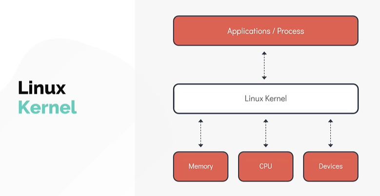
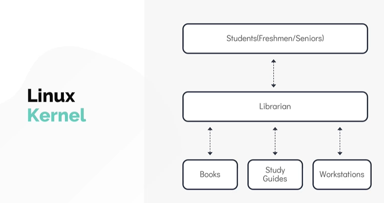
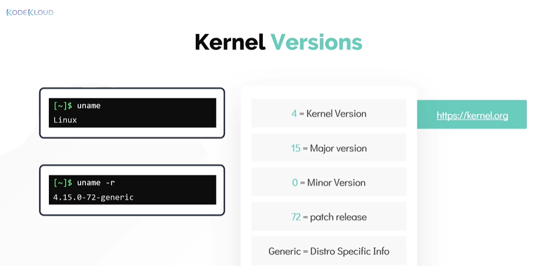
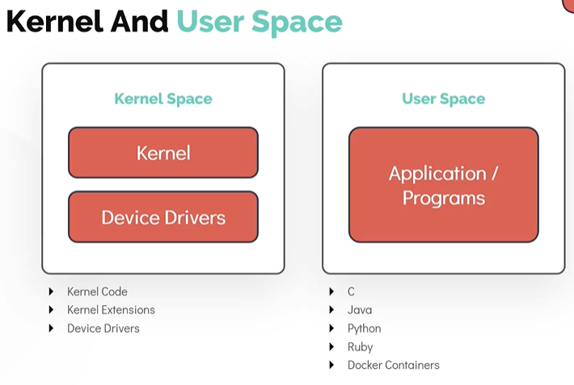
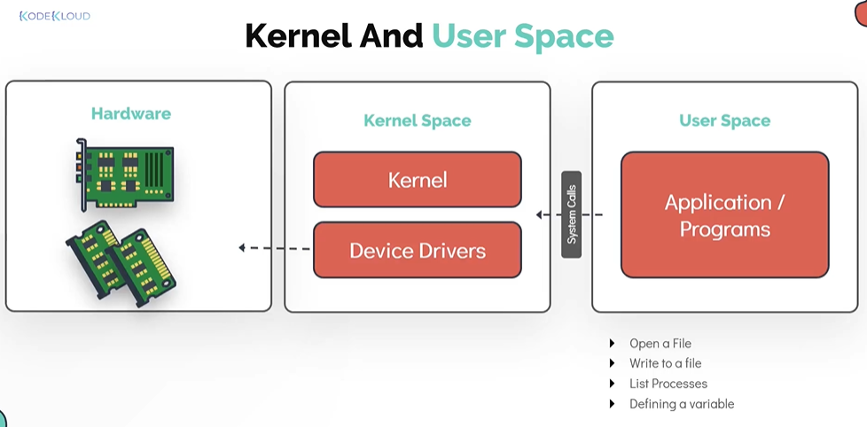
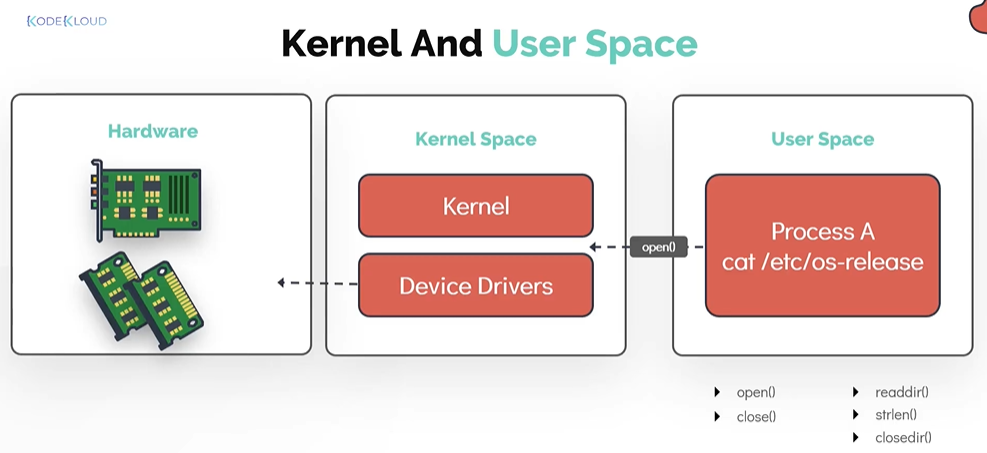

# Linux Core Concepts — The Linux Kernel
# Linux 核心概念 — Linux 内核

- Take me to the [Video Tutorial](https://kodekloud.com/topic/linux-kernel/)

In this section, we will take a look at the core concepts of a Linux operating system, starting with an introduction to the Linux kernel, and then exploring the kernel space and user space.

在本节中，我们将学习 Linux 操作系统的核心概念，从 Linux 内核简介开始，然后深入探讨内核空间与用户空间。

---

## The Linux Kernel
## Linux 内核

If you have worked with any operating system, you have encountered the term **kernel**. The kernel is the **core** of the operating system — the layer that sits between the hardware and all software running on the machine.

如果你使用过任何操作系统，就一定见过**内核**这个词。内核是操作系统的**核心**——位于硬件和所有运行在机器上的软件之间的那一层。



The Linux kernel has two key architectural characteristics:

Linux 内核有两个关键的架构特性：

- **Monolithic（宏内核）**: The Linux kernel is monolithic, meaning it carries out CPU scheduling, memory management, device drivers, and several other operations **all within a single large process running in kernel space**. This gives it high performance since components communicate directly without message passing overhead.

- **宏内核（Monolithic）**：Linux 内核是宏内核，意味着 CPU 调度、内存管理、设备驱动等操作**全部在内核空间的单一大进程中执行**。由于各组件之间直接通信，无需消息传递开销，因此性能很高。

- **Modular（模块化）**: Despite being monolithic, the Linux kernel is also modular — it can **extend its capabilities through dynamically loaded kernel modules** without rebooting. This means drivers and features can be added or removed on the fly.

- **模块化（Modular）**：尽管是宏内核，Linux 内核同样支持模块化——可以**通过动态加载内核模块来扩展功能**，而无需重启。这意味着驱动程序和功能可以随时添加或移除。

### The Library Analogy / 图书馆类比

To understand the kernel in simple terms, think of a **college library**:

为了简单理解内核，可以把它比作一个**大学图书馆**：



| Library / 图书馆 | Linux System / Linux 系统 |
|---|---|
| Librarian / 图书管理员 | Linux Kernel / Linux 内核 |
| Books / 书籍 | Data / Files on disk / 磁盘上的数据/文件 |
| Students / 学生 | User programs / 用户程序 |
| Rules for borrowing / 借书规则 | System calls / 系统调用 |
| Library shelves / 书架 | Memory / RAM / 内存 |

Just as students must go through the librarian to access books (following rules), user programs must go through the kernel to access hardware resources (following system calls).

正如学生必须通过图书管理员（遵守规则）才能借书，用户程序必须通过内核（遵循系统调用）才能访问硬件资源。

---

## The Kernel's 4 Major Responsibilities
## 内核的四大职责


### 1. Memory Management / 内存管理

The kernel is responsible for managing the system's RAM. This includes:
- Allocating memory to processes when they need it
- Freeing memory when processes are done
- **Virtual memory**: giving each process the illusion of having its own private address space
- **Swapping**: moving data between RAM and disk (swap space) when RAM is full
- Preventing one process from accessing another's memory (isolation/security)

内核负责管理系统的 RAM，包括：
- 在进程需要时为其分配内存
- 进程结束时释放内存
- **虚拟内存**：让每个进程都以为自己拥有独立的私有地址空间
- **交换（Swapping）**：当 RAM 不足时，在 RAM 和磁盘（交换空间）之间移动数据
- 防止一个进程访问另一个进程的内存（隔离/安全性）

### 2. Process Management / 进程管理

The kernel manages all running processes:
- **Scheduling**: deciding which process runs on the CPU and for how long
- **Creating and terminating** processes
- **Inter-process communication (IPC)**: pipes, signals, sockets, shared memory
- Managing process states: running, sleeping, stopped, zombie

内核管理所有运行中的进程：
- **调度**：决定哪个进程在 CPU 上运行以及运行多长时间
- **创建和终止**进程
- **进程间通信（IPC）**：管道、信号、套接字、共享内存
- 管理进程状态：运行、休眠、停止、僵尸

### 3. Device Drivers / 设备驱动

The kernel acts as the translator between hardware devices and software:
- Provides a **uniform interface** to hardware (programs don't need to know hardware specifics)
- Manages hardware events (interrupts)
- Loads appropriate drivers for each device

内核充当硬件设备与软件之间的翻译：
- 为硬件提供**统一接口**（程序无需了解硬件细节）
- 管理硬件事件（中断）
- 为每个设备加载相应的驱动程序

### 4. System Calls and Security / 系统调用与安全

The kernel provides a controlled gateway for user programs to request services:
- **System calls** (syscalls) are the API between user space and kernel space
- The kernel validates all requests for security
- Enforces user permissions and access control

内核为用户程序请求服务提供受控的通道：
- **系统调用**（syscalls）是用户空间和内核空间之间的 API
- 内核验证所有请求以保证安全性
- 执行用户权限和访问控制

---

## Linux Kernel Versions
## Linux 内核版本

### Checking the Kernel Version / 检查内核版本

Use the **`uname`** command to get information about the kernel:

使用 **`uname`** 命令获取内核信息：

```bash
# Just prints "Linux" — confirms the OS is Linux kernel-based
# 只打印 "Linux"——确认操作系统基于 Linux 内核
$ uname
Linux

# Print kernel release version
# 打印内核发行版本
$ uname -r
4.15.0-88-generic

# Print all kernel information
# 打印所有内核信息
$ uname -a
Linux ubuntu 4.15.0-88-generic #88-Ubuntu SMP Tue Feb 11 20:11:34 UTC 2020 x86_64 x86_64 x86_64 GNU/Linux
```



### Understanding the Version String / 理解版本字符串

For a kernel version like **`4.15.0-88-generic`**:

对于内核版本 **`4.15.0-88-generic`**：

```
4   .  15  .  0   -  88      -  generic
│      │      │      │          │
│      │      │      │          └── Distro-specific flavor
│      │      │      │               发行版特定的变体
│      │      │      └── ABI (Application Binary Interface) version
│      │      │           ABI（应用程序二进制接口）版本
│      │      └── Patch/Revision (bug fixes, minor changes)
│      │           补丁/修订版本（修复 bug，小改动）
│      └── Major version (significant feature additions)
│           主版本号（重要新功能）
└── Kernel version
     内核版本号
```

| Field / 字段 | Value / 值 | Meaning / 含义 |
|---|---|---|
| Kernel version / 内核版本 | `4` | The kernel version number / 内核版本号 |
| Major version / 主版本 | `15` | Significant new features added / 有重要新功能 |
| Minor/Patch / 次版本 | `0` | Bug fix releases / 漏洞修复版本 |
| ABI version / ABI 版本 | `88` | Ubuntu-specific build number / Ubuntu 特定的构建号 |
| Flavor / 变体 | `generic` | Kernel optimized for general use / 通用用途优化的内核 |

> **Common kernel flavors / 常见内核变体:**
> - `generic` — standard kernel for desktops/servers / 桌面/服务器的标准内核
> - `lowlatency` — optimized for audio/real-time applications / 为音频/实时应用优化
> - `server` — optimized for server workloads / 为服务器负载优化
> - `virtual` — stripped-down kernel for VMs / 为虚拟机精简的内核

---

## Kernel Space and User Space
## 内核空间与用户空间

One of the most important functions of the Linux kernel is **Memory Management**. The kernel divides memory into two distinct areas:

Linux 内核最重要的功能之一是**内存管理**。内核将内存划分为两个独立区域：



### Kernel Space / 内核空间

Kernel space is the region of memory where the kernel itself runs. Code running here has **unrestricted access** to all hardware and memory.

内核空间是内核本身运行的内存区域。在这里运行的代码对所有硬件和内存拥有**不受限制的访问权限**。

Contents of Kernel Space:
- Kernel code (scheduler, memory manager, etc.)
- Kernel extensions (loadable modules)
- Device drivers

内核空间的内容：
- 内核代码（调度器、内存管理器等）
- 内核扩展（可加载模块）
- 设备驱动程序

### User Space / 用户空间

User space is where all **user applications** run. Code here has **restricted access** — it cannot directly touch hardware or other processes' memory.

用户空间是所有**用户应用程序**运行的地方。这里的代码**访问受限**——不能直接接触硬件或其他进程的内存。

Contents of User Space:
- Applications written in C, Java, Python, Ruby, Go, etc.
- Docker containers (container processes run in user space)
- Shell sessions
- Desktop environments

用户空间的内容：
- 用 C、Java、Python、Ruby、Go 等语言编写的应用程序
- Docker 容器（容器进程运行在用户空间）
- Shell 会话
- 桌面环境

### System Calls — The Bridge / 系统调用——连接两个空间的桥梁

All user programs function by manipulating data stored in memory and on disk. To access hardware resources, user programs make special requests to the kernel called **System Calls**.

所有用户程序通过操作存储在内存和磁盘上的数据来运行。为了访问硬件资源，用户程序向内核发出称为**系统调用**的特殊请求。



**Examples of system calls / 系统调用示例:**

| User Action / 用户操作 | System Call / 系统调用 |
|---|---|
| Open a file / 打开文件 | `open()` |
| Read from a file / 读取文件 | `read()` |
| Write to a file / 写入文件 | `write()` |
| Allocate memory (`malloc`) / 分配内存 | `brk()` / `mmap()` |
| Create a new process (`fork`) / 创建新进程 | `fork()` / `clone()` |
| Send data over network / 通过网络发送数据 | `send()` / `sendto()` |
| Get current time / 获取当前时间 | `gettimeofday()` |

**Example — opening `/etc/os-release` / 示例——打开 `/etc/os-release`:**

When a program opens the file `/etc/os-release` to check the OS version, it triggers a system call:

当程序打开 `/etc/os-release` 文件以检查操作系统版本时，会触发一个系统调用：



```
User Program          System Call         Kernel
用户程序              系统调用             内核
    │                    │                  │
    │── open("/etc/...") ──>                │
    │                    │── validate ──>   │
    │                    │<── file handle ──│
    │<── file handle ────│                  │
    │                    │                  │
    │── read(handle) ────>                  │
    │                    │── read disk ──>  │
    │<── file data ──────│                  │
```

> **Security benefit / 安全优势**: Because all hardware access must go through the kernel via system calls, the kernel can **enforce access control** — a user program cannot read another user's files, write to system memory, or access hardware it shouldn't. This is fundamental to Linux security.
>
> 因为所有硬件访问都必须通过系统调用经过内核，内核可以**执行访问控制**——用户程序不能读取其他用户的文件、写入系统内存或访问不该访问的硬件。这是 Linux 安全性的基础。

---

## Kernel Modules
## 内核模块

As mentioned, the Linux kernel is modular. Kernel modules allow the kernel to be extended without rebooting.

如前所述，Linux 内核是模块化的。内核模块允许在不重启的情况下扩展内核功能。

```bash
# List currently loaded kernel modules / 列出当前已加载的内核模块
$ lsmod

# Get information about a module / 获取模块信息
$ modinfo <module_name>
$ modinfo bluetooth

# Load a module / 加载模块
$ sudo modprobe <module_name>
$ sudo modprobe bluetooth

# Remove a module / 移除模块
$ sudo modprobe -r <module_name>

# Load module with insmod (low-level, requires full path) / 用 insmod 加载模块（底层，需要完整路径）
$ sudo insmod /lib/modules/$(uname -r)/kernel/drivers/bluetooth/bluetooth.ko

# Remove with rmmod / 用 rmmod 移除
$ sudo rmmod bluetooth
```

> **`modprobe` vs `insmod` / 区别**: `modprobe` is preferred because it automatically handles module **dependencies** (loads required modules first). `insmod` is lower-level and requires manual dependency management.
>
> 推荐使用 `modprobe`，因为它会自动处理模块**依赖关系**（先加载所需模块）。`insmod` 是底层命令，需要手动管理依赖。

---

## Summary
## 小结

| Concept / 概念 | Key Point / 要点 |
|---|---|
| Linux Kernel | Core of OS; manages CPU, memory, devices, security / OS 核心；管理 CPU、内存、设备、安全 |
| Monolithic / 宏内核 | All core functions in one process, high performance / 所有核心功能在一个进程中，高性能 |
| Modular / 模块化 | Extend via dynamically loaded modules, no reboot needed / 通过动态加载模块扩展，无需重启 |
| Kernel Space / 内核空间 | Unrestricted access; kernel code, drivers / 不受限制访问；内核代码、驱动程序 |
| User Space / 用户空间 | Restricted access; all user applications / 受限访问；所有用户应用程序 |
| System Calls / 系统调用 | API from user space to kernel space / 用户空间到内核空间的 API |
| `uname -r` | Check kernel version / 检查内核版本 |
| `lsmod` | List loaded kernel modules / 列出已加载的内核模块 |
| `modprobe` | Load/unload kernel modules (handles dependencies) / 加载/卸载内核模块（处理依赖） |
