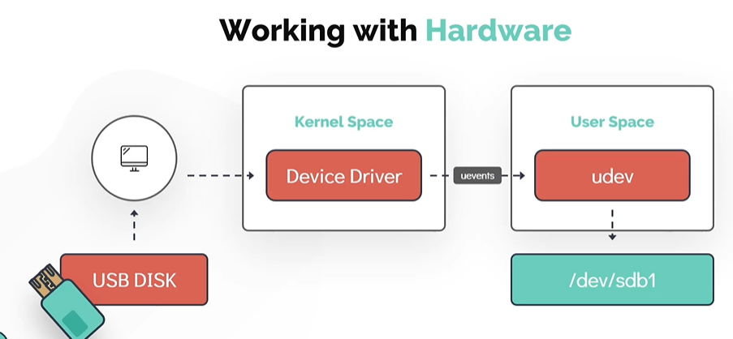
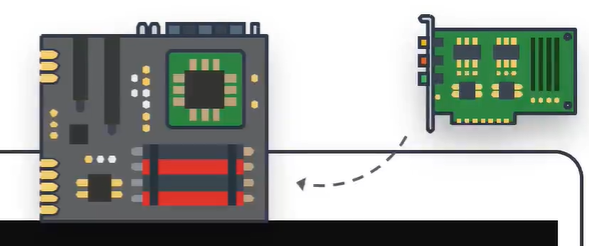
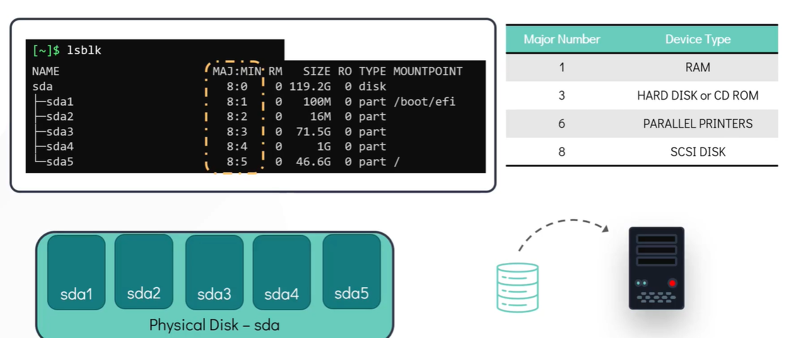

# Working with Hardware
# 硬件管理

- Take me to the [Video Tutorial](https://kodekloud.com/topic/working-with-hardware/)

In this section, we will look at how Linux works with the hardware resources available to the system and how to make use of kernel modules. We will explore how Linux identifies and manages hardware devices, and then see ways to list and get detailed information about these devices from the command line.

在本节中，我们将了解 Linux 如何与系统中的硬件资源协同工作，以及如何使用内核模块。我们将探索 Linux 如何识别和管理硬件设备，并学习从命令行列出和获取这些设备详细信息的方法。

---

## How Linux Detects Hardware — The udev System
## Linux 如何检测硬件——udev 系统

Let's take the example of a **USB disk** being plugged into the system to understand the complete hardware detection flow:

让我们以**USB 磁盘**插入系统为例，了解完整的硬件检测流程：



### Step-by-step process / 逐步流程

**Step 1 — Hardware event detected / 步骤一——检测到硬件事件**

As soon as the USB device is attached, the corresponding **device driver** (which is part of the kernel space) detects the state change and generates an event called a **`uevent`**.

USB 设备插入后，对应的**设备驱动程序**（属于内核空间）立即检测到状态变化，并生成一个称为 **`uevent`** 的事件。

**Step 2 — Event sent to user space / 步骤二——事件发送到用户空间**

The `uevent` is sent to the **User Space device manager daemon** called **`udev`**.

`uevent` 被发送到**用户空间设备管理守护进程** **`udev`**。

**Step 3 — Device node created / 步骤三——创建设备节点**

The `udev` service dynamically creates a **device node** (a special file) associated with the newly attached USB drive in the **`/dev/`** filesystem.

`udev` 服务在 **`/dev/`** 文件系统中动态创建与新插入 USB 驱动器关联的**设备节点**（一种特殊文件）。

**Step 4 — Device becomes accessible / 步骤四——设备可访问**

Once complete, the newly attached disk is visible under `/dev/` (e.g., `/dev/sdb`) and can be mounted and used.

完成后，新插入的磁盘在 `/dev/` 下可见（例如 `/dev/sdb`），可以挂载并使用。

```
USB Plugged In → Kernel Driver → uevent → udev daemon → /dev/sdb created → Mount & use
USB 插入      → 内核驱动      → uevent → udev 守护进程 → 创建 /dev/sdb  → 挂载使用
```

> **What is `/dev/`? / 什么是 `/dev/`?**: The `/dev/` directory contains **device files** — special files that represent hardware devices. Reading/writing to these files directly interacts with the hardware. For example:
> - `/dev/sda` — first hard disk / 第一块硬盘
> - `/dev/sdb` — second hard disk or USB drive / 第二块硬盘或 USB 驱动器
> - `/dev/null` — a "black hole" that discards all data / 丢弃所有数据的"黑洞"
> - `/dev/zero` — outputs an infinite stream of zero bytes / 输出无限零字节流
> - `/dev/random` — produces random data / 产生随机数据

---

## Hardware Inspection Commands
## 硬件检查命令

### `dmesg` — Kernel Ring Buffer Messages / 内核环形缓冲区消息

The `dmesg` command displays messages from the **kernel ring buffer** — a fixed-size buffer in the kernel that records messages generated during and after boot, including hardware detection messages.

`dmesg` 命令显示来自**内核环形缓冲区**的消息——内核中一个固定大小的缓冲区，记录启动期间及之后生成的消息，包括硬件检测消息。

```bash
# Show all kernel messages / 显示所有内核消息
$ dmesg

# Filter messages related to USB / 过滤 USB 相关消息
$ dmesg | grep -i usb

# Filter messages related to hard disks / 过滤硬盘相关消息
$ dmesg | grep -i sda

# Show messages with timestamps / 显示带时间戳的消息
$ dmesg -T

# Show only error messages / 只显示错误消息
$ dmesg --level=err

# Follow new messages in real time / 实时跟踪新消息
$ dmesg -w
$ dmesg --follow
```

**Example output when a USB drive is inserted / 插入 USB 驱动器时的示例输出:**
```
[12345.678901] usb 1-1: new high-speed USB device number 3 using xhci_hcd
[12345.832104] usb 1-1: New USB device found, idVendor=0781, idProduct=5591
[12345.832109] usb 1-1: Product: Ultra
[12345.832111] usb 1-1: Manufacturer: SanDisk
[12346.012345] sd 6:0:0:0: [sdb] 60088320 512-byte logical blocks: (30.8 GB/28.6 GiB)
[12346.015678] sdb: sdb1
```

> **Use case / 使用场景**: `dmesg` is invaluable for **troubleshooting hardware issues**. If a device isn't recognized, check `dmesg` for error messages immediately after plugging it in.
>
> `dmesg` 对于**排查硬件问题**非常有价值。如果设备未被识别，插入后立即检查 `dmesg` 中的错误消息。

---

### `udevadm` — udev Administration Tool / udev 管理工具

`udevadm` is the management utility for `udev`, used to query the udev database for device information.

`udevadm` 是 `udev` 的管理工具，用于查询 udev 数据库中的设备信息。

```bash
# Query device information by device path / 按设备路径查询设备信息
$ udevadm info --query=path --name=/dev/sda5
/devices/pci0000:00/0000:00:1f.2/ata1/host0/target0:0:0/0:0:0:0/block/sda/sda5

# Query all attributes of a device / 查询设备的所有属性
$ udevadm info --query=all --name=/dev/sda

# Show the complete device hierarchy / 显示完整的设备层次结构
$ udevadm info --attribute-walk --name=/dev/sda

# Monitor kernel uevents in real time / 实时监控内核 uevent
$ udevadm monitor

# Monitor only specific subsystems / 只监控特定子系统
$ udevadm monitor --subsystem-match=usb
```

**`udevadm monitor` output when USB is inserted / 插入 USB 时 `udevadm monitor` 的输出:**
```
KERNEL[12345.678] add      /devices/pci0000:00/...usb1/1-1 (usb)
UDEV  [12345.890] add      /devices/pci0000:00/...usb1/1-1 (usb)
KERNEL[12346.012] add      /devices/.../block/sdb (block)
UDEV  [12346.234] add      /devices/.../block/sdb (block)
```

> **`KERNEL` vs `UDEV` events / 区别**: `KERNEL` events are raw events from the kernel; `UDEV` events have been processed by the udev daemon (device nodes already created).
>
> `KERNEL` 事件是来自内核的原始事件；`UDEV` 事件已由 udev 守护进程处理完毕（设备节点已创建）。

---

### `lspci` — List PCI Devices / 列出 PCI 设备

Lists all **PCI (Peripheral Component Interconnect)** devices configured in the system.

列出系统中配置的所有 **PCI（外围组件互连）**设备。

```bash
# Basic listing / 基本列表
$ lspci

# Verbose output with detailed information / 详细输出
$ lspci -v

# Extra verbose (very detailed) / 超详细输出
$ lspci -vv

# Show kernel driver in use / 显示正在使用的内核驱动程序
$ lspci -k

# Filter by device type / 按设备类型过滤
$ lspci | grep -i ethernet
$ lspci | grep -i vga
$ lspci | grep -i wireless
```



**Common PCI devices / 常见 PCI 设备:**
- Ethernet Cards / 以太网卡
- RAID Controllers / RAID 控制器
- Video/Graphics Cards / 视频/显卡
- Wireless Adapters / 无线网卡
- USB Controllers / USB 控制器
- Sound Cards / 声卡
- NVMe SSD Controllers / NVMe SSD 控制器

---

### `lsblk` — List Block Devices / 列出块设备

Displays information about all **block devices** (storage devices) in a tree format.

以树形格式显示所有**块设备**（存储设备）的信息。

```bash
# Basic listing / 基本列表
$ lsblk

# Include all empty devices / 包含所有空设备
$ lsblk -a

# Show filesystem information / 显示文件系统信息
$ lsblk -f

# Show size in bytes / 以字节显示大小
$ lsblk -b

# Show detailed information / 显示详细信息
$ lsblk -o NAME,SIZE,TYPE,MOUNTPOINT,FSTYPE
```



**Example output / 示例输出:**
```
NAME   MAJ:MIN RM   SIZE RO TYPE MOUNTPOINT
sda      8:0    0    50G  0 disk
├─sda1   8:1    0    49G  0 part /
├─sda2   8:2    0     1K  0 part
└─sda5   8:5    0   975M  0 part [SWAP]
sdb      8:16   1    30G  0 disk
└─sdb1   8:17   1    30G  0 part /media/usb
```

**Understanding the columns / 理解各列含义:**
- `NAME` — device name / 设备名
- `MAJ:MIN` — major:minor device numbers / 主:次设备号
- `RM` — removable device? (1=yes) / 是否可移除（1=是）
- `SIZE` — device size / 设备大小
- `RO` — read-only? (1=yes) / 是否只读（1=是）
- `TYPE` — disk, partition, or LVM / 磁盘、分区或 LVM
- `MOUNTPOINT` — where it's mounted / 挂载点

---

### `lscpu` — CPU Information / CPU 信息

Displays detailed information about the **CPU architecture**.

显示 **CPU 架构**的详细信息。

```bash
$ lscpu
```

**Example output / 示例输出:**
```
Architecture:        x86_64
CPU op-mode(s):      32-bit, 64-bit
Byte Order:          Little Endian
CPU(s):              4
On-line CPU(s) list: 0-3
Thread(s) per core:  2
Core(s) per socket:  2
Socket(s):           1
NUMA node(s):        1
Vendor ID:           GenuineIntel
CPU family:          6
Model name:          Intel(R) Core(TM) i5-8250U @ 1.60GHz
CPU MHz:             1600.000
Cache L1d:           32K
Cache L1i:           32K
Cache L2:            256K
Cache L3:            6144K
```

**Calculating total physical cores / 计算总物理核心数:**
```
Total Physical Cores = Core(s) per socket × Socket(s)
总物理核心数 = 每个插槽的核心数 × 插槽数
             = 2 × 1 = 2 physical cores / 2 个物理核心

Total Logical CPUs (threads) = CPU(s) = 4
(2 physical cores × 2 threads/core via Hyper-Threading)
（2 个物理核心 × 每核 2 线程，通过超线程）
```

---

### Memory Commands / 内存命令

#### `lsmem` — List Memory

```bash
# Show memory summary / 显示内存摘要
$ lsmem --summary

# Show detailed memory block info / 显示详细内存块信息
$ lsmem
```

**Example output / 示例输出:**
```
RANGE                                  SIZE  STATE REMOVABLE BLOCK
0x0000000000000000-0x000000007fffffff    2G online       yes   0-15
0x0000000100000000-0x000000047fffffff   14G online       yes  32-143

Memory block size:       128M
Total online memory:      16G
Total offline memory:      0B
```

#### `free` — Memory Usage / 内存使用情况

```bash
# Display in megabytes / 以兆字节显示
$ free -m

# Display in gigabytes / 以吉字节显示
$ free -g

# Display in human-readable format / 以易读格式显示
$ free -h

# Update every 2 seconds / 每 2 秒更新
$ free -h -s 2
```

**Example output / 示例输出:**
```
              total        used        free      shared  buff/cache   available
Mem:           15Gi       3.2Gi       8.1Gi       512Mi       4.1Gi      11.6Gi
Swap:           975Mi         0B       975Mi
```

**Understanding columns / 理解各列:**
- `total` — total installed RAM / 已安装的总 RAM
- `used` — memory in use / 正在使用的内存
- `free` — completely unused memory / 完全未使用的内存
- `shared` — memory shared between processes / 进程间共享的内存
- `buff/cache` — disk cache (can be reclaimed if needed) / 磁盘缓存（需要时可回收）
- `available` — memory available for new applications / 可供新应用程序使用的内存

> **`free` vs `available` / 区别**: `free` shows completely unused memory. `available` includes `buff/cache` that can be freed — this is the more useful number for determining if you're running low on memory.
>
> `free` 显示完全未使用的内存。`available` 包含可以释放的 `buff/cache`——这是判断内存是否不足的更有用的数字。

---

### `lshw` — List Hardware / 列出硬件

Provides **comprehensive hardware information** for the entire machine.

提供整台机器的**全面硬件信息**。

```bash
# Full hardware listing (requires sudo for complete info) / 完整硬件列表（需要 sudo 获取完整信息）
$ sudo lshw

# Short summary / 简短摘要
$ sudo lshw -short

# HTML output for documentation / HTML 格式输出（用于文档）
$ sudo lshw -html > hardware_report.html

# Filter by class / 按类别过滤
$ sudo lshw -class disk
$ sudo lshw -class network
$ sudo lshw -class cpu
$ sudo lshw -class memory
```

**Example `lshw -short` output / 示例输出:**
```
H/W path        Device    Class       Description
=================================================
                          system      ThinkPad T490
/0                        bus         Motherboard
/0/0                      memory      16GiB System Memory
/0/1                      processor   Intel Core i5-8265U
/0/100/1f.2               storage     Cannon Point-LP SATA Controller
/0/100/1f.2/0   /dev/sda  disk        512GB Samsung SSD
/1              eth0      network     Intel Ethernet Connection
/2              wlan0     network     Intel Wireless-AC 9560
```

---

## Using `sudo` for Hardware Commands
## 使用 `sudo` 运行硬件命令

Not every user can run all commands in Linux. Some commands require **root (superuser) privileges** — particularly commands that access low-level hardware information or make system changes.

并非每个用户都能在 Linux 中运行所有命令。某些命令需要 **root（超级用户）权限**——特别是访问底层硬件信息或进行系统更改的命令。

```bash
# Run a command with root privileges / 以 root 权限运行命令
$ sudo lshw
$ sudo dmesg
$ sudo lspci -vv

# Become root user temporarily / 临时切换到 root 用户
$ sudo -i
$ sudo su -

# Run a command as a specific user / 以特定用户身份运行命令
$ sudo -u www-data command
```

> **What is `sudo`? / 什么是 `sudo`?**: `sudo` stands for **"superuser do"**. It allows permitted users to run commands as root (or another user) based on the `/etc/sudoers` configuration file. Running commands as root is powerful — a mistake can damage the system, so `sudo` provides an audit trail of who ran what.
>
> `sudo` 代表 **"superuser do"（以超级用户身份执行）**。它允许经过授权的用户根据 `/etc/sudoers` 配置文件以 root（或其他用户）身份运行命令。以 root 身份运行命令功能强大——一个错误可能损坏系统，因此 `sudo` 提供了谁运行了什么命令的审计跟踪。

---

## Summary — Hardware Commands Quick Reference
## 小结 — 硬件命令快速参考

| Command / 命令 | Purpose / 用途 | Key Options / 常用选项 |
|---|---|---|
| `dmesg` | Kernel messages including hardware events / 内核消息（含硬件事件） | `-T` (timestamps), `-w` (follow), `\| grep -i usb` |
| `udevadm info` | Query udev device database / 查询 udev 设备数据库 | `--query=path`, `--query=all` |
| `udevadm monitor` | Watch hardware events in real time / 实时监控硬件事件 | `--subsystem-match=usb` |
| `lspci` | List PCI devices / 列出 PCI 设备 | `-v`, `-k` (kernel driver) |
| `lsblk` | List block/storage devices / 列出块/存储设备 | `-f` (filesystem), `-o` (columns) |
| `lscpu` | CPU architecture details / CPU 架构详情 | (no options needed) |
| `lsmem` | Memory block information / 内存块信息 | `--summary` |
| `free` | RAM and swap usage / RAM 和交换空间使用情况 | `-h` (human-readable), `-m` (MB), `-s N` (repeat) |
| `lshw` | Complete hardware inventory / 完整硬件清单 | `-short`, `-class disk`, `-html` |
| `sudo` | Run command as root / 以 root 身份运行命令 | `-i` (root shell), `-u user` |
