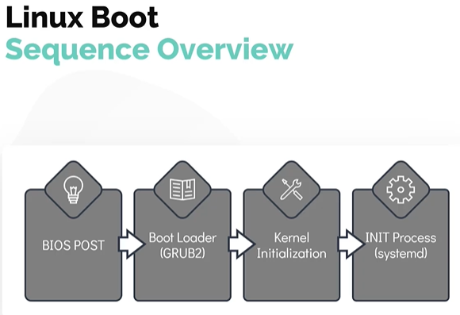
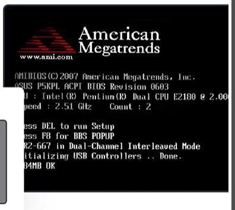
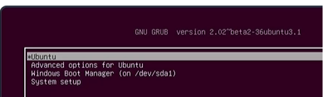
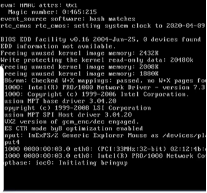

# Linux Boot Sequence

# Linux 启动流程

- Take me to the [Video Tutorial](https://kodekloud.com/topic/linux-boot-sequence/)

In this section, we look at the boot process in a simplified manner by dividing it into four broader stages. Understanding the boot sequence helps you troubleshoot startup failures and understand how the system transitions from powered-off hardware to a fully running Linux environment.

在本节中，我们将把启动过程分为四个主要阶段来简化讲解。了解启动流程有助于排查启动故障，并理解系统如何从断电状态过渡到完整运行的 Linux 环境。

---

## Overview — The 4 Stages of Boot

## 概述 — 启动的四个阶段

```
Power On
上电
  │
  ▼
┌─────────────────┐
│   1. BIOS POST  │  Hardware self-test / 硬件自检
└────────┬────────┘
         │ (POST passed / POST 通过)
         ▼
┌─────────────────┐
│  2. Boot Loader │  GRUB2 loads the kernel / GRUB2 加载内核
│    (GRUB2)      │
└────────┬────────┘
         │
         ▼
┌─────────────────────┐
│ 3. Kernel           │  Hardware init, mounts root filesystem
│    Initialization   │  硬件初始化，挂载根文件系统
└────────┬────────────┘
         │
         ▼
┌─────────────────┐
│  4. INIT Process│  systemd brings system to usable state
│   (systemd)     │  systemd 将系统带到可用状态
└─────────────────┘
         │
         ▼
Login prompt / Graphical desktop
登录提示符 / 图形桌面
```



**How to initiate a Linux boot process / 如何启动 Linux 启动流程:**

- **Cold boot / 冷启动**: Start a Linux device that is in a halted or powered-off state / 启动处于停止或关闭状态的 Linux 设备
- **Warm boot / 热启动**: Reboot or reset a running system / 重启或重置正在运行的系统

---

## Stage 1 — BIOS POST

## 阶段一 — BIOS POST（开机自检）



**POST** stands for **Power On Self Test**.

**POST** 代表**开机自检（Power On Self Test）**。

The first stage has very little to do with Linux itself. It is entirely about the **hardware**:

第一阶段与 Linux 本身几乎无关，完全是关于**硬件**的：

- When you press the power button, the **BIOS (Basic Input/Output System)** or its modern replacement **UEFI (Unified Extensible Firmware Interface)** takes control.
- BIOS/UEFI runs a POST test to ensure all essential hardware components are functioning correctly:

  - CPU is working / CPU 正常运作
  - RAM is accessible / RAM 可访问
  - Storage devices are detected / 检测到存储设备
  - Keyboard, display are present / 键盘、显示器存在
- 按下电源按钮后，**BIOS（基本输入/输出系统）**或其现代替代品 **UEFI（统一可扩展固件接口）**接管控制权。
- BIOS/UEFI 运行 POST 测试，确保所有基本硬件组件正常工作。

**If POST fails / 如果 POST 失败:**

- The system may emit **beep codes** (different patterns indicate different hardware failures) / 系统可能发出**蜂鸣代码**（不同模式表示不同硬件故障）
- The system will **not proceed** to the next boot stage / 系统将**不会进入**下一启动阶段
- Error messages may appear on screen (if display is functional) / 如果显示器正常，屏幕上可能出现错误信息

**If POST succeeds / 如果 POST 成功:**

- BIOS/UEFI searches for a bootable device (according to the configured boot order) / BIOS/UEFI 按照配置的启动顺序搜索可引导设备
- Control is handed to the **Boot Loader** / 控制权移交给**引导加载程序**

> **BIOS vs UEFI / 区别**:
>
> - **BIOS**: Legacy firmware, 16-bit, uses MBR (Master Boot Record), max 2TB disk support / 传统固件，16 位，使用 MBR（主引导记录），最大支持 2TB 磁盘
> - **UEFI**: Modern replacement, 64-bit, uses GPT (GUID Partition Table), supports larger disks, faster boot, Secure Boot / 现代替代品，64 位，使用 GPT（GUID 分区表），支持更大磁盘、更快启动、安全启动
>
> Most modern systems use UEFI, but the Linux boot process works similarly for both.
>
> 大多数现代系统使用 UEFI，但 Linux 的启动流程对两者都类似。

---

## Stage 2 — Boot Loader (GRUB2)

## 阶段二 — 引导加载程序（GRUB2）



After successful POST, BIOS/UEFI loads and executes the **boot loader** from the boot device:

- On BIOS systems: loaded from the **first sector of the hard disk** (MBR, 512 bytes)
- On UEFI systems: loaded from a file in the **EFI System Partition (ESP)**
- In Linux, boot files are located in the **`/boot`** filesystem

POST 成功后，BIOS/UEFI 从引导设备加载并执行**引导加载程序**：

- BIOS 系统：从**硬盘的第一个扇区**（MBR，512 字节）加载
- UEFI 系统：从 **EFI 系统分区（ESP）**中的文件加载
- 在 Linux 中，引导文件位于 **`/boot`** 文件系统

The most popular Linux boot loader is **GRUB2** (GRand Unified Bootloader Version 2):

最流行的 Linux 引导加载程序是 **GRUB2**（GRand Unified Bootloader Version 2）：

**What GRUB2 does / GRUB2 的功能:**

1. **Displays a boot menu** — lists available operating systems/kernels to boot into (useful in dual-boot setups) / **显示启动菜单**——列出可引导的操作系统/内核（在双引导系统中很有用）
2. **Loads the selected kernel** into memory / **将选定的内核**加载到内存
3. **Passes parameters** to the kernel (e.g., root filesystem location, `quiet`, `splash`) / 向内核**传递参数**（如根文件系统位置、`quiet`、`splash`）
4. **Hands control** to the kernel / 将控制权**移交**给内核

**GRUB2 configuration files / GRUB2 配置文件:**

```bash
# Main GRUB2 config (auto-generated, do not edit directly) / 主 GRUB2 配置（自动生成，勿直接编辑）
/boot/grub/grub.cfg

# User-editable GRUB2 settings / 用户可编辑的 GRUB2 设置
/etc/default/grub

# After editing /etc/default/grub, regenerate the config / 编辑后重新生成配置
$ sudo update-grub          # Debian/Ubuntu
$ sudo grub2-mkconfig -o /boot/grub2/grub.cfg  # RHEL/CentOS
```

**Useful GRUB2 settings in `/etc/default/grub` / `/etc/default/grub` 中的常用设置:**

```bash
GRUB_DEFAULT=0              # Default boot entry (0 = first) / 默认启动项（0=第一个）
GRUB_TIMEOUT=5              # Seconds to show menu before auto-booting / 自动启动前显示菜单的秒数
GRUB_CMDLINE_LINUX_DEFAULT="quiet splash"  # Default kernel parameters / 默认内核参数
```

---

## Stage 3 — Kernel Initialization

## 阶段三 — 内核初始化



After GRUB2 loads the kernel into memory:

GRUB2 将内核加载到内存后：

1. **Decompression / 解压**: The kernel image (often stored as a compressed `vmlinuz` file) decompresses itself into memory.

   内核镜像（通常以压缩的 `vmlinuz` 文件存储）将自身解压到内存中。
2. **Hardware initialization / 硬件初始化**: The kernel:

   - Detects and initializes hardware (CPU, memory, PCI buses, storage controllers) / 检测并初始化硬件（CPU、内存、PCI 总线、存储控制器）
   - Sets up **interrupt handlers** (IRQs) / 设置**中断处理程序**（IRQ）
   - Initializes **memory management** (sets up virtual memory, page tables) / 初始化**内存管理**（设置虚拟内存、页表）
   - Mounts the **initial RAM disk (initrd/initramfs)** as a temporary root filesystem / 挂载**初始 RAM 磁盘（initrd/initramfs）**作为临时根文件系统
3. **Mount root filesystem / 挂载根文件系统**: The kernel locates and mounts the real root filesystem (`/`).

   内核定位并挂载真实的根文件系统（`/`）。
4. **Start INIT process / 启动 INIT 进程**: Once fully operational, the kernel starts the first user-space process — the **INIT process** (PID 1) — which sets up the user environment.

   完全运行后，内核启动第一个用户空间进程——**INIT 进程**（PID 1）——它负责建立用户环境。

**Kernel files in `/boot` / `/boot` 中的内核文件:**

```bash
$ ls /boot/
config-4.15.0-88-generic     # Kernel configuration / 内核配置
grub/                         # GRUB2 files / GRUB2 文件
initrd.img-4.15.0-88-generic  # Initial RAM disk / 初始 RAM 磁盘
System.map-4.15.0-88-generic  # Kernel symbol table / 内核符号表
vmlinuz-4.15.0-88-generic     # Compressed kernel image / 压缩内核镜像
```

> **What is `initramfs`? / 什么是 `initramfs`?**: The initial RAM filesystem is a small temporary filesystem loaded into memory by GRUB2. It contains the minimal tools and drivers needed to mount the real root filesystem (e.g., storage drivers, filesystem tools). Once the real root is mounted, `initramfs` is discarded.
>
> 初始 RAM 文件系统是 GRUB2 加载到内存中的一个小型临时文件系统。它包含挂载真实根文件系统所需的最小工具和驱动程序（如存储驱动、文件系统工具）。一旦挂载了真实根目录，`initramfs` 就会被丢弃。

---

## Stage 4 — INIT Process (systemd)

## 阶段四 — INIT 进程（systemd）

In most current Linux distributions, the INIT function calls the **`systemd`** daemon.

在大多数现代 Linux 发行版中，INIT 函数调用 **`systemd`** 守护进程。

**What `systemd` does / `systemd` 的职责:**

- **Mounts filesystems** listed in `/etc/fstab` / **挂载** `/etc/fstab` 中列出的文件系统
- **Starts system services** (network, logging, cron, SSH, etc.) / **启动系统服务**（网络、日志、定时任务、SSH 等）
- **Manages service dependencies** (starts services in the correct order) / **管理服务依赖关系**（按正确顺序启动服务）
- Sets up the **login environment** (tty, display manager for GUI) / 设置**登录环境**（tty、GUI 的显示管理器）
- **Handles system state transitions** (shutdown, reboot, sleep) / **处理系统状态转换**（关机、重启、睡眠）

### systemd vs SysV init / systemd 与 SysV init 对比

`systemd` is the modern standard, but the older **System V (SysV) init** was used for many years:

`systemd` 是现代标准，但旧版 **System V（SysV）init** 曾使用多年：

| Feature / 特性                 | SysV init                              | systemd                                |
| ------------------------------ | -------------------------------------- | -------------------------------------- |
| Startup style / 启动方式       | Sequential (one by one) / 顺序（逐一） | Parallel (simultaneous) / 并行（同时） |
| Boot speed / 启动速度          | Slower / 较慢                          | Much faster / 快得多                   |
| Service scripts / 服务脚本     | Shell scripts in `/etc/init.d/`      | Unit files in `/etc/systemd/system/` |
| Dependency handling / 依赖处理 | Manual, error-prone / 手动，易出错     | Automatic / 自动                       |
| Used in / 使用于               | RHEL 6, CentOS 6, older Debian         | RHEL 7+, Ubuntu 15+, Debian 8+         |

> **Key advantage of `systemd` / `systemd` 的关键优势**: By **parallelizing** service startup, `systemd` dramatically reduces boot time. Services that don't depend on each other start simultaneously rather than waiting for each other.
>
> 通过**并行化**服务启动，`systemd` 大幅减少了启动时间。不相互依赖的服务会同时启动，而不是互相等待。

### Check Which INIT System is Being Used / 检查正在使用哪种 INIT 系统

```bash
$ ls -l /sbin/init
lrwxrwxrwx 1 root root 20 Jan 14 10:00 /sbin/init -> /lib/systemd/systemd
```

If the output shows a **symlink pointing to systemd**, the system uses `systemd`. If it points to something else (like `/sbin/init` itself with no symlink), the system may use SysV init or Upstart.

如果输出显示**指向 systemd 的符号链接**，则系统使用 `systemd`。如果指向其他内容，系统可能使用 SysV init 或 Upstart。

```bash
# Check systemd version / 检查 systemd 版本
$ systemd --version
systemd 237
+PAM +AUDIT +SELINUX +IMA +APPARMOR ...

# Check if systemd is running as PID 1 / 检查 systemd 是否作为 PID 1 运行
$ ps -p 1
  PID TTY          TIME CMD
    1 ?        00:00:03 systemd
```

---

## Boot Troubleshooting Tips

## 启动故障排查技巧

| Problem / 问题                          | Likely Stage / 可能阶段 | What to Check / 检查内容                                                                 |
| --------------------------------------- | ----------------------- | ---------------------------------------------------------------------------------------- |
| Beep codes, no display / 蜂鸣，无显示   | Stage 1 (POST)          | Hardware connections, RAM seating / 硬件连接、RAM 插槽                                   |
| "No bootable device" / "找不到引导设备" | Stage 2 (GRUB)          | Boot order in BIOS, disk connection / BIOS 中的启动顺序、磁盘连接                        |
| GRUB rescue prompt / GRUB 救援提示符    | Stage 2 (GRUB)          | `grub.cfg` missing/corrupt, reinstall GRUB / `grub.cfg` 丢失/损坏，重装 GRUB         |
| Kernel panic / 内核崩溃                 | Stage 3 (Kernel)        | Hardware failure, corrupted kernel, check `dmesg` / 硬件故障、内核损坏，检查 `dmesg` |
| Stuck at boot logo / 卡在启动 Logo      | Stage 4 (systemd)       | Failing service, check `systemctl status` / 服务失败，检查 `systemctl status`        |
| Can't login / 无法登录                  | Stage 4 (systemd)       | Display manager, PAM config / 显示管理器、PAM 配置                                       |

---

## Summary

## 小结

| Stage / 阶段 | Name / 名称            | Key Action / 关键动作                                             |
| ------------ | ---------------------- | ----------------------------------------------------------------- |
| 1            | BIOS/UEFI POST         | Hardware self-test / 硬件自检                                     |
| 2            | Boot Loader (GRUB2)    | Load kernel + show boot menu / 加载内核 + 显示启动菜单            |
| 3            | Kernel Initialization  | Init hardware, mount root filesystem / 初始化硬件，挂载根文件系统 |
| 4            | INIT Process (systemd) | Start services, prepare user environment / 启动服务，准备用户环境 |

```bash
# Key diagnostic commands / 关键诊断命令
$ ls -l /sbin/init          # Check init system / 检查 init 系统
$ systemd --version         # Check systemd version / 检查 systemd 版本
$ systemctl list-units      # List all systemd units / 列出所有 systemd 单元
$ journalctl -b             # View logs from current boot / 查看当前启动的日志
$ journalctl -b -1          # View logs from previous boot / 查看上一次启动的日志
```
