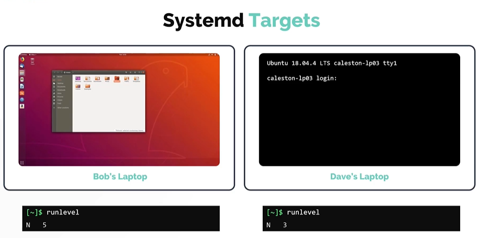
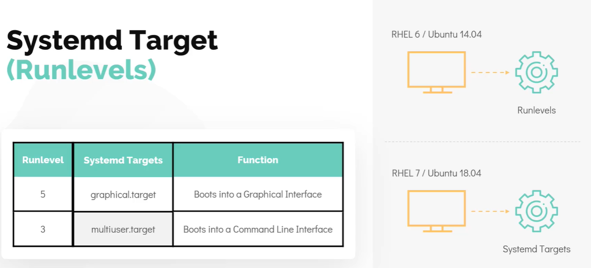
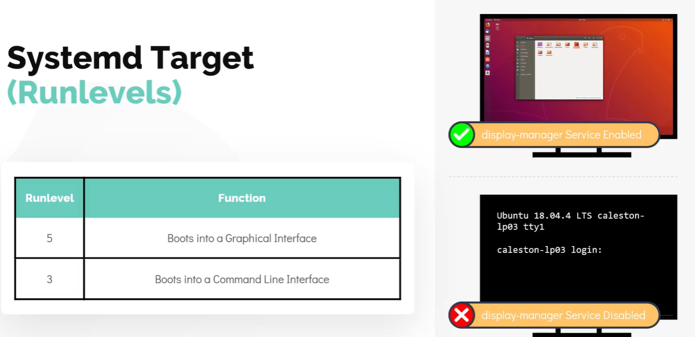

# Run Levels
# 运行级别

- Take me to the [Video Tutorial](https://kodekloud.com/topic/runlevels/)

---

## Systemd Targets (Run Levels)
## Systemd 目标（运行级别）

Linux can run in multiple **operation modes**, each designed for a different purpose. These modes are called **runlevels** in the traditional SysV system, and **targets** in the modern systemd system.

Linux 可以以多种**运行模式**运行，每种模式为不同目的而设计。这些模式在传统 SysV 系统中称为**运行级别（runlevel）**，在现代 systemd 系统中称为**目标（target）**。



---

## Traditional SysV Runlevels
## 传统 SysV 运行级别

The traditional SysV init system defined **7 runlevels** (0–6):

传统 SysV init 系统定义了 **7 个运行级别**（0–6）：

| Runlevel / 运行级别 | Purpose / 用途 | systemd Target / systemd 目标 |
|---|---|---|
| **0** | Halt / Power off / 停机/关机 | `poweroff.target` |
| **1** | Single-user mode (recovery, maintenance) / 单用户模式（恢复、维护） | `rescue.target` |
| **2** | Multi-user, no networking (Debian default) / 多用户，无网络（Debian 默认） | `multi-user.target` |
| **3** | Multi-user, with networking, **no GUI** / 多用户，有网络，**无图形界面** | `multi-user.target` |
| **4** | Undefined / user-definable / 未定义/用户自定义 | `multi-user.target` |
| **5** | Multi-user, with networking, **with GUI** / 多用户，有网络，**有图形界面** | `graphical.target` |
| **6** | Reboot / 重启 | `reboot.target` |

The most commonly used are:
- **Runlevel 3** — non-graphical server mode / 非图形界面服务器模式
- **Runlevel 5** — graphical desktop mode / 图形桌面模式

最常用的是：
- **运行级别 3** — 非图形界面服务器模式
- **运行级别 5** — 图形桌面模式

**Check the current runlevel / 检查当前运行级别:**
```bash
$ runlevel
N 5
# N = previous runlevel (N means none/unknown) / 上一个运行级别（N 表示无/未知）
# 5 = current runlevel / 当前运行级别
```

---

## systemd Targets
## systemd 目标

In systemd-based distributions (all modern Linux distros), runlevels are replaced by **targets**. Targets are more flexible — a system can be in multiple targets simultaneously.

在基于 systemd 的发行版（所有现代 Linux 发行版）中，运行级别被**目标**替代。目标更加灵活——系统可以同时处于多个目标中。



**Main systemd targets / 主要 systemd 目标:**

| Target / 目标 | Equivalent Runlevel / 等效运行级别 | Description / 描述 |
|---|---|---|
| `poweroff.target` | 0 | Shut down the system / 关闭系统 |
| `rescue.target` | 1 | Single-user rescue mode, minimal services / 单用户救援模式，最少服务 |
| `multi-user.target` | 3 | Multi-user, networking, **no GUI** / 多用户，有网络，**无图形界面** |
| `graphical.target` | 5 | Multi-user, networking, **with GUI** / 多用户，有网络，**有图形界面** |
| `reboot.target` | 6 | Reboot the system / 重启系统 |
| `emergency.target` | — | Emergency shell, minimal environment / 紧急 Shell，最小环境 |
| `sleep.target` | — | System sleep / 系统睡眠 |
| `hibernate.target` | — | System hibernate / 系统休眠 |

### Why does `graphical.target` require more services? / 为什么 `graphical.target` 需要更多服务？

During boot, the init process checks the target and ensures all required programs are started:

启动期间，init 进程检查目标并确保所有所需程序都已启动：



- **`multi-user.target`** starts: networking, logging, SSH, cron, etc.
- **`graphical.target`** starts everything in `multi-user.target` PLUS: a **display manager** (like GDM, LightDM, or SDDM) that provides the graphical login screen.

- **`multi-user.target`** 启动：网络、日志、SSH、定时任务等
- **`graphical.target`** 启动 `multi-user.target` 的所有内容，**加上**：提供图形登录界面的**显示管理器**（如 GDM、LightDM 或 SDDM）

> **Server best practice / 服务器最佳实践**: Servers typically use `multi-user.target` (no GUI) to conserve resources. GUIs consume significant CPU and RAM that could be used for actual server workloads.
>
> 服务器通常使用 `multi-user.target`（无图形界面）来节省资源。图形界面会占用大量 CPU 和 RAM，而这些资源本可用于实际的服务器工作负载。

---

## Managing Targets with `systemctl`
## 使用 `systemctl` 管理目标

### Check the Default Target / 检查默认目标

The default target determines what mode the system boots into. It is configured via a symlink at `/etc/systemd/system/default.target`.

默认目标决定系统引导进入的模式。它通过 `/etc/systemd/system/default.target` 处的符号链接来配置。

```bash
$ systemctl get-default
graphical.target

# Verify the symlink / 验证符号链接
$ ls -l /etc/systemd/system/default.target
lrwxrwxrwx 1 root root 40 Jan 1 00:00 /etc/systemd/system/default.target ->
  /lib/systemd/system/graphical.target
```

### Change the Default Target / 更改默认目标

```bash
# Switch to non-graphical (server) mode / 切换到非图形界面（服务器）模式
$ sudo systemctl set-default multi-user.target

# Switch back to graphical mode / 切换回图形界面模式
$ sudo systemctl set-default graphical.target

# Verify the change / 验证更改
$ systemctl get-default
multi-user.target
```

### Switch Target Without Rebooting / 不重启切换目标

You can change the **current running target** without a reboot using `systemctl isolate`:

可以使用 `systemctl isolate` 在**不重启**的情况下切换当前运行目标：

```bash
# Switch to multi-user (stop GUI) / 切换到多用户模式（停止图形界面）
$ sudo systemctl isolate multi-user.target

# Switch to graphical (start GUI) / 切换到图形界面模式（启动图形界面）
$ sudo systemctl isolate graphical.target

# Enter rescue mode (single user, be careful!) / 进入救援模式（单用户，请谨慎！）
$ sudo systemctl isolate rescue.target
```

> **`set-default` vs `isolate` / 区别**:
> - `set-default` — changes what target the system **boots into next time** / 更改系统**下次启动**进入的目标
> - `isolate` — **immediately** switches to the target in the current session / **立即**在当前会话中切换目标

---

## Working with systemd Services
## 使用 systemd 服务

Since `systemd` manages services when entering targets, it's useful to know basic service management:

由于 `systemd` 在进入目标时管理服务，了解基本的服务管理很有用：

```bash
# Check service status / 检查服务状态
$ systemctl status ssh
$ systemctl status nginx

# Start a service / 启动服务
$ sudo systemctl start nginx

# Stop a service / 停止服务
$ sudo systemctl stop nginx

# Restart a service / 重启服务
$ sudo systemctl restart nginx

# Reload service config without restarting / 重新加载服务配置（不重启）
$ sudo systemctl reload nginx

# Enable service to start at boot / 启用服务在启动时自动运行
$ sudo systemctl enable nginx

# Disable service from starting at boot / 禁用服务在启动时自动运行
$ sudo systemctl disable nginx

# Check if service is enabled / 检查服务是否已启用
$ systemctl is-enabled nginx

# List all running services / 列出所有正在运行的服务
$ systemctl list-units --type=service --state=running

# List all failed services / 列出所有失败的服务
$ systemctl list-units --type=service --state=failed
```

---

## Boot Logs with journalctl
## 使用 journalctl 查看启动日志

`journalctl` is systemd's log viewer — it replaces the need to search through multiple log files:

`journalctl` 是 systemd 的日志查看器——它替代了搜索多个日志文件的需求：

```bash
# View all logs from current boot / 查看当前启动的所有日志
$ journalctl -b

# View logs from previous boot / 查看上一次启动的日志
$ journalctl -b -1

# View logs for a specific service / 查看特定服务的日志
$ journalctl -u nginx
$ journalctl -u ssh

# Follow logs in real time / 实时跟踪日志
$ journalctl -f

# View logs since a specific time / 查看指定时间以来的日志
$ journalctl --since "2026-03-28 10:00:00"
$ journalctl --since "1 hour ago"
```

---

## Summary
## 小结

| Concept / 概念 | SysV Term / SysV 术语 | systemd Term / systemd 术语 |
|---|---|---|
| Operation mode / 运行模式 | Runlevel / 运行级别 | Target / 目标 |
| No GUI, multi-user / 无图形，多用户 | Runlevel 3 | `multi-user.target` |
| With GUI / 有图形界面 | Runlevel 5 | `graphical.target` |
| Power off / 关机 | Runlevel 0 | `poweroff.target` |
| Reboot / 重启 | Runlevel 6 | `reboot.target` |
| Single user recovery / 单用户恢复 | Runlevel 1 | `rescue.target` |

**Key commands / 关键命令:**

| Command / 命令 | Purpose / 用途 |
|---|---|
| `runlevel` | Show current SysV runlevel / 显示当前 SysV 运行级别 |
| `systemctl get-default` | Show default boot target / 显示默认启动目标 |
| `sudo systemctl set-default <target>` | Change default boot target / 更改默认启动目标 |
| `sudo systemctl isolate <target>` | Switch target immediately (no reboot) / 立即切换目标（无需重启） |
| `systemctl status <service>` | Check service status / 检查服务状态 |
| `sudo systemctl enable <service>` | Enable service at boot / 在启动时启用服务 |
| `journalctl -b` | View current boot logs / 查看当前启动日志 |
