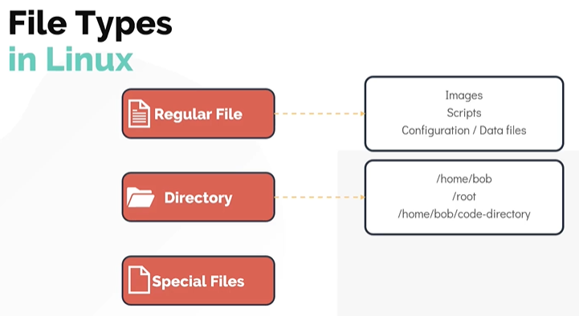
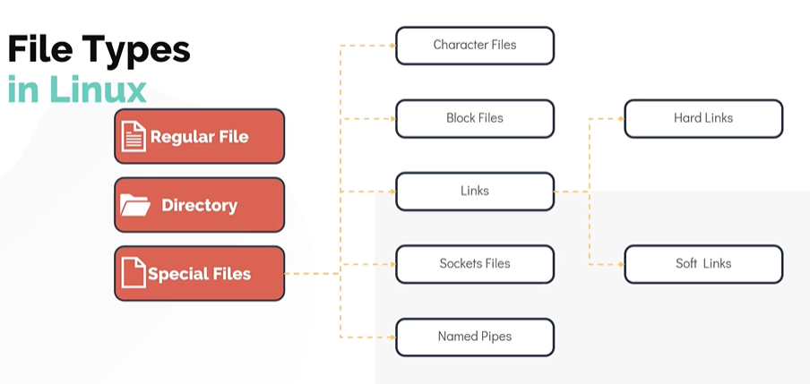
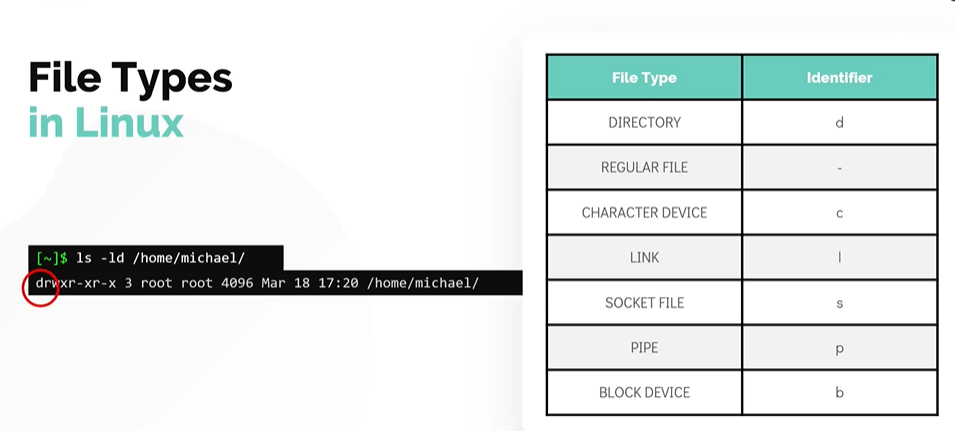

# File Types in Linux

# Linux 中的文件类型

- Take me to the [Video Tutorial](https://kodekloud.com/topic/file-types/)

In this section, we will take a look at the different types of files in Linux, and learn how to identify them from the command line.

在本节中，我们将了解 Linux 中不同类型的文件，并学习如何从命令行识别它们。

---

## Everything is a File in Linux

## Linux 中一切皆文件

One of the most fundamental principles of Linux (inherited from Unix) is: **"Everything is a file."**

Linux（继承自 Unix）最基本的原则之一是：**"一切皆文件。"**

This means that in Linux, every object — regular documents, directories, hardware devices, network sockets, and inter-process communication channels — is represented as a file in the filesystem. This design provides a **uniform interface**: you can use the same tools (`cat`, `read`, `write`) to interact with a text file, a hard disk, a keyboard, or a network socket.

这意味着在 Linux 中，每个对象——普通文档、目录、硬件设备、网络套接字和进程间通信通道——都以文件的形式在文件系统中表示。这种设计提供了**统一接口**：你可以使用相同的工具（`cat`、`read`、`write`）与文本文件、硬盘、键盘或网络套接字进行交互。

---

## The 7 File Types in Linux

## Linux 中的 7 种文件类型



Linux has **7 distinct file types**, which fall into three broad categories:

Linux 有 **7 种不同的文件类型**，分为三大类：

```
All File Types / 所有文件类型
├── 1. Regular File (-)        普通文件
├── 2. Directory (d)           目录
└── Special Files / 特殊文件
    ├── 3. Character File (c)  字符设备文件
    ├── 4. Block File (b)      块设备文件
    ├── 5. Symbolic Link (l)   符号链接
    ├── 6. Socket (s)          套接字
    └── 7. Named Pipe (p)      命名管道
```

---

### 1. Regular Files / 普通文件 (`-`)

Regular files are the most common type. They contain data in some form:

普通文件是最常见的类型，以某种形式包含数据：

- **Text files** — scripts, config files, source code / 文本文件——脚本、配置文件、源代码
- **Binary files** — executables, compiled programs / 二进制文件——可执行文件、编译程序
- **Image files** — `.jpg`, `.png`, `.gif` / 图像文件
- **Archive files** — `.tar`, `.zip`, `.gz` / 归档文件
- **Data files** — `.csv`, `.sqlite`, `.log` / 数据文件

```bash
# Examples / 示例
/etc/passwd          # Text configuration file / 文本配置文件
/bin/ls              # Binary executable / 二进制可执行文件
/home/user/photo.jpg # Image file / 图像文件
```

---

### 2. Directories / 目录 (`d`)

A directory is a **special file that contains a list of other files** (and their inode numbers). Directories are the building blocks of the filesystem hierarchy.

目录是一种**包含其他文件列表**（及其 inode 编号）的特殊文件。目录是文件系统层次结构的基本构建块。

```bash
# Examples / 示例
/home/michael/       # User home directory / 用户家目录
/etc/               # Configuration files directory / 配置文件目录
/usr/bin/           # User binary directory / 用户二进制目录
```

> **Directories are files too / 目录也是文件**: Technically, a directory is a file whose content is a table mapping filenames to inode numbers. When you `ls` a directory, Linux reads this table.
>
> 从技术上说，目录是一个内容为文件名到 inode 编号映射表的文件。当你 `ls` 一个目录时，Linux 读取这张表。

---

### 3. Character Device Files / 字符设备文件 (`c`)

Character device files represent hardware devices that **transfer data character by character** (one byte at a time), without buffering. They are located under the `/dev/` filesystem.

字符设备文件代表**逐字符传输数据**（一次一个字节）、不使用缓冲的硬件设备。它们位于 `/dev/` 文件系统下。

**Examples / 示例:**

- `/dev/tty` — terminal device / 终端设备
- `/dev/ttyS0` — serial port (COM1) / 串口（COM1）
- `/dev/null` — null device (discards all input) / 空设备（丢弃所有输入）
- `/dev/zero` — zero device (outputs zeros) / 零设备（输出零字节）
- `/dev/random` — random number generator / 随机数生成器
- `/dev/input/mouse0` — mouse / 鼠标
- `/dev/input/keyboard` — keyboard / 键盘

```bash
# Check /dev/null — a classic character device / 检查 /dev/null——经典字符设备
$ ls -l /dev/null
crw-rw-rw- 1 root root 1, 3 Mar 28 09:00 /dev/null
│
└── 'c' = character device / 'c' 表示字符设备
```

---

### 4. Block Device Files / 块设备文件 (`b`)

Block device files represent hardware devices that **transfer data in fixed-size blocks**, with kernel-level buffering. Storage devices are the primary examples.

块设备文件代表以**固定大小块传输数据**、具有内核级缓冲的硬件设备。存储设备是主要例子。

**Examples / 示例:**

- `/dev/sda` — first SCSI/SATA hard disk / 第一块 SCSI/SATA 硬盘
- `/dev/sda1` — first partition of `/dev/sda` / `/dev/sda` 的第一个分区
- `/dev/nvme0n1` — first NVMe SSD / 第一块 NVMe SSD
- `/dev/sr0` — CD/DVD-ROM drive / 光驱

```bash
$ ls -l /dev/sda
brw-rw---- 1 root disk 8, 0 Mar 28 09:00 /dev/sda
│
└── 'b' = block device / 'b' 表示块设备
```

> **Character vs Block / 字符设备 vs 块设备**:
>
> - **Character**: Stream-based, no buffering, read/write one byte at a time / 流式，无缓冲，一次读写一个字节
> - **Block**: Block-based (e.g., 512 bytes or 4096 bytes), with kernel cache buffer / 块式（如 512 或 4096 字节），有内核缓存缓冲



---

### 5. Symbolic Links (Soft Links) / 符号链接（软链接）(`l`)

A symbolic link (symlink) is a file that **points to another file or directory** by name. It's similar to a Windows shortcut.

符号链接（软链接）是一个**通过名称指向另一个文件或目录**的文件，类似于 Windows 的快捷方式。

```bash
# Create a symbolic link / 创建符号链接
$ ln -s /etc/nginx/nginx.conf ~/nginx.conf

# View the link / 查看链接
$ ls -l ~/nginx.conf
lrwxrwxrwx 1 user user 20 Mar 28 ~/nginx.conf -> /etc/nginx/nginx.conf
│
└── 'l' = symbolic link / 'l' 表示符号链接

# Common system symlinks / 常见系统符号链接
$ ls -l /sbin/init
lrwxrwxrwx 1 root root 20 Jan 14 /sbin/init -> /lib/systemd/systemd
```

> **Hard Link vs Soft Link / 硬链接 vs 软链接**:
>
> | Feature / 特性                                                | Hard Link / 硬链接                                     | Soft Link / 软链接                |
> | ------------------------------------------------------------- | ------------------------------------------------------ | --------------------------------- |
> | Points to / 指向                                              | Inode (data) directly / 直接指向 inode（数据）         | Filename (path) / 文件名（路径）  |
> | Works across filesystems / 跨文件系统                         | No / 不支持                                            | Yes / 支持                        |
> | Works for directories / 用于目录                              | No / 不支持                                            | Yes / 支持                        |
> | Still works if target moved/deleted / 目标移动/删除后是否有效 | Yes (data persists) / 是（数据保留）                   | No (broken link) / 否（链接失效） |
> | `ls -l` indicator / `ls -l` 标识                          | Same as regular file (`-`) / 与普通文件相同（`-`） | `l`                             |

```bash
# Create hard link / 创建硬链接
$ ln /etc/hosts ~/hosts_hardlink

# Create soft link / 创建软链接
$ ln -s /etc/hosts ~/hosts_softlink
```

---

### 6. Sockets / 套接字 (`s`)

A socket is a special file that enables **bidirectional communication between two processes** on the same system. Unlike network sockets (which use IP addresses), Unix domain sockets use filesystem paths.

套接字是一种允许**同一系统上两个进程之间双向通信**的特殊文件。与使用 IP 地址的网络套接字不同，Unix 域套接字使用文件系统路径。

**Examples / 示例:**

- `/var/run/docker.sock` — Docker daemon socket / Docker 守护进程套接字
- `/run/mysqld/mysqld.sock` — MySQL socket / MySQL 套接字
- `/tmp/.X11-unix/X0` — X11 display server socket / X11 显示服务器套接字
- `/run/systemd/private/journal.socket` — journald socket / journald 套接字

```bash
$ ls -l /var/run/docker.sock
srw-rw---- 1 root docker 0 Mar 28 09:00 /var/run/docker.sock
│
└── 's' = socket / 's' 表示套接字
```

---

### 7. Named Pipes (FIFOs) / 命名管道（FIFO）(`p`)

A named pipe (also called FIFO — First In, First Out) is a special file that allows **one-directional data flow** between processes. Unlike regular pipes (`|`) that exist only for the life of a command, named pipes persist in the filesystem.

命名管道（也称为 FIFO——先进先出）是一种允许进程之间**单向数据流**的特殊文件。与只在命令生命周期内存在的普通管道（`|`）不同，命名管道在文件系统中持久存在。

```bash
# Create a named pipe / 创建命名管道
$ mkfifo mypipe

$ ls -l mypipe
prw-r--r-- 1 user user 0 Mar 28 10:00 mypipe
│
└── 'p' = named pipe / 'p' 表示命名管道

# Use a named pipe: terminal 1 writes, terminal 2 reads
# 使用命名管道：终端1写入，终端2读取
# Terminal 1 / 终端 1:
$ echo "hello" > mypipe

# Terminal 2 / 终端 2:
$ cat mypipe
hello
```

---

## Identifying File Types

## 识别文件类型

### Method 1: `file` Command / 方法一：`file` 命令

The `file` command examines the **file contents** to determine the file type (more reliable than just looking at the extension):

`file` 命令通过检查**文件内容**来确定文件类型（比查看扩展名更可靠）：

```bash
$ file /home/michael
/home/michael: directory

$ file /home/michael/bash-script.sh
/home/michael/bash-script.sh: Bourne-Again shell script, ASCII text executable

$ file /home/michael/bash-script     # No extension / 无扩展名
/home/michael/bash-script: ELF 64-bit LSB executable, x86-64, ...

$ file insync1000.sock
insync1000.sock: socket

$ file /dev/sda
/dev/sda: block special (8/0)

$ file /dev/tty
/dev/tty: character special (5/0)

$ file /bin/ls
/bin/ls: ELF 64-bit LSB shared object, x86-64, version 1 (SYSV), dynamically linked

# Check multiple files at once / 一次检查多个文件
$ file /etc/passwd /bin/bash /dev/null /var/run/docker.sock
/etc/passwd:          ASCII text
/bin/bash:            ELF 64-bit LSB shared object, x86-64, ...
/dev/null:            character special (1/3)
/var/run/docker.sock: socket
```

### Method 2: `ls -l` Command / 方法二：`ls -l` 命令

The first character of the permissions string in `ls -l` output indicates the file type:

`ls -l` 输出中权限字符串的第一个字符表示文件类型：

```bash
$ ls -ld /home/michael
drwxr-xr-x 15 michael michael 4096 Mar 28 09:00 /home/michael
│
└── 'd' = directory / 'd' 表示目录

$ ls -l /etc/passwd
-rw-r--r-- 1 root root 2345 Mar 28 09:00 /etc/passwd
│
└── '-' = regular file / '-' 表示普通文件
```



**File type indicators / 文件类型标识符:**

| First Character / 第一个字符 | File Type / 文件类型        | Example / 示例           |
| ---------------------------- | --------------------------- | ------------------------ |
| `-`                        | Regular file / 普通文件     | `/etc/passwd`          |
| `d`                        | Directory / 目录            | `/home/michael`        |
| `c`                        | Character device / 字符设备 | `/dev/tty`             |
| `b`                        | Block device / 块设备       | `/dev/sda`             |
| `l`                        | Symbolic link / 符号链接    | `/sbin/init`           |
| `s`                        | Socket / 套接字             | `/var/run/docker.sock` |
| `p`                        | Named pipe / 命名管道       | `mypipe`               |

### Method 3: `stat` Command / 方法三：`stat` 命令

The `stat` command provides **detailed metadata** about a file, including its type:

`stat` 命令提供关于文件的**详细元数据**，包括其类型：

```bash
$ stat /etc/passwd
  File: /etc/passwd
  Size: 2345            Blocks: 8          IO Block: 4096   regular file
Device: 802h/2050d      Inode: 524294      Links: 1
Access: (0644/-rw-r--r--)  Uid: (    0/    root)   Gid: (    0/    root)
Access: 2026-03-28 09:00:00
Modify: 2026-03-20 14:30:00
Change: 2026-03-20 14:30:00

$ stat /home/michael
  File: /home/michael
  Size: 4096            Blocks: 8          IO Block: 4096   directory
```

---

## Summary

## 小结

| Type / 类型                 | Symbol / 符号 | Description / 描述                                        | Example / 示例           |
| --------------------------- | ------------- | --------------------------------------------------------- | ------------------------ |
| Regular file / 普通文件     | `-`         | Text, binary, images, archives / 文本、二进制、图像、归档 | `/etc/passwd`          |
| Directory / 目录            | `d`         | Container for files / 文件容器                            | `/home/michael`        |
| Character device / 字符设备 | `c`         | Stream-based hardware / 流式硬件                          | `/dev/tty`             |
| Block device / 块设备       | `b`         | Block-based storage / 块式存储                            | `/dev/sda`             |
| Symbolic link / 符号链接    | `l`         | Pointer to another file/dir / 指向其他文件/目录的指针     | `/sbin/init`           |
| Socket / 套接字             | `s`         | IPC between processes / 进程间通信                        | `/var/run/docker.sock` |
| Named pipe / 命名管道       | `p`         | One-direction IPC / 单向进程间通信                        | `mypipe`               |

**Identification commands / 识别命令:**

```bash
$ file <path>        # Best for content-based detection / 最适合基于内容的检测
$ ls -l <path>       # Quick check via first character / 通过第一个字符快速检查
$ stat <path>        # Full metadata including type / 包含类型的完整元数据
```
