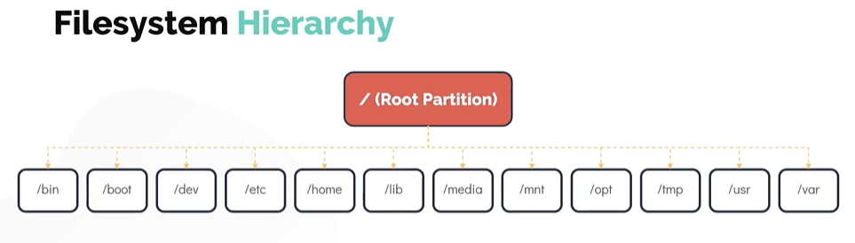

# Filesystem Hierarchy
# 文件系统层级结构

- Take me to the [Video Tutorial](https://kodekloud.com/topic/filesystem-hierarchy/)

In this section, we will take a look at the **Filesystem Hierarchy Standard (FHS)** — the standard that defines the directory structure and contents of Linux systems.

在本节中，我们将了解**文件系统层次结构标准（FHS）**——定义 Linux 系统目录结构和内容的标准。

---

## The Linux Filesystem Structure
## Linux 文件系统结构

Linux uses a **single-rooted, inverted tree-like filesystem**. Everything starts from the root directory **`/`** — all files, directories, devices, and mounted filesystems are accessible from this single root.

Linux 使用**单根、倒置树形文件系统**。一切都从根目录 **`/`** 开始——所有文件、目录、设备和已挂载的文件系统都可以从这个单一根目录访问。

This is fundamentally different from Windows, which uses drive letters (`C:\`, `D:\`). In Linux, even external drives, USB sticks, and network shares are mounted as subdirectories within this single tree.

这与 Windows 使用盘符（`C:\`、`D:\`）的方式根本不同。在 Linux 中，即使是外部驱动器、USB 盘和网络共享也作为子目录挂载在这棵单一目录树中。

```
/                          ← Root of everything / 万物之根
├── bin/                   ← Essential user binaries / 基本用户程序
├── boot/                  ← Boot loader files / 引导加载程序文件
├── dev/                   ← Device files / 设备文件
├── etc/                   ← System configuration / 系统配置
├── home/                  ← User home directories / 用户家目录
│   ├── alice/
│   └── bob/
├── lib/                   ← Essential shared libraries / 基本共享库
├── media/                 ← Removable media mount points / 可移动媒体挂载点
├── mnt/                   ← Temporary mount points / 临时挂载点
├── opt/                   ← Optional/third-party software / 可选/第三方软件
├── proc/                  ← Virtual filesystem for processes / 进程虚拟文件系统
├── root/                  ← Root user's home / root 用户的家目录
├── run/                   ← Runtime data / 运行时数据
├── sbin/                  ← System binaries / 系统程序
├── srv/                   ← Service data / 服务数据
├── sys/                   ← Virtual filesystem for kernel / 内核虚拟文件系统
├── tmp/                   ← Temporary files / 临时文件
├── usr/                   ← User programs and data / 用户程序和数据
│   ├── bin/
│   ├── lib/
│   ├── local/
│   └── share/
└── var/                   ← Variable data / 可变数据
    ├── log/
    ├── mail/
    └── www/
```



---

## Key Directories Explained
## 关键目录详解

### `/` — Root Directory / 根目录

The starting point of the entire filesystem hierarchy. Every file and directory on the system is accessible from here.

整个文件系统层次结构的起点。系统上的每个文件和目录都可以从这里访问。

```bash
$ ls /
bin  boot  dev  etc  home  lib  lib64  media  mnt  opt  proc  root
run  sbin  srv  sys  tmp  usr  var
```

---

### `/home` — User Home Directories / 用户家目录

Contains the personal directories of all **regular users**. Each user gets their own subdirectory.

包含所有**普通用户**的个人目录。每个用户都有自己的子目录。

```bash
/home/
├── alice/      # alice's personal files / alice 的个人文件
├── bob/        # bob's personal files / bob 的个人文件
└── charlie/    # charlie's personal files / charlie 的个人文件
```

> **Exception / 例外**: The `root` user's home directory is **`/root`**, not `/home/root`. This is intentional — even if `/home` is on a separate partition that fails to mount, root can still log in.
>
> `root` 用户的家目录是 **`/root`**，而不是 `/home/root`。这是有意为之的——即使 `/home` 所在的独立分区挂载失败，root 用户仍然可以登录。

---

### `/root` — Root User's Home / root 用户的家目录

The home directory for the **superuser (root)**. Kept separate from `/home` for security and reliability.

**超级用户（root）**的家目录。出于安全和可靠性原因，与 `/home` 分开存放。

```bash
$ sudo ls /root
# Only accessible with root privileges / 只能以 root 权限访问
```

---

### `/bin` — Essential User Binaries / 基本用户程序

Contains **essential command-line programs** that must be available even in single-user mode or when `/usr` is not mounted. These are commands every user needs.

包含**基本命令行程序**，即使在单用户模式下或 `/usr` 未挂载时也必须可用。这些是每个用户都需要的命令。

```bash
/bin/ls    /bin/cp    /bin/mv    /bin/rm    /bin/mkdir
/bin/cat   /bin/echo  /bin/bash  /bin/grep  /bin/chmod
```

> **Modern Linux / 现代 Linux**: On many modern distributions (Ubuntu 20.04+, Debian 10+), `/bin` is a **symlink** to `/usr/bin`, merging both directories.
>
> 在许多现代发行版（Ubuntu 20.04+、Debian 10+）中，`/bin` 是指向 `/usr/bin` 的**符号链接**，两个目录已合并。

---

### `/sbin` — System Binaries / 系统程序

Contains binaries for **system administration** tasks, typically only run by root.

包含用于**系统管理**任务的程序，通常只由 root 运行。

```bash
/sbin/init      # System init / 系统初始化
/sbin/fdisk     # Disk partition tool / 磁盘分区工具
/sbin/ifconfig  # Network interface config / 网络接口配置
/sbin/iptables  # Firewall management / 防火墙管理
/sbin/fsck      # Filesystem check / 文件系统检查
/sbin/reboot    # Reboot the system / 重启系统
```

---

### `/etc` — Configuration Files / 配置文件

The **central configuration directory** for the entire system. Almost all system-wide configuration files live here. Stands for **"Editable Text Configuration"** (historically "et cetera").

整个系统的**中央配置目录**。几乎所有系统范围的配置文件都在这里。代表**"可编辑文本配置"**（历史上是"et cetera/等等"的缩写）。

```bash
/etc/passwd         # User account information / 用户账号信息
/etc/shadow         # Encrypted passwords / 加密密码
/etc/group          # Group information / 组信息
/etc/hostname       # System hostname / 系统主机名
/etc/hosts          # Static hostname-to-IP mapping / 静态主机名到IP映射
/etc/fstab          # Filesystem mount table / 文件系统挂载表
/etc/resolv.conf    # DNS resolver configuration / DNS 解析器配置
/etc/ssh/           # SSH server and client config / SSH 服务器和客户端配置
/etc/nginx/         # Nginx web server config / Nginx Web 服务器配置
/etc/apt/           # APT package manager config / APT 包管理器配置
/etc/crontab        # System cron jobs / 系统计划任务
/etc/sudoers        # sudo privileges / sudo 权限配置
/etc/systemd/       # systemd unit files and config / systemd 单元文件和配置
```

> **Important / 重要**: Files in `/etc` are **text files** that can be edited with any text editor. Always make a backup before editing system configuration files: `sudo cp /etc/fstab /etc/fstab.bak`
>
> `/etc` 中的文件是**文本文件**，可以用任何文本编辑器编辑。在编辑系统配置文件之前，始终先备份：`sudo cp /etc/fstab /etc/fstab.bak`

---

### `/opt` — Optional Software / 可选软件

Used for **third-party or optional software** that is not part of the standard distribution. Software installed here is typically self-contained in its own subdirectory.

用于**第三方或可选软件**，这些软件不是标准发行版的一部分。此处安装的软件通常包含在自己的子目录中，自成一体。

```bash
/opt/google/chrome/    # Google Chrome / 谷歌浏览器
/opt/obs-studio/       # OBS Studio
/opt/pycharm/          # JetBrains PyCharm
/opt/cisco/            # Cisco VPN client / 思科 VPN 客户端
/opt/caleston-code/    # Custom company software / 公司自定义软件
```

> **When to use `/opt` / 何时使用 `/opt`**: Install software here when:
> - It doesn't fit the standard package manager (apt/yum) / 不适合标准包管理器（apt/yum）
> - It needs to be isolated from system files / 需要与系统文件隔离
> - It's a commercial/proprietary application / 是商业/专有应用程序
>
> 以下情况安装到 `/opt`：不适合标准包管理器、需要与系统文件隔离、是商业/专有应用程序。

---

### `/mnt` and `/media` — Mount Points / 挂载点

**`/mnt`** — The default mount point for **temporarily mounting** filesystems. Typically used by system administrators.

**`/mnt`** — **临时挂载**文件系统的默认挂载点，通常由系统管理员使用。

```bash
# Manually mount a partition / 手动挂载分区
$ sudo mount /dev/sdb1 /mnt
$ ls /mnt   # access the mounted filesystem / 访问已挂载的文件系统
$ sudo umount /mnt
```

**`/media`** — Where **removable media** is automatically mounted by the system (e.g., USB drives, CD-ROMs, SD cards).

**`/media`** — 系统自动挂载**可移动媒体**的位置（如 USB 驱动器、CD-ROM、SD 卡）。

```bash
/media/username/USB_DRIVE/    # Auto-mounted USB drive / 自动挂载的 USB 驱动器
/media/username/CDROM/        # CD-ROM / 光盘
```

---

### `/tmp` — Temporary Files / 临时文件

A directory for **temporary files** created by applications and users. Files here are typically deleted on reboot (or by a cleanup daemon).

用于存放应用程序和用户创建的**临时文件**的目录。这里的文件通常在重启时（或由清理守护进程）删除。

```bash
# World-writable (any user can write here) / 所有用户都可写
$ ls -ld /tmp
drwxrwxrwt 15 root root 4096 Mar 28 09:00 /tmp
#        t ← sticky bit: only owner can delete their own files
#        t ← 粘滞位：只有所有者才能删除自己的文件
```

> **Warning / 警告**: Do NOT store important data in `/tmp`. It is cleared on reboot and may be cleared at any time.
>
> 不要在 `/tmp` 中存储重要数据。它在重启时被清除，随时可能被清空。

---

### `/dev` — Device Files / 设备文件

Contains **special device files** that represent hardware and virtual devices. These are not regular files — accessing them interacts with the kernel and hardware.

包含代表硬件和虚拟设备的**特殊设备文件**。这些不是普通文件——访问它们会与内核和硬件进行交互。

```bash
/dev/sda          # First hard disk / 第一块硬盘
/dev/sda1         # First partition of sda / sda 的第一个分区
/dev/nvme0n1      # First NVMe SSD / 第一块 NVMe SSD
/dev/tty          # Current terminal / 当前终端
/dev/null         # Null device / 空设备
/dev/zero         # Zero device / 零设备
/dev/random       # Random number generator / 随机数生成器
/dev/urandom      # Non-blocking random generator / 非阻塞随机数生成器
/dev/loop0        # Loop device (for mounting ISO files) / 回环设备（用于挂载 ISO 文件）
```

---

### `/lib` and `/lib64` — Shared Libraries / 共享库

Contains **shared libraries** (similar to Windows DLLs) that are needed by programs in `/bin` and `/sbin`.

包含 `/bin` 和 `/sbin` 中程序所需的**共享库**（类似于 Windows 的 DLL 文件）。

```bash
/lib/x86_64-linux-gnu/libc.so.6    # C standard library / C 标准库
/lib/x86_64-linux-gnu/libm.so.6    # Math library / 数学库
/lib/modules/                       # Kernel modules / 内核模块
```

---

### `/usr` — User Programs and Data / 用户程序和数据

In modern Linux, `/usr` is the **primary location for user-installed software** and its supporting data. It contains the bulk of the system's programs.

在现代 Linux 中，`/usr` 是**用户安装软件**及其支持数据的**主要位置**，包含系统中大部分程序。

```bash
/usr/bin/          # Most user commands / 大多数用户命令
/usr/sbin/         # Non-essential system admin commands / 非必要系统管理命令
/usr/lib/          # Libraries for /usr/bin programs / /usr/bin 程序的库
/usr/local/        # Locally compiled/installed software / 本地编译/安装的软件
/usr/local/bin/    # Local user binaries / 本地用户程序
/usr/share/        # Architecture-independent data / 与架构无关的数据
/usr/share/man/    # Manual pages / 手册页
/usr/share/doc/    # Package documentation / 包文档
/usr/include/      # Header files for development / 开发用头文件
```

> **Historical note / 历史背景**: In early Unix, `/usr` stood for "User" and contained user home directories. Over time, it evolved to contain system programs, and home directories moved to `/home`. Today `/usr` effectively means "Unix System Resources".
>
> 在早期 Unix 中，`/usr` 代表"用户"，包含用户家目录。随着时间推移，它演变为包含系统程序，而家目录则移到了 `/home`。今天 `/usr` 实际上代表"Unix 系统资源"。

---

### `/var` — Variable Data / 可变数据

Contains **files that are expected to grow or change** continuously during normal system operation.

包含在正常系统运行过程中**预期会持续增长或变化**的文件。

```bash
/var/log/           # System and application log files / 系统和应用程序日志文件
/var/log/syslog     # General system log / 通用系统日志
/var/log/auth.log   # Authentication log / 认证日志
/var/log/kern.log   # Kernel log / 内核日志
/var/log/nginx/     # Nginx access and error logs / Nginx 访问和错误日志
/var/mail/          # User mailboxes / 用户邮箱
/var/spool/         # Spooled data (print jobs, cron, etc.) / 假脱机数据（打印作业、计划任务等）
/var/www/           # Web server document root / Web 服务器文档根目录
/var/cache/         # Application cache data / 应用程序缓存数据
/var/tmp/           # Temporary files that persist across reboots / 跨重启保留的临时文件
/var/run/ → /run    # Runtime data (PIDs, sockets) / 运行时数据（PID、套接字）
```

---

### `/proc` and `/sys` — Virtual Filesystems / 虚拟文件系统

These directories don't contain real files on disk — they are **virtual filesystems** that expose kernel and process information as files.

这些目录不包含磁盘上的真实文件——它们是将内核和进程信息以文件形式展示的**虚拟文件系统**。

```bash
# Process information / 进程信息
$ cat /proc/1/status      # Info about PID 1 (systemd) / PID 1 的信息
$ cat /proc/cpuinfo       # CPU information / CPU 信息
$ cat /proc/meminfo       # Memory information / 内存信息
$ cat /proc/version       # Kernel version / 内核版本
$ cat /proc/uptime        # System uptime / 系统运行时间
$ ls /proc/               # Each numbered dir is a process ID / 每个数字目录是一个进程 ID

# Kernel/hardware parameters / 内核/硬件参数
$ cat /sys/class/net/eth0/speed   # Network interface speed / 网卡速度
$ ls /sys/block/                  # Block devices / 块设备
```

---

## Viewing Mounted Filesystems
## 查看已挂载的文件系统

Use the `df` (disk filesystem) command to see all mounted filesystems and their usage:

使用 `df`（磁盘文件系统）命令查看所有已挂载的文件系统及其使用情况：

```bash
# Human-readable, POSIX format / 易读格式，POSIX 格式
$ df -hP

# Show filesystem types / 显示文件系统类型
$ df -hT

# Show inode usage / 显示 inode 使用情况
$ df -i

# Show a specific filesystem / 显示特定文件系统
$ df -h /home
```

**Example output / 示例输出:**
```
Filesystem      Size  Used Avail Use% Mounted on
/dev/sda1        49G   15G   32G  32% /
tmpfs           7.8G     0  7.8G   0% /dev/shm
/dev/sda5       976M  100M  810M  11% /boot
/dev/sdb1        30G   10G   20G  33% /home
```

---

## Summary — Filesystem Hierarchy Quick Reference
## 小结 — 文件系统层级快速参考

| Directory / 目录 | Purpose / 用途 | Examples / 示例 |
|---|---|---|
| `/` | Root of filesystem / 文件系统根目录 | Everything starts here / 一切从这里开始 |
| `/home` | Regular user home directories / 普通用户家目录 | `/home/bob`, `/home/alice` |
| `/root` | Root user's home / root 用户家目录 | Accessed with sudo / 用 sudo 访问 |
| `/bin` | Essential user commands / 基本用户命令 | `ls`, `cp`, `bash` |
| `/sbin` | System admin commands / 系统管理命令 | `fdisk`, `ifconfig` |
| `/etc` | System configuration files / 系统配置文件 | `passwd`, `fstab`, `ssh/` |
| `/opt` | Third-party software / 第三方软件 | Google Chrome, custom apps |
| `/mnt` | Temporary manual mounts / 临时手动挂载 | `mount /dev/sdb1 /mnt` |
| `/media` | Auto-mounted removable media / 自动挂载的可移动媒体 | USB drives, CD-ROMs |
| `/tmp` | Temporary files (cleared on reboot) / 临时文件（重启后清除）| App temp files |
| `/dev` | Device files / 设备文件 | `/dev/sda`, `/dev/null` |
| `/lib` | Essential shared libraries / 基本共享库 | `libc.so`, kernel modules |
| `/usr` | User programs and data / 用户程序和数据 | `/usr/bin`, `/usr/share` |
| `/var` | Variable/growing data / 可变/增长数据 | Logs, mail, web files |
| `/proc` | Process info virtual FS / 进程信息虚拟文件系统 | `/proc/cpuinfo` |
| `/sys` | Kernel/hardware virtual FS / 内核/硬件虚拟文件系统 | `/sys/class/net/` |
| `/boot` | Boot loader files / 引导加载程序文件 | GRUB, kernel images |
| `/run` | Runtime data (PIDs, sockets) / 运行时数据 | systemd sockets |

```bash
# Key command / 关键命令
$ df -hP    # Show all mounted filesystems / 显示所有已挂载的文件系统
```
