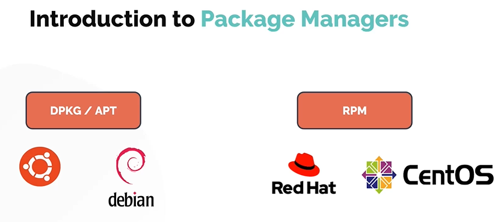
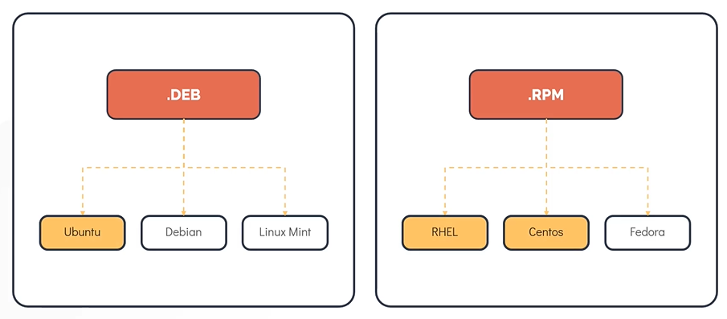
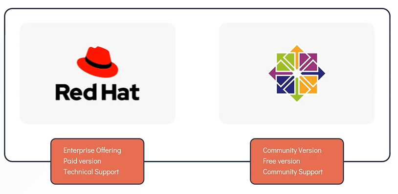
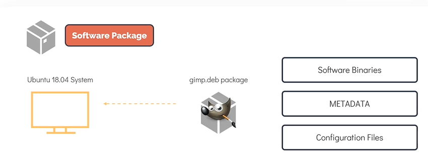
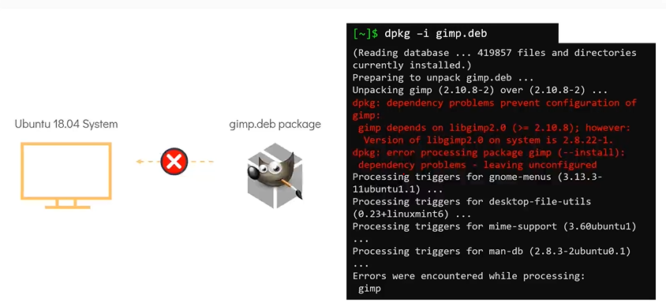
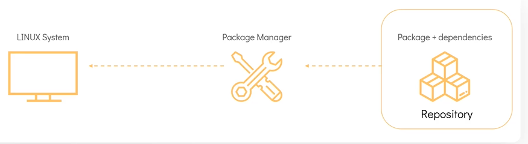
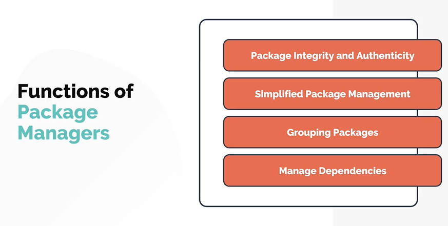
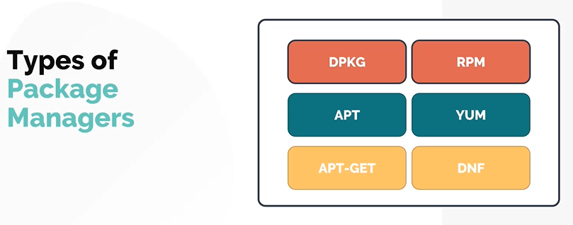

# Package Management & Linux Distributions
# 包管理与 Linux 发行版

- Take me to the [Video Tutorial](https://kodekloud.com/topic/package-management-introduction/)

In this section, we will take a look at Linux package management tools used in different Linux distributions, starting with an introduction to what packages and package managers are, and why they matter.

在本节中，我们将了解不同 Linux 发行版中使用的包管理工具，从包和包管理器的基本概念开始，理解它们为何如此重要。

---

## Linux Distributions and Package Managers
## Linux 发行版与包管理器

There are **hundreds of Linux distributions** in use today. One of the most common ways to categorize them is by the **package manager** they use.

目前有**数百种 Linux 发行版**在使用。对它们进行分类的最常见方式之一是按所使用的**包管理器**。



### The Two Major Package Ecosystems / 两大包管理生态系统



| Family / 系列 | Package Format / 包格式 | Low-level Tool / 底层工具 | High-level Tool / 高层工具 | Distributions / 发行版 |
|---|---|---|---|---|
| **Red Hat / RPM** | `.rpm` | `rpm` | `yum` / `dnf` | RHEL, CentOS, Fedora, Rocky Linux, AlmaLinux |
| **Debian / DEB** | `.deb` | `dpkg` | `apt` / `apt-get` | Debian, Ubuntu, Linux Mint, Pop!_OS, Kali Linux |

> **Other package managers / 其他包管理器**: There are also distribution-specific tools like `pacman` (Arch Linux), `zypper` (openSUSE), `emerge` (Gentoo), and universal formats like `snap`, `flatpak`, and `AppImage` that work across distributions.
>
> 还有一些发行版特定工具，如 `pacman`（Arch Linux）、`zypper`（openSUSE）、`emerge`（Gentoo），以及跨发行版通用格式，如 `snap`、`flatpak` 和 `AppImage`。

---

## RHEL vs CentOS — What's the Difference?
## RHEL 与 CentOS 的区别



| Feature / 特性 | RHEL | CentOS (Classic) | Rocky Linux / AlmaLinux |
|---|---|---|---|
| Full name / 全称 | Red Hat Enterprise Linux | Community ENTerprise OS | Community RHEL rebuilds |
| Cost / 费用 | Paid (subscription) / 付费（订阅制）| Free / 免费 | Free / 免费 |
| Support / 支持 | Official Red Hat support / 官方 Red Hat 支持 | Community only / 仅社区支持 | Community + commercial options |
| Use case / 用途 | Enterprise production / 企业生产环境 | Dev/test/budget servers / 开发/测试/低成本服务器 | RHEL replacement after CentOS 8 EOL |
| Package compatibility / 包兼容性 | Source of truth / 标准来源 | Binary compatible with RHEL / 与 RHEL 二进制兼容 | Binary compatible with RHEL |

> **CentOS in 2024+ / 2024 年以后的 CentOS**: Red Hat discontinued CentOS Linux (the RHEL rebuild) in 2021. CentOS Stream is now a **rolling preview** of the next RHEL release — upstream rather than downstream. Rocky Linux and AlmaLinux emerged as the main community RHEL-compatible replacements.
>
> Red Hat 于 2021 年停止了 CentOS Linux（RHEL 重建版）。CentOS Stream 现在是下一个 RHEL 版本的**滚动预览**——位于上游而非下游。Rocky Linux 和 AlmaLinux 成为社区中主要的 RHEL 兼容替代品。

---

## What is a Package?
## 什么是软件包？

A **package** is a compressed archive that contains **all the files required** by a particular software to run on a Linux system.

**软件包**是一个压缩归档文件，包含特定软件在 Linux 系统上运行所需的**所有文件**。



**A typical package contains / 一个典型的软件包包含：**

| Content / 内容 | Description / 说明 |
|---|---|
| Executable binaries / 可执行文件 | The actual program files / 实际程序文件 |
| Configuration files / 配置文件 | Default config files for the software / 软件的默认配置文件 |
| Libraries / 库文件 | Shared libraries the program needs / 程序所需的共享库 |
| Documentation / 文档 | Man pages, README files / 手册页、README 文件 |
| Metadata / 元数据 | Package name, version, description, dependencies / 包名、版本、描述、依赖关系 |
| Pre/Post scripts / 安装前后脚本 | Scripts run before/after installation / 安装前/后运行的脚本 |

**Example / 示例**: To install the **GIMP** (GNU Image Manipulation Program) image editor on Ubuntu, we use the `gimp.deb` package, which contains all the software binaries, configuration files, and metadata needed for GIMP to run.

**示例**：要在 Ubuntu 上安装 **GIMP**（GNU 图像处理程序）图像编辑器，我们使用 `gimp.deb` 包，其中包含 GIMP 运行所需的所有软件二进制文件、配置文件和元数据。

---

## The Dependency Problem
## 依赖问题

Installing a package sounds simple — just download and install it. So why do we need a package manager?

安装软件包听起来很简单——只需下载并安装。那么为什么我们需要包管理器呢？

The answer is **dependencies**. Modern software rarely runs in isolation. Almost every program relies on other libraries and components — these are called **dependencies**.

答案是**依赖关系**。现代软件很少单独运行。几乎每个程序都依赖其他库和组件——这些被称为**依赖项**。

**Example / 示例**: Trying to install `gimp.deb` manually without a package manager:

**示例**：尝试在没有包管理器的情况下手动安装 `gimp.deb`：

```
Error: Dependency is not satisfiable: libgegl-0.4-0 (>= 0.4.18)
Error: Dependency is not satisfiable: libmypaint-1.5-1 (>= 1.5.0)
Error: Dependency is not satisfiable: libpoppler-glib8 (>= 0.62.0)
...
```



**The dependency chain problem / 依赖链问题:**

```
gimp
├── requires libgegl-0.4-0
│   ├── requires libjson-glib-1.0-0
│   │   └── requires libglib2.0-0
│   └── requires libgraphene-1.0-0
├── requires libmypaint-1.5-1
│   └── requires libjson-glib-1.0-0  ← (same as above)
└── requires libpoppler-glib8
    └── requires libglib2.0-0        ← (same as above)
```

Each dependency may have its own dependencies, creating a complex tree. Managing this manually is **error-prone and extremely tedious**. This is exactly where a **Package Manager** saves the day.

每个依赖项可能有自己的依赖项，形成一棵复杂的树。手动管理这些依赖是**容易出错且极其繁琐**的。这正是**包管理器**大显身手的地方。

---

## What is a Package Manager?
## 什么是包管理器？

A **package manager** is software that provides a **consistent and automated process** for installing, upgrading, configuring, and removing packages from the operating system.

**包管理器**是为操作系统提供**一致且自动化流程**的软件，用于安装、升级、配置和删除软件包。



### Core Functions of a Package Manager / 包管理器的核心功能



| Function / 功能 | Description / 说明 |
|---|---|
| **Install packages / 安装包** | Downloads and installs a package and all its dependencies automatically / 自动下载并安装软件包及其所有依赖项 |
| **Uninstall packages / 卸载包** | Removes a package and optionally its config files / 删除软件包，可选择是否删除配置文件 |
| **Upgrade packages / 升级包** | Updates installed packages to newer versions / 将已安装的包更新到新版本 |
| **Query packages / 查询包** | Lists installed packages, search for packages, show package info / 列出已安装的包、搜索包、显示包信息 |
| **Verify packages / 验证包** | Checks integrity of installed files against package database / 根据包数据库检查已安装文件的完整性 |
| **Resolve dependencies / 解析依赖** | Automatically finds and installs all required dependencies / 自动查找并安装所有必需的依赖项 |
| **Manage repositories / 管理仓库** | Maintains a list of trusted software sources / 维护可信软件源列表 |

---

## Package Manager Architecture
## 包管理器架构

Most Linux distributions use a **two-tier package management** system:

大多数 Linux 发行版使用**两层包管理**系统：

```
┌─────────────────────────────────────┐
│        High-Level Package Manager   │  ← User-friendly, handles deps
│   (APT / YUM / DNF)                 │    用户友好，处理依赖关系
└─────────────────┬───────────────────┘
                  │ calls
                  ▼
┌─────────────────────────────────────┐
│        Low-Level Package Manager    │  ← Works with .deb/.rpm files
│   (DPKG / RPM)                      │    处理 .deb/.rpm 文件
└─────────────────────────────────────┘
                  │
                  ▼
┌─────────────────────────────────────┐
│        Package Database             │  ← Tracks what's installed
│   (/var/lib/dpkg or /var/lib/rpm)   │    记录已安装的内容
└─────────────────────────────────────┘
```

| Layer / 层次 | Tool (Debian) | Tool (Red Hat) | Role / 角色 |
|---|---|---|---|
| High-level / 高层 | `apt`, `apt-get` | `yum`, `dnf` | Dependency resolution, repo management / 依赖解析、仓库管理 |
| Low-level / 底层 | `dpkg` | `rpm` | Install/remove individual `.deb`/`.rpm` files / 安装/删除单个包文件 |
| Database / 数据库 | `/var/lib/dpkg/` | `/var/lib/rpm/` | Track installed packages / 跟踪已安装的包 |

---

## Types of Package Managers
## 包管理器类型



### 1. Distribution Package Managers / 发行版包管理器

These are the standard tools built into each distribution:

这些是内置于每个发行版的标准工具：

| Tool / 工具 | Distribution / 发行版 | Format / 格式 |
|---|---|---|
| `apt` / `dpkg` | Debian, Ubuntu, Mint | `.deb` |
| `yum` / `rpm` | RHEL 6, CentOS 6, Amazon Linux | `.rpm` |
| `dnf` / `rpm` | RHEL 7+, Fedora, CentOS 7+, Rocky | `.rpm` |
| `zypper` / `rpm` | openSUSE, SLES | `.rpm` |
| `pacman` | Arch Linux, Manjaro | `.pkg.tar.zst` |
| `emerge` | Gentoo | Source-based / 源码编译 |

### 2. Universal Package Formats / 通用包格式

These work across distributions, bundling all dependencies:

这些格式跨发行版工作，将所有依赖项打包在一起：

| Format / 格式 | Manager / 管理器 | Notes / 说明 |
|---|---|---|
| **Snap** | `snap` | Developed by Canonical (Ubuntu); runs in sandbox / Canonical 开发；沙盒运行 |
| **Flatpak** | `flatpak` | Community-driven; good for desktop apps / 社区驱动；适合桌面应用 |
| **AppImage** | (self-contained) | Single executable file, no installation needed / 单一可执行文件，无需安装 |

```bash
# Snap example / Snap 示例
$ sudo snap install vlc
$ snap list

# Flatpak example / Flatpak 示例
$ flatpak install flathub org.videolan.VLC
$ flatpak list
```

---

## Software Repositories
## 软件仓库

Package managers download software from **repositories** (repos) — curated collections of pre-built packages hosted on servers.

包管理器从**软件仓库**（repo）下载软件——这些是托管在服务器上经过整理的预构建包集合。

```
User runs: apt install nginx
              │
              ▼
Package Manager checks: /etc/apt/sources.list
              │
              ▼
Downloads from: http://archive.ubuntu.com/ubuntu/
              │
              ▼
Installs on system + updates package database
```

**Repository configuration files / 仓库配置文件:**

| System / 系统 | Config Location / 配置位置 |
|---|---|
| Debian/Ubuntu | `/etc/apt/sources.list` and `/etc/apt/sources.list.d/*.list` |
| RHEL/CentOS | `/etc/yum.repos.d/*.repo` |
| Fedora | `/etc/yum.repos.d/*.repo` (uses `dnf`) |

---

## Summary
## 小结

| Concept / 概念 | Key Point / 要点 |
|---|---|
| Package / 软件包 | Compressed archive with binaries, configs, metadata, dependencies list / 包含二进制文件、配置、元数据和依赖列表的压缩归档 |
| Dependency / 依赖 | Other packages that must be installed for this package to work / 此包运行所需安装的其他包 |
| Package Manager / 包管理器 | Automates install/remove/upgrade and resolves dependencies / 自动化安装/删除/升级并解析依赖关系 |
| Repository / 软件仓库 | Server hosting a collection of packages / 托管包集合的服务器 |
| RPM family / RPM 系列 | RHEL, CentOS, Fedora → uses `.rpm`, `yum`/`dnf` |
| DEB family / DEB 系列 | Debian, Ubuntu, Mint → uses `.deb`, `apt`/`dpkg` |
