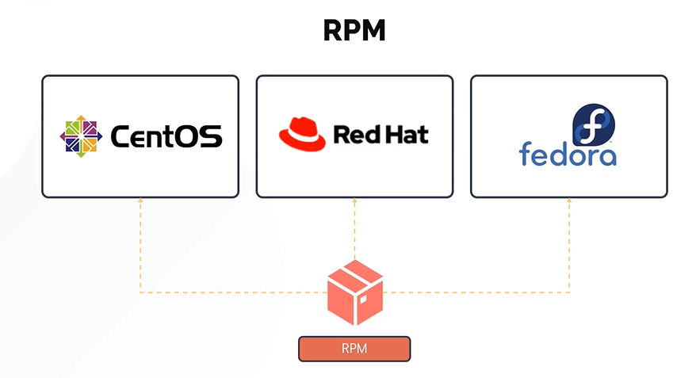
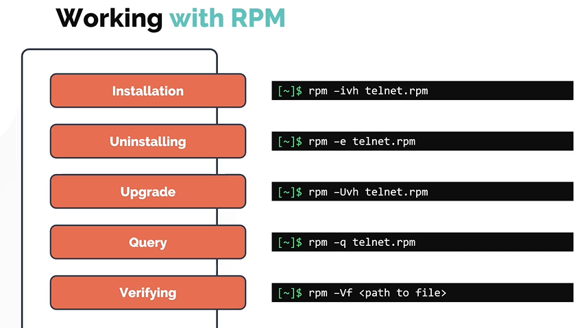
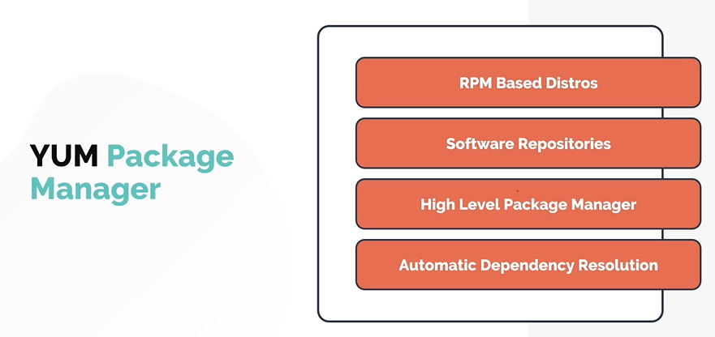
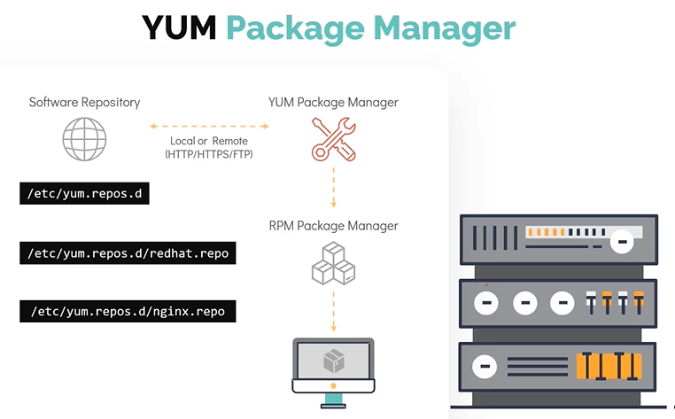
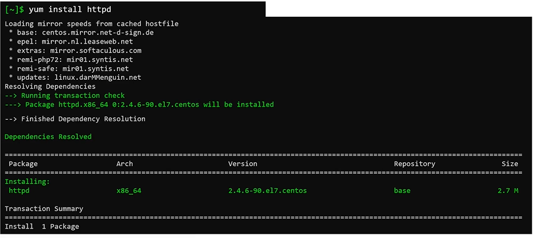
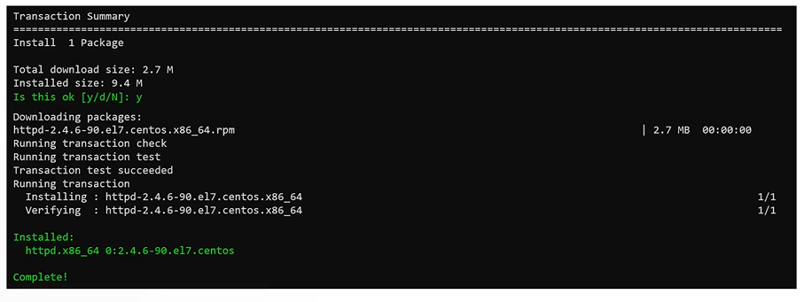
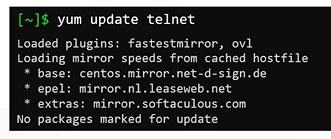

# RPM and YUM Package Managers
# RPM 与 YUM 包管理器

- Take me to the [Video Tutorial](https://kodekloud.com/topic/rpm-and-yum/)

In this section, we will take a detailed look at the **RPM** and **YUM** package managers used in Red Hat-based Linux distributions.

在本节中，我们将详细了解 Red Hat 系 Linux 发行版中使用的 **RPM** 和 **YUM** 包管理器。

---

## RPM — Red Hat Package Manager
## RPM — Red Hat 包管理器

**RPM** (Red Hat Package Manager) is the **low-level** package management tool used in RHEL, CentOS, Fedora, and other RPM-based distributions. Package files managed by RPM have the **`.rpm`** extension.

**RPM**（Red Hat 包管理器）是 RHEL、CentOS、Fedora 等 RPM 系发行版中使用的**底层**包管理工具。RPM 管理的包文件扩展名为 **`.rpm`**。



### Understanding the RPM Package Name Format / 理解 RPM 包名格式

RPM package filenames follow a strict naming convention:

RPM 包文件名遵循严格的命名规范：

```
firefox-68.6.0-1.el7.centos.x86_64.rpm
│       │       │ │        │
│       │       │ │        └── Architecture: x86_64, i686, noarch, aarch64
│       │       │ │             架构：x86_64, i686, noarch, aarch64
│       │       │ └── Distribution tag: el7=RHEL7, fc34=Fedora34
│       │       │      发行版标签
│       │       └── Release number / 发行号
│       └── Version / 版本号
└── Package name / 包名
```

| Field / 字段 | Example / 示例 | Meaning / 含义 |
|---|---|---|
| Name / 包名 | `firefox` | Software name / 软件名称 |
| Version / 版本 | `68.6.0` | Software version / 软件版本 |
| Release / 发行号 | `1` | Package build number / 包构建号 |
| Dist tag / 发行版标签 | `el7.centos` | Target distribution / 目标发行版 |
| Arch / 架构 | `x86_64` | CPU architecture / CPU 架构 |

**Common architecture values / 常见架构值:**
- `x86_64` — 64-bit Intel/AMD / 64 位 Intel/AMD
- `i686` / `i386` — 32-bit Intel / 32 位 Intel
- `aarch64` / `arm64` — 64-bit ARM / 64 位 ARM
- `noarch` — architecture-independent (scripts, data files) / 与架构无关（脚本、数据文件）

---

### RPM's 5 Modes of Operation
### RPM 的五种操作模式



> **Critical limitation / 关键限制**: RPM does **NOT** resolve dependencies automatically. If a package requires `libssl.so.1.1` and it's not installed, RPM will report an error and refuse to install. This is why `YUM` (the high-level tool) is preferred for most operations.
>
> RPM **不会**自动解析依赖关系。如果一个包需要 `libssl.so.1.1` 但未安装，RPM 会报错并拒绝安装。这就是为什么大多数操作优先使用 `YUM`（高层工具）。

---

### RPM Commands
### RPM 命令

#### Installing / 安装

```bash
# Install a package (-i = install, -v = verbose, -h = hash progress bar)
# 安装软件包（-i=安装，-v=详细输出，-h=哈希进度条）
$ sudo rpm -ivh package.rpm
$ sudo rpm -ivh firefox-68.6.0-1.el7.centos.x86_64.rpm

# Install without dependency checking (use with caution!)
# 安装时不检查依赖（谨慎使用！）
$ sudo rpm -ivh --nodeps package.rpm

# Force install even if already installed / 强制安装（即使已安装）
$ sudo rpm -ivh --force package.rpm
```

#### Uninstalling / 卸载

```bash
# Remove a package (-e = erase)
# 删除软件包（-e=擦除）
$ sudo rpm -e firefox

# Remove without checking for dependents / 删除时不检查依赖项
$ sudo rpm -e --nodeps firefox
```

#### Upgrading / 升级

```bash
# Upgrade package (-U = upgrade; installs if not present)
# 升级软件包（-U=升级；如果未安装则安装）
$ sudo rpm -Uvh package.rpm

# Freshen — only upgrade if older version is already installed
# 更新——仅在已安装旧版本时才升级
$ sudo rpm -Fvh package.rpm
```

#### Querying / 查询

```bash
# List ALL installed packages / 列出所有已安装的包
$ rpm -qa
$ rpm -qa | grep firefox      # filter / 过滤
$ rpm -qa | wc -l             # count total / 统计总数

# Query specific installed package / 查询特定已安装的包
$ rpm -q firefox
firefox-68.6.0-1.el7.centos.x86_64

# Show detailed info about installed package / 显示已安装包的详细信息
$ rpm -qi firefox

# List files installed by a package / 列出包安装的文件
$ rpm -ql firefox

# Find which package a file belongs to / 查找文件属于哪个包
$ rpm -qf /usr/bin/firefox
firefox-68.6.0-1.el7.centos.x86_64

# Query a .rpm file (not yet installed) / 查询 .rpm 文件（尚未安装）
$ rpm -qip package.rpm        # info / 信息
$ rpm -qlp package.rpm        # file list / 文件列表

# List dependencies of a package / 列出包的依赖项
$ rpm -qR firefox
```

#### Verifying / 验证

```bash
# Verify all installed packages (checks file integrity)
# 验证所有已安装的包（检查文件完整性）
$ rpm -Va

# Verify a specific package / 验证特定包
$ rpm -V firefox

# Output explanation / 输出说明:
# S = file size differs / 文件大小不同
# M = permissions differ / 权限不同
# 5 = MD5 checksum differs / MD5 校验和不同
# T = file modification time differs / 文件修改时间不同
# . = test passed / 测试通过（正常）
```

---

## YUM — Yellowdog Updater Modified
## YUM — Yellowdog 更新修改器

**YUM** (Yellowdog Updater Modified) is the **high-level** package manager for RPM-based systems. It solves RPM's biggest limitation — automatic dependency resolution.

**YUM** 是 RPM 系系统的**高层**包管理器，解决了 RPM 最大的限制——自动依赖解析。



**Key features of YUM / YUM 的主要特性:**
- Works with **software repositories** to find and download packages / 与**软件仓库**协作查找和下载包
- **Automatically resolves dependencies** — installs all required packages / **自动解析依赖关系**——安装所有必需的包
- Repository configuration stored in **`/etc/yum.repos.d/`** (`.repo` files) / 仓库配置存储在 **`/etc/yum.repos.d/`** 中（`.repo` 文件）
- Under the hood, still uses **RPM** to perform the actual installation / 底层仍使用 **RPM** 执行实际安装
- Maintains a **local cache** of package metadata for faster operation / 维护包元数据的**本地缓存**以加快操作速度



---

### How YUM Installs a Package — Step by Step
### YUM 安装包的逐步流程



```
$ yum install httpd
      │
      ▼
1. Transaction Check / 事务检查
   - Is the package already installed? / 包是否已安装？
   - Check /etc/yum.repos.d/ for available repos / 检查可用仓库
   - Find the package in repo metadata / 在仓库元数据中查找包
      │
      ▼
2. Dependency Resolution / 依赖解析
   - What does httpd need? / httpd 需要什么？
   - Are dependencies already installed? / 依赖项是否已安装？
   - Which ones need to be downloaded? / 哪些需要下载？
      │
      ▼
3. Transaction Summary / 事务摘要
   Installing: httpd-2.4.6-97.el7.x86_64
   Installing: apr-1.4.8-7.el7.x86_64      (dependency)
   Installing: apr-util-1.5.2-6.el7.x86_64 (dependency)
   Is this ok [y/d/N]: y
      │
      ▼
4. Download & Install / 下载并安装
   - Downloads RPMs from repository / 从仓库下载 RPM
   - Calls rpm to install each package / 调用 rpm 安装每个包
      │
      ▼
5. Post-install scripts run / 运行安装后脚本
   - Update system databases, create users, etc.
   / 更新系统数据库、创建用户等
```



---

### YUM Repository Configuration
### YUM 仓库配置

Each `.repo` file in `/etc/yum.repos.d/` defines one or more repositories:

`/etc/yum.repos.d/` 中的每个 `.repo` 文件定义一个或多个仓库：

```bash
# View existing repo files / 查看现有仓库文件
$ ls /etc/yum.repos.d/
CentOS-Base.repo  CentOS-CR.repo  CentOS-Debuginfo.repo

# View a repo file / 查看仓库文件内容
$ cat /etc/yum.repos.d/CentOS-Base.repo
[base]
name=CentOS-$releasever - Base
mirrorlist=http://mirrorlist.centos.org/?release=$releasever&arch=$basearch&repo=os
enabled=1
gpgcheck=1
gpgkey=file:///etc/pki/rpm-gpg/RPM-GPG-KEY-CentOS-7
```

**Repo file fields / 仓库文件字段:**

| Field / 字段 | Meaning / 含义 |
|---|---|
| `[base]` | Repository ID (unique name) / 仓库 ID（唯一名称）|
| `name` | Human-readable name / 易读名称 |
| `baseurl` | URL to the repository / 仓库 URL |
| `mirrorlist` | URL returning a list of mirrors / 返回镜像列表的 URL |
| `enabled` | `1` = enabled, `0` = disabled / `1`=启用，`0`=禁用 |
| `gpgcheck` | `1` = verify package signatures / `1`=验证包签名 |
| `gpgkey` | Path/URL to GPG key for verification / GPG 密钥路径/URL |

---

### YUM Commands Reference
### YUM 命令参考

#### Repository Management / 仓库管理

```bash
# List all configured repositories / 列出所有已配置的仓库
$ yum repolist
$ yum repolist all              # include disabled repos / 包含已禁用的仓库

# Show detailed repo information / 显示仓库详细信息
$ yum repoinfo base

# Add a new repository / 添加新仓库
$ sudo yum-config-manager --add-repo https://example.com/repo.repo

# Enable/disable a repository / 启用/禁用仓库
$ sudo yum-config-manager --enable epel
$ sudo yum-config-manager --disable epel

# Clean YUM cache / 清理 YUM 缓存
$ sudo yum clean all
$ sudo yum makecache             # rebuild cache / 重建缓存
```

#### Finding Packages / 查找包

```bash
# Search for a package by name or description / 按名称或描述搜索包
$ yum search nginx
$ yum search "web server"

# Find which package provides a specific file or command
# 查找提供特定文件或命令的包
$ yum provides scp
$ yum provides /usr/bin/scp
$ yum provides tcpdump
$ yum provides "*/nginx.conf"

# Show detailed info about a package / 显示包的详细信息
$ yum info httpd
```

#### Installing Packages / 安装包

```bash
# Install a package (with dependency resolution)
# 安装包（带依赖解析）
$ sudo yum install httpd

# Install without prompting / 安装时不提示确认
$ sudo yum install httpd -y

# Install a local .rpm file (with dependency resolution from repos)
# 安装本地 .rpm 文件（从仓库解析依赖）
$ sudo yum install ./package.rpm

# Install a package group / 安装包组
$ sudo yum groupinstall "Development Tools"
$ yum grouplist                  # list available groups / 列出可用组
```

#### Updating Packages / 更新包

```bash
# Update a specific package / 更新特定包
$ sudo yum update telnet
$ sudo yum update httpd

# Update all packages / 更新所有包
$ sudo yum update
$ sudo yum update -y             # no confirmation / 不需要确认

# Check for available updates (without installing) / 检查可用更新（不安装）
$ yum check-update

# Update only security patches / 仅更新安全补丁
$ sudo yum update --security
```



#### Removing Packages / 删除包

```bash
# Remove a package / 删除包
$ sudo yum remove httpd

# Remove package and its unused dependencies / 删除包及其未使用的依赖项
$ sudo yum autoremove httpd
```

#### Listing and History / 列出与历史

```bash
# List all installed packages / 列出所有已安装的包
$ yum list installed
$ yum list installed | grep httpd

# List all available packages in repos / 列出仓库中所有可用的包
$ yum list available

# Show YUM transaction history / 显示 YUM 事务历史
$ sudo yum history
$ sudo yum history info 5        # details of transaction #5 / 第5次事务的详情

# Undo a previous transaction / 撤销之前的事务
$ sudo yum history undo 5
```

---

## DNF — The Next Generation YUM
## DNF — 新一代 YUM

On **Fedora** and **RHEL 8+**, `dnf` (Dandified YUM) has replaced `yum` as the default package manager. It is faster, uses less memory, and has better dependency resolution.

在 **Fedora** 和 **RHEL 8+** 中，`dnf`（Dandified YUM）已取代 `yum` 成为默认包管理器。它更快、占用内存更少，且依赖解析更好。

```bash
# DNF commands are almost identical to YUM / DNF 命令几乎与 YUM 相同
$ sudo dnf install nginx
$ sudo dnf update
$ sudo dnf remove nginx
$ dnf search nginx
$ dnf provides /usr/bin/nginx

# DNF-specific features / DNF 特有功能
$ dnf module list                # list module streams / 列出模块流
$ sudo dnf module install nodejs:14   # install specific module / 安装特定模块
```

> **YUM on RHEL 8+ / RHEL 8+ 中的 YUM**: On RHEL 8+, the `yum` command still exists but is actually a symlink to `dnf`. They are fully compatible.
>
> 在 RHEL 8+ 中，`yum` 命令仍然存在，但实际上是 `dnf` 的符号链接，完全兼容。

---

## Summary
## 小结

| Feature / 特性 | RPM | YUM | DNF |
|---|---|---|---|
| Type / 类型 | Low-level / 底层 | High-level / 高层 | High-level / 高层 |
| Dependency resolution / 依赖解析 | No / 否 | Yes / 是 | Yes (better) / 是（更好）|
| Works with repos / 使用仓库 | No / 否 | Yes / 是 | Yes / 是 |
| Used in / 使用于 | All RPM distros | RHEL 6/7, CentOS | RHEL 8+, Fedora |
| Package format / 包格式 | `.rpm` | `.rpm` | `.rpm` |

**Quick command reference / 快速命令参考:**

| Task / 任务 | RPM Command | YUM Command |
|---|---|---|
| Install / 安装 | `rpm -ivh pkg.rpm` | `yum install pkg` |
| Remove / 卸载 | `rpm -e pkg` | `yum remove pkg` |
| Upgrade / 升级 | `rpm -Uvh pkg.rpm` | `yum update pkg` |
| List all installed / 列出已安装 | `rpm -qa` | `yum list installed` |
| Query package info / 查询包信息 | `rpm -qi pkg` | `yum info pkg` |
| Find file's package / 查找文件归属 | `rpm -qf /path/file` | `yum provides /path/file` |
| Verify package / 验证包 | `rpm -V pkg` | — |
| List repo / 列出仓库 | — | `yum repolist` |
| Search / 搜索 | — | `yum search keyword` |
