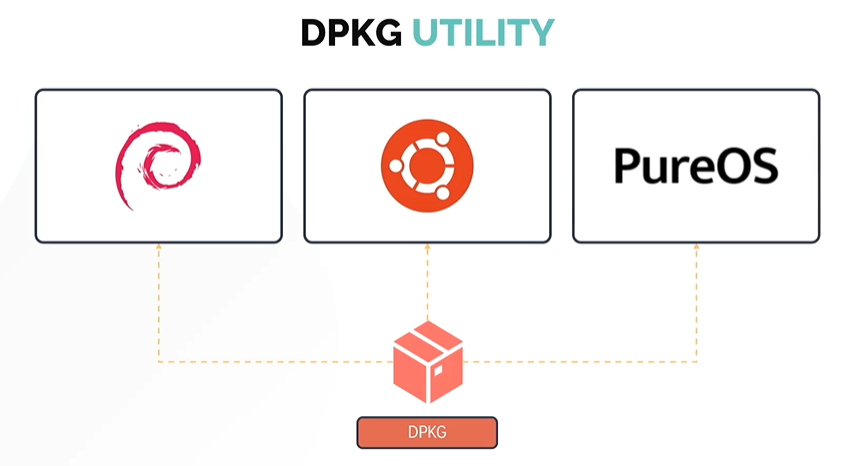
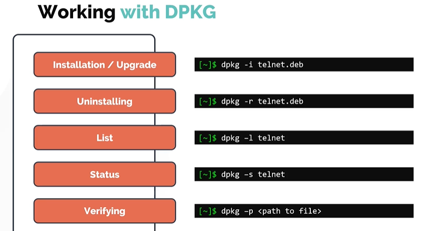
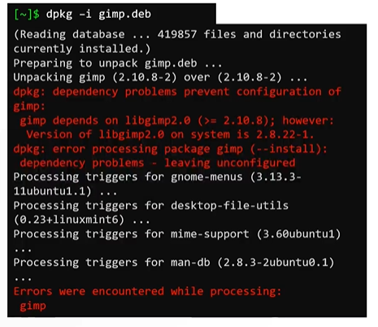
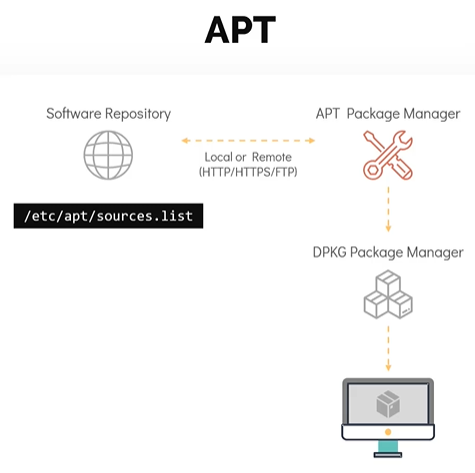

# DPKG and APT Package Managers
# DPKG 与 APT 包管理器

- Take me to the [Video Tutorial](https://kodekloud.com/topic/dpkg-and-apt/)

In this section, we will look at Debian package managers for distributions like **Ubuntu**, **Debian**, and **Linux Mint**.

在本节中，我们将了解 **Ubuntu**、**Debian** 和 **Linux Mint** 等发行版的 Debian 包管理器。

---

## DPKG — Debian Package Manager
## DPKG — Debian 包管理器

**DPKG** (Debian Package Manager) is the **low-level** package management tool for Debian-based systems. It directly handles `.deb` package files.

**DPKG** 是 Debian 系系统的**底层**包管理工具，直接处理 `.deb` 包文件。



### Understanding the .deb Package Name Format / 理解 .deb 包名格式

```
firefox_75.0+build3-0ubuntu1_amd64.deb
│       │              │       │
│       │              │       └── Architecture: amd64, i386, arm64, all
│       │              │            架构
│       │              └── Distribution-specific suffix
│       │                   发行版特定后缀
│       └── Version / 版本号
└── Package name / 包名
```

**Common architecture values / 常见架构值:**
- `amd64` — 64-bit Intel/AMD (equivalent to `x86_64` in RPM) / 64 位 Intel/AMD
- `i386` / `i686` — 32-bit Intel / 32 位 Intel
- `arm64` — 64-bit ARM / 64 位 ARM
- `all` — architecture-independent / 与架构无关

---

### DPKG's 6 Modes of Operation
### DPKG 的六种操作模式



> **Critical limitation / 关键限制**: Like RPM, DPKG does **NOT** resolve dependencies automatically. If `gimp.deb` requires `libgegl-0.4-0` and it's not installed, DPKG will fail. This is why we use `APT` as the high-level tool.
>
> 与 RPM 一样，DPKG **不会**自动解析依赖关系。如果 `gimp.deb` 需要 `libgegl-0.4-0` 但未安装，DPKG 会失败。这就是我们使用 `APT` 作为高层工具的原因。

---

### DPKG Commands
### DPKG 命令

#### Installing / 安装

```bash
# Install a .deb file (-i = install)
# 安装 .deb 文件（-i=安装）
$ sudo dpkg -i package.deb
$ sudo dpkg -i firefox_75.0_amd64.deb

# Install multiple packages at once / 一次安装多个包
$ sudo dpkg -i package1.deb package2.deb
```

**Example failure due to missing dependencies / 由于缺少依赖而失败的示例:**
```bash
$ sudo dpkg -i gimp_2.10.18_amd64.deb
(Reading database ... 85000 files and directories currently installed.)
Preparing to unpack gimp_2.10.18_amd64.deb ...
Unpacking gimp (2.10.18) ...
dpkg: dependency problems prevent configuration of gimp:
 gimp depends on libgegl-0.4-0 (>= 0.4.18); however:
  Package libgegl-0.4-0 is not installed.
 gimp depends on libmypaint-1.5-1 (>= 1.5.0); however:
  Package libmypaint-1.5-1 is not installed.
```



#### Removing / 删除

```bash
# Remove a package (keep config files) / 删除包（保留配置文件）
$ sudo dpkg -r firefox

# Purge a package (remove package AND config files) / 清除包（删除包和配置文件）
$ sudo dpkg -P firefox
$ sudo dpkg --purge firefox
```

> **`-r` vs `-P` (purge) / 区别**:
> - `-r` removes the package but leaves configuration files in place (so settings are preserved if you reinstall) / `-r` 删除包但保留配置文件（重装时设置得以保留）
> - `-P` (purge) removes everything including config files — a clean slate / `-P`（清除）删除所有内容包括配置文件——彻底清除

#### Listing and Querying / 列出与查询

```bash
# List all installed packages / 列出所有已安装的包
$ dpkg -l
$ dpkg -l | grep firefox      # filter / 过滤
$ dpkg -l | wc -l             # count / 统计

# Show detailed status of a specific package / 显示特定包的详细状态
$ dpkg -s firefox
Package: firefox
Status: install ok installed
Version: 75.0+build3-0ubuntu1
Architecture: amd64
Depends: lsb-release, ...

# List files installed by a package / 列出包安装的文件
$ dpkg -L firefox
/usr/bin/firefox
/usr/share/applications/firefox.desktop
/usr/share/pixmaps/firefox.png
...

# Find which package a file belongs to / 查找文件属于哪个包
$ dpkg -S /usr/bin/firefox
firefox: /usr/bin/firefox

$ dpkg -S /etc/hosts
netbase: /etc/hosts
```

#### Verifying / 验证

```bash
# Verify integrity of installed package files / 验证已安装包文件的完整性
$ dpkg -V firefox
$ dpkg --verify firefox

# Fix broken package installations / 修复损坏的包安装
$ sudo dpkg --configure -a
```

**Understanding `dpkg -l` status output / 理解 `dpkg -l` 状态输出:**
```
$ dpkg -l | head -5
Desired=Unknown/Install/Remove/Purge/Hold
| Status=Not/Inst/Conf-files/Unpacked/halF-conf/Half-inst/trig-aWait/Trig-pend
|/ Err?=(none)/Reinst-required (Status,Err: uppercase=bad)
||/ Name            Version       Architecture Description
+++-===============-=============-============-================================
ii  firefox         75.0+build3   amd64         Safe and easy web browser

# ii = desired:Install, status:Installed (both i's = normal installed state)
# ii = 期望:安装，状态:已安装（两个 i 表示正常安装状态）
# rc = desired:Remove, status:Conf-files (removed but config files remain)
# rc = 期望:删除，状态:配置文件（已删除但配置文件保留）
```

---

## APT — Advanced Package Tool
## APT — 高级包工具

**APT** (Advanced Package Tool) is the **high-level** package manager for Debian-based systems. It solves DPKG's dependency problem by automatically fetching and installing all required packages.

**APT** 是 Debian 系系统的**高层**包管理器，通过自动获取并安装所有必需的包来解决 DPKG 的依赖问题。



**Key features of APT / APT 的主要特性:**
- Automatically resolves and installs **all dependencies** / 自动解析并安装**所有依赖项**
- Works with **software repositories** defined in `/etc/apt/sources.list` / 使用 `/etc/apt/sources.list` 中定义的**软件仓库**
- Under the hood, still uses **DPKG** for actual installation / 底层仍使用 **DPKG** 执行实际安装
- Maintains a **local package index** (cache) of available packages / 维护可用包的**本地包索引**（缓存）

---

### APT Repository Configuration
### APT 仓库配置

```bash
# Main sources file / 主源文件
$ cat /etc/apt/sources.list

# Example entry / 示例条目：
deb http://archive.ubuntu.com/ubuntu focal main restricted
deb http://archive.ubuntu.com/ubuntu focal-updates main restricted
deb http://security.ubuntu.com/ubuntu focal-security main restricted
```

**Format of a sources.list entry / sources.list 条目格式:**
```
deb [options] URL distribution component1 component2 ...

deb                   → binary packages / 二进制包
deb-src               → source packages / 源码包
URL                   → repository URL / 仓库 URL
distribution          → Ubuntu/Debian release name / 发行版名称（如 focal, jammy）
component             → main, restricted, universe, multiverse
```

**Ubuntu component meanings / Ubuntu 组件含义:**

| Component / 组件 | Description / 描述 |
|---|---|
| `main` | Officially supported free software / 官方支持的自由软件 |
| `restricted` | Proprietary drivers / 专有驱动程序 |
| `universe` | Community-maintained free software / 社区维护的自由软件 |
| `multiverse` | Non-free software / 非自由软件 |

**Adding extra repositories / 添加额外仓库:**
```bash
# Add a PPA (Personal Package Archive) for Ubuntu / 为 Ubuntu 添加 PPA
$ sudo add-apt-repository ppa:username/ppaname
$ sudo apt update

# Add a third-party repo / 添加第三方仓库
$ echo "deb [signed-by=/usr/share/keyrings/nginx.gpg] http://nginx.org/packages/ubuntu focal nginx" | sudo tee /etc/apt/sources.list.d/nginx.list

# Edit sources directly / 直接编辑源
$ sudo apt edit-sources    # opens /etc/apt/sources.list in editor / 在编辑器中打开 sources.list
```

---

### APT Commands Reference
### APT 命令参考

#### Updating the Package Index / 更新包索引

```bash
# IMPORTANT: Always run this before installing/upgrading!
# 重要：在安装/升级之前始终先运行此命令！
$ sudo apt update

# What it does / 它做什么:
# - Connects to all configured repositories / 连接所有配置的仓库
# - Downloads the latest package metadata (index files) / 下载最新的包元数据（索引文件）
# - Does NOT install or upgrade anything / 不安装或升级任何东西
```

> **`apt update` vs `apt upgrade` / 区别**:
> - `apt update` — refreshes the list of available packages (metadata only) / 刷新可用包列表（仅元数据）
> - `apt upgrade` — actually downloads and installs newer versions / 实际下载并安装新版本
>
> Always run `apt update` first, then `apt upgrade`.
>
> 始终先运行 `apt update`，然后再运行 `apt upgrade`。

#### Upgrading Packages / 升级包

```bash
# Upgrade all installed packages to their latest versions
# 将所有已安装的包升级到最新版本
$ sudo apt upgrade

# Upgrade and handle dependency changes (add/remove packages as needed)
# 升级并处理依赖变化（根据需要添加/删除包）
$ sudo apt full-upgrade
$ sudo apt dist-upgrade   # older alias / 旧版别名

# Upgrade a specific package / 升级特定包
$ sudo apt upgrade nginx
```

#### Installing Packages / 安装包

```bash
# Install a package / 安装包
$ sudo apt install nginx
$ sudo apt install python3 python3-pip    # multiple packages / 多个包

# Install without confirmation / 安装时不需要确认
$ sudo apt install -y nginx

# Install a specific version / 安装特定版本
$ sudo apt install nginx=1.18.0-0ubuntu1

# Install a downloaded .deb file (with dep resolution from repos)
# 安装下载的 .deb 文件（从仓库解析依赖）
$ sudo apt install ./package.deb

# Reinstall a package / 重新安装包
$ sudo apt reinstall nginx

# Install without recommended packages / 安装时不安装推荐包
$ sudo apt install --no-install-recommends nginx
```

#### Removing Packages / 删除包

```bash
# Remove a package (keep config files) / 删除包（保留配置文件）
$ sudo apt remove nginx

# Purge a package (remove + config files) / 清除包（删除+配置文件）
$ sudo apt purge nginx

# Remove unused auto-installed dependencies / 删除未使用的自动安装依赖项
$ sudo apt autoremove

# Full cleanup: purge + autoremove / 完全清理：清除+自动删除
$ sudo apt purge nginx && sudo apt autoremove
```

#### Searching and Listing / 搜索与列出

```bash
# Search for a package by name or description / 按名称或描述搜索包
$ apt search nginx
$ apt search "web server"

# Show detailed information about a package / 显示包的详细信息
$ apt show nginx
Package: nginx
Version: 1.18.0-0ubuntu1
Depends: libpcre3, libssl1.1, zlib1g
Description: small, powerful, scalable web/proxy server

# List all installed packages / 列出所有已安装的包
$ apt list --installed
$ apt list --installed | grep nginx

# List all upgradable packages / 列出所有可升级的包
$ apt list --upgradable

# List all available packages matching a pattern / 列出匹配模式的所有可用包
$ apt list | grep nginx
```

#### Cache Management / 缓存管理

```bash
# Remove cached .deb files that are no longer needed
# 删除不再需要的缓存 .deb 文件
$ sudo apt clean          # removes all cached packages / 删除所有缓存的包
$ sudo apt autoclean      # removes only obsolete cached packages / 只删除过时的缓存包

# Show cache statistics / 显示缓存统计信息
$ apt-cache stats

# Show cached package info / 显示缓存的包信息
$ apt-cache show nginx
$ apt-cache showpkg nginx  # show all versions and dependencies / 显示所有版本和依赖

# Find which package provides a file / 查找哪个包提供某个文件
$ apt-file search /usr/bin/nginx     # requires: sudo apt install apt-file
```

---

## APT vs DPKG — When to Use Which
## APT 与 DPKG — 何时使用哪个

| Scenario / 场景 | Use / 使用 | Why / 原因 |
|---|---|---|
| Install from internet / 从网络安装 | `apt install` | Handles deps automatically / 自动处理依赖 |
| Install local .deb file / 安装本地 .deb | `apt install ./file.deb` or `dpkg -i` | `apt` handles deps, `dpkg` doesn't / `apt` 处理依赖，`dpkg` 不处理 |
| Remove package / 删除包 | `apt remove` / `apt purge` | Cleans up properly / 正确清理 |
| List installed packages / 列出已安装 | `dpkg -l` | More detailed status / 更详细的状态 |
| Find which package owns a file / 查找文件归属 | `dpkg -S /path/file` | Direct database lookup / 直接数据库查找 |
| Check package integrity / 检查包完整性 | `dpkg -V` | Verifies file checksums / 验证文件校验和 |
| Search for a package / 搜索包 | `apt search` | Searches repo metadata / 搜索仓库元数据 |

---

## Summary
## 小结

| Feature / 特性 | DPKG | APT |
|---|---|---|
| Type / 类型 | Low-level / 底层 | High-level / 高层 |
| Dependency resolution / 依赖解析 | No / 否 | Yes / 是 |
| Works with repos / 使用仓库 | No / 否 | Yes / 是 |
| Package format / 包格式 | `.deb` | `.deb` |
| Config location / 配置位置 | `/var/lib/dpkg/` | `/etc/apt/sources.list` |

**Quick command reference / 快速命令参考:**

| Task / 任务 | DPKG Command | APT Command |
|---|---|---|
| Install / 安装 | `dpkg -i pkg.deb` | `apt install pkg` |
| Remove / 删除 | `dpkg -r pkg` | `apt remove pkg` |
| Purge / 清除 | `dpkg -P pkg` | `apt purge pkg` |
| List all installed / 列出已安装 | `dpkg -l` | `apt list --installed` |
| Package status / 包状态 | `dpkg -s pkg` | `apt show pkg` |
| Files in package / 包中的文件 | `dpkg -L pkg` | — |
| Find file's package / 查找文件归属 | `dpkg -S /path/file` | — |
| Search packages / 搜索包 | — | `apt search keyword` |
| Update package index / 更新包索引 | — | `apt update` |
| Upgrade all packages / 升级所有包 | — | `apt upgrade` |
