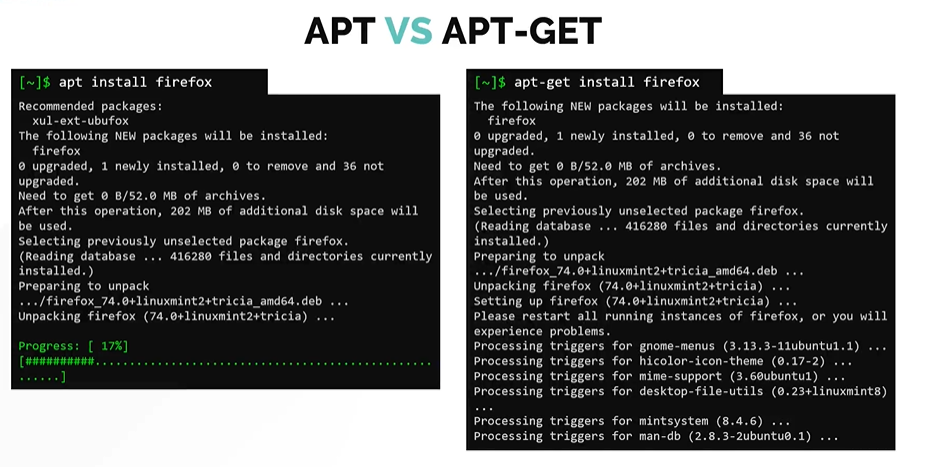
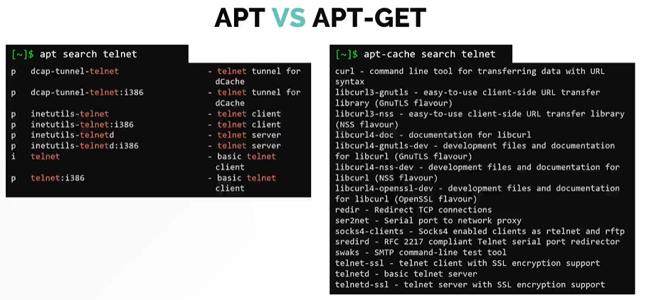

# APT vs APT-GET
# APT 与 APT-GET 的区别

- Take me to the [Video Tutorial](https://kodekloud.com/topic/apt-vs-apt-get/)

In this section, we will compare **`apt`** and **`apt-get`** — two command-line tools for managing packages on Debian-based systems. While they perform similar tasks, there are important differences in their features and user experience.

在本节中，我们将比较 **`apt`** 和 **`apt-get`**——两个用于管理 Debian 系系统软件包的命令行工具。虽然它们执行类似的任务，但在功能和用户体验上有重要差异。

---

## Background — The History of APT Tools
## 背景 — APT 工具的历史

| Tool / 工具 | Introduced / 推出时间 | Purpose / 用途 |
|---|---|---|
| `apt-get` | 1998 | Original high-level package installer / 原始高层包安装器 |
| `apt-cache` | 1998 | Package search and info queries / 包搜索和信息查询 |
| `apt-file` | 2000 | Search files within packages / 在包中搜索文件 |
| `apt` | 2014 (Ubuntu 14.04) | Unified, user-friendly replacement / 统一的用户友好替代工具 |

`apt` was introduced to combine the most commonly used features of `apt-get`, `apt-cache`, and other APT tools into **one unified command** with a better user experience.

推出 `apt` 是为了将 `apt-get`、`apt-cache` 等 APT 工具的最常用功能合并成**一个统一命令**，并提供更好的用户体验。

---

## Key Differences
## 主要区别

### 1. User Interface — Progress Bar
### 1. 用户界面 — 进度条

The most visible difference when installing a package:

安装包时最明显的差异：



**`apt install firefox`** — shows a clean progress bar:
```
Reading package lists... Done
Building dependency tree... Done
The following NEW packages will be installed:
  firefox
0 upgraded, 1 newly installed, 0 to remove and 5 not upgraded.
Need to get 52.3 MB of archives.

Get:1 http://archive.ubuntu.com focal/main firefox 75.0 [52.3 MB]
########################################## 100%

Setting up firefox (75.0) ...
```

**`apt-get install firefox`** — functional but less polished:
```
Reading package lists... Done
Building dependency tree
Reading state information... Done
The following NEW packages will be installed:
  firefox
0 upgraded, 1 newly installed, 0 to remove and 5 not upgraded.
Need to get 52.3 MB of archives.
After this operation, 185 MB of additional disk space will be used.
Get:1 http://archive.ubuntu.com focal/main amd64 firefox amd64 75.0 [52.3 MB]
Fetched 52.3 MB in 12s (4,358 kB/s)
Selecting previously unselected package firefox.
(Reading database ... 85234 files and directories currently installed.)
Preparing to unpack .../firefox_75.0_amd64.deb ...
Unpacking firefox (75.0) ...
Setting up firefox (75.0) ...
```

> **Summary / 小结**: `apt` gives you **just enough information** with a clean progress bar. `apt-get` is functional but outputs more verbose, less structured text.
>
> `apt` 提供**恰到好处的信息**，带有简洁的进度条。`apt-get` 功能完善但输出更详细、结构性更差。

---

### 2. Search — One Tool vs Two Tools
### 2. 搜索 — 一个工具 vs 两个工具



With `apt`, search is built-in:

使用 `apt`，搜索功能是内置的：

```bash
$ apt search telnet
Sorting... Done
Full Text Search... Done
inetutils-telnet/focal 2:1.9.4-10 amd64
  telnet client

telnet/focal 0.17-41.2 amd64
  basic telnet client

telnetd/focal 0.17-41.2 amd64
  basic telnet server
```

With `apt-get`, you cannot search — you need a separate tool:

使用 `apt-get`，你不能搜索——需要单独的工具：

```bash
# This DOES NOT WORK / 这不能工作：
$ apt-get search telnet
E: Invalid operation search

# You must use apt-cache instead / 必须改用 apt-cache：
$ apt-cache search telnet
inetutils-telnet - telnet client
telnet - basic telnet client
netkit-telnet-ssl - telnet client with SSL
telnetd - basic telnet server
netkit-telnetd-ssl - telnet server with SSL
ldap-utils - OpenLDAP utilities (ldapsearch, ...)
# ← Many extra results, harder to read / 更多额外结果，难以阅读
```

---

### 3. Command Mapping — `apt` Unifies Multiple Tools
### 3. 命令映射 — `apt` 统一了多个工具

`apt` consolidates commands from `apt-get`, `apt-cache`, and `dpkg`:

`apt` 整合了 `apt-get`、`apt-cache` 和 `dpkg` 的命令：

| Task / 任务 | Old way / 旧方式 | New way (`apt`) |
|---|---|---|
| Update package index / 更新包索引 | `apt-get update` | `apt update` |
| Upgrade all packages / 升级所有包 | `apt-get upgrade` | `apt upgrade` |
| Full upgrade / 完整升级 | `apt-get dist-upgrade` | `apt full-upgrade` |
| Install a package / 安装包 | `apt-get install pkg` | `apt install pkg` |
| Remove a package / 删除包 | `apt-get remove pkg` | `apt remove pkg` |
| Purge a package / 清除包 | `apt-get purge pkg` | `apt purge pkg` |
| Autoremove / 自动删除 | `apt-get autoremove` | `apt autoremove` |
| Search for a package / 搜索包 | `apt-cache search keyword` | `apt search keyword` |
| Show package info / 显示包信息 | `apt-cache show pkg` | `apt show pkg` |
| List installed packages / 列出已安装 | `dpkg -l` | `apt list --installed` |
| List upgradable / 列出可升级 | `apt-get -u upgrade --assume-no` | `apt list --upgradable` |
| Edit sources / 编辑源 | `nano /etc/apt/sources.list` | `apt edit-sources` |

---

### 4. Detailed Comparison Table
### 4. 详细对比表

| Feature / 特性 | `apt` | `apt-get` |
|---|---|---|
| Progress bar / 进度条 | Yes (colored) / 是（彩色）| No / 否 |
| Search built-in / 内置搜索 | Yes (`apt search`) / 是 | No (need `apt-cache search`) / 否 |
| Package count display / 显示包数量 | Yes / 是 | No / 否 |
| Available in all Debian systems / 所有 Debian 系统均有 | Ubuntu 14.04+ / Debian 8+ | All versions / 所有版本 |
| Suitable for scripts / 适合脚本 | No (unstable API) / 否（API 不稳定）| Yes (stable API) / 是（API 稳定）|
| Recommended for humans / 推荐人工使用 | Yes / 是 | Less so / 较少 |
| Backwards compatible / 向后兼容 | No old scripts / 不兼容旧脚本 | Yes / 是 |

> **Important for scripts / 脚本编写的重要提示**: When writing **shell scripts**, prefer `apt-get` over `apt`. The `apt` command's output format may change between versions (it's designed for human reading), while `apt-get` has a stable, scriptable output format.
>
> 编写 **Shell 脚本**时，优先使用 `apt-get` 而非 `apt`。`apt` 命令的输出格式可能在版本间变化（它是为人类阅读设计的），而 `apt-get` 具有稳定的、可脚本化的输出格式。

---

## Practical Examples — Side by Side
## 实践示例 — 并排比较

### Updating the System / 更新系统

```bash
# With apt (recommended for interactive use) / 使用 apt（推荐用于交互使用）
$ sudo apt update && sudo apt upgrade -y

# With apt-get (recommended for scripts) / 使用 apt-get（推荐用于脚本）
$ sudo apt-get update && sudo apt-get upgrade -y
```

### Installing a Package / 安装包

```bash
# Both work the same way / 两者工作方式相同
$ sudo apt install nginx -y
$ sudo apt-get install nginx -y
```

### Searching for a Package / 搜索包

```bash
# With apt (easy) / 使用 apt（简单）
$ apt search "pdf viewer"

# With apt-get ecosystem (requires separate tool) / 使用 apt-get 生态系统（需要单独工具）
$ apt-cache search "pdf viewer"
```

### Viewing Package Information / 查看包信息

```bash
# With apt / 使用 apt
$ apt show nginx

# With apt-cache / 使用 apt-cache
$ apt-cache show nginx
```

---

## Which Should You Use?
## 应该使用哪个？

```
Interactive terminal use? → Use apt
交互式终端使用？           → 使用 apt
        │
        ▼ No

Writing a shell script? → Use apt-get
编写 Shell 脚本？        → 使用 apt-get
        │
        ▼ Need search/show?

Use apt-cache search / apt-cache show
```

**General recommendation / 一般建议:**
- **Daily use at the terminal** → `apt` (better UX, one tool for everything) / **日常终端使用** → `apt`（更好的用户体验，一个工具完成所有操作）
- **Shell scripts and automation** → `apt-get` + `apt-cache` (stable API, predictable output) / **Shell 脚本和自动化** → `apt-get` + `apt-cache`（稳定 API，可预测的输出）
- **Checking packages in CI/CD pipelines** → `apt-get` (consistent behavior across versions) / **CI/CD 流水线中检查包** → `apt-get`（跨版本行为一致）

---

## `apt-get` Commands That Have No `apt` Equivalent
## `apt-get` 中没有 `apt` 等价命令的操作

```bash
# Build dependency installation / 安装构建依赖
$ sudo apt-get build-dep package

# Download source package / 下载源码包
$ apt-get source package

# Check for broken dependencies / 检查损坏的依赖
$ sudo apt-get check

# Simulate an installation / 模拟安装
$ apt-get install --dry-run package
$ apt-get -s install package
```

---

## Summary
## 小结

| | `apt` | `apt-get` |
|---|---|---|
| **Best for / 最适合** | Interactive use by humans / 人工交互使用 | Scripts and automation / 脚本和自动化 |
| **Progress bar / 进度条** | Yes / 是 | No / 否 |
| **Search / 搜索** | `apt search` | `apt-cache search` |
| **Info / 信息** | `apt show` | `apt-cache show` |
| **API stability / API 稳定性** | May change / 可能改变 | Stable / 稳定 |
| **Available since / 可用版本** | Ubuntu 14.04 / Debian 8 | All versions / 所有版本 |

**Bottom line / 结论**: Use `apt` at the command line for convenience. Use `apt-get` in scripts for reliability.

**结论**：在命令行中使用 `apt` 以获得便利。在脚本中使用 `apt-get` 以确保可靠性。
