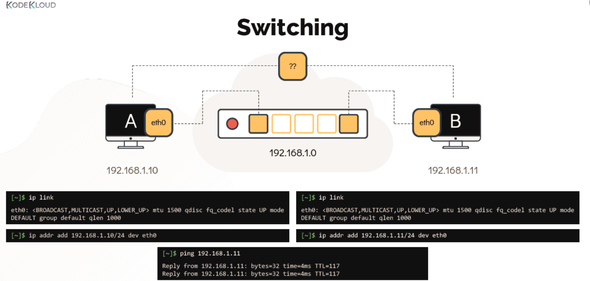
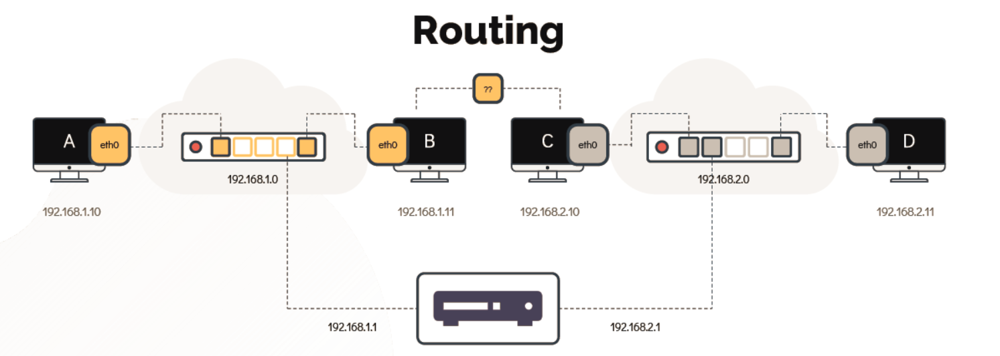

# Switching & Routing | 交换与路由

- Take me to the [Tutorial](https://kodekloud.com/topic/networking-basics/)
- 前往 [视频教程](https://kodekloud.com/topic/networking-basics/)

---

## Overview | 概述

To understand how Linux handles networking, it helps to first understand two fundamental concepts: **switching** (connecting devices within the same network) and **routing** (connecting different networks together). Together, they form the backbone of all modern networking.

要理解 Linux 如何处理网络，首先了解两个基本概念会很有帮助：**交换**（连接同一网络中的设备）和**路由**（将不同网络连接在一起）。这两者共同构成了所有现代网络的基础。

---

## Switching | 交换

### What is Switching? | 什么是交换？

A **switch** is a network device that connects multiple hosts within the **same network** (same subnet). When Host A wants to send data to Host B on the same subnet, the switch reads the destination MAC address in the Ethernet frame and forwards it directly to the correct port — without involving any router.

**交换机**是一种网络设备，用于连接**同一网络**（同一子网）中的多台主机。当主机 A 想向同一子网的主机 B 发送数据时，交换机读取以太网帧中的目标 MAC 地址，并直接将其转发到正确的端口——无需路由器参与。



### Viewing Network Interfaces | 查看网络接口

Use the `ip link` command to list all network interfaces on a host and check their state (UP/DOWN).

使用 `ip link` 命令列出主机上所有网络接口并检查其状态（UP/DOWN）。

```bash
[~]$ ip link
1: lo: <LOOPBACK,UP,LOWER_UP> mtu 65536 qdisc noqueue state UNKNOWN mode DEFAULT group default qlen 1000
    link/loopback 00:00:00:00:00:00 brd 00:00:00:00:00:00
2: eth0: <BROADCAST,MULTICAST,UP,LOWER_UP> mtu 1500 qdisc fq_codel state UP mode DEFAULT group default qlen 1000
    link/ether 08:00:27:ab:cd:ef brd ff:ff:ff:ff:ff:ff
```

**Key output fields | 关键输出字段：**

| Field | Meaning | 含义 |
|-------|---------|------|
| `lo` | Loopback interface — used for local communication only | 环回接口——仅用于本地通信 |
| `eth0` | First Ethernet interface | 第一个以太网接口 |
| `state UP` | Interface is active and connected | 接口已激活并已连接 |
| `state DOWN` | Interface is inactive — no cable or disabled | 接口未激活——无网线或已禁用 |
| `mtu 1500` | Maximum Transmission Unit — largest packet size in bytes | 最大传输单元——最大数据包大小（字节） |

### Assigning an IP Address to an Interface | 为接口分配 IP 地址

To connect to a switch and communicate with other hosts on the same network, each interface needs an IP address.

要连接到交换机并与同一网络上的其他主机通信，每个接口都需要一个 IP 地址。

```bash
# Assign IP address 192.168.1.10 with subnet mask /24 to eth0
# 将 IP 地址 192.168.1.10（子网掩码 /24）分配给 eth0
[~]$ ip addr add 192.168.1.10/24 dev eth0
```

**Verify the assignment | 验证分配结果：**

```bash
[~]$ ip addr show eth0
2: eth0: <BROADCAST,MULTICAST,UP,LOWER_UP> mtu 1500 ...
    inet 192.168.1.10/24 brd 192.168.1.255 scope global eth0
```

> **Note | 注意：** Changes made with `ip addr add` are **temporary** — they are lost when the system reboots. To make them persistent, see the section on permanent configuration below.
>
> 使用 `ip addr add` 所做的更改是**临时的**——系统重启后会消失。若要使其持久化，请参阅下面的永久配置部分。

---

## Routing | 路由

### What is Routing? | 什么是路由？

A **router** is a device that connects **two or more separate networks** and forwards packets between them. When a host wants to communicate with a device on a different subnet, it sends the packet to its **default gateway** (the router), which then decides how to forward it.

**路由器**是一种连接**两个或多个不同网络**并在它们之间转发数据包的设备。当主机想要与不同子网上的设备通信时，它将数据包发送到其**默认网关**（路由器），由路由器决定如何转发。



### The Routing Table | 路由表

Every Linux system maintains a **routing table** — a set of rules that determines where to send packets based on their destination IP address. Think of it as a GPS navigation system for network packets.

每个 Linux 系统都维护着一张**路由表**——一组规则，根据目标 IP 地址决定将数据包发送到哪里。可以把它想象成网络数据包的 GPS 导航系统。

**View the routing table | 查看路由表：**

```bash
[~]$ route
Kernel IP routing table
Destination     Gateway         Genmask         Flags Metric Ref    Use Iface
```

Or use the newer `ip route` command (preferred):

或者使用更新的 `ip route` 命令（推荐）：

```bash
[~]$ ip route
# (or: ip route show)
```

### Adding a Route | 添加路由

**Scenario:** Host A is on network `192.168.1.0/24`. It needs to reach hosts on network `192.168.2.0/24` via a router at `192.168.1.1`.

**场景：** 主机 A 在网络 `192.168.1.0/24` 上，需要通过位于 `192.168.1.1` 的路由器访问 `192.168.2.0/24` 网络上的主机。

```bash
# Add a route to 192.168.2.0/24 via the gateway at 192.168.1.1
# 通过网关 192.168.1.1 添加到 192.168.2.0/24 的路由
[~]$ ip route add 192.168.2.0/24 via 192.168.1.1
```

**Verify the route was added | 验证路由已添加：**

```bash
[~]$ route

Kernel IP routing table
Destination     Gateway         Genmask         Flags Metric Ref    Use Iface
192.168.2.0     192.168.1.1     255.255.255.0   UG    0      0      0   eth0
```

**Route flags explained | 路由标志解析：**

| Flag | Meaning | 含义 |
|------|---------|------|
| `U` | Route is Up (active) | 路由已启用（活跃） |
| `G` | Uses a Gateway | 使用网关 |
| `H` | Route to a single Host (not a network) | 到单台主机的路由（非网络） |

### Default Gateway | 默认网关

The **default gateway** is the route packets take when no more specific route matches. It's the "last resort" router — anything destined for the internet goes here.

**默认网关**是在没有更具体的路由匹配时数据包所走的路由。它是"最后手段"路由器——任何发往互联网的数据包都经过这里。

```bash
# Set the default gateway | 设置默认网关
[~]$ ip route add default via 192.168.1.1

# Equivalent form | 等价形式
[~]$ ip route add 0.0.0.0/0 via 192.168.1.1
```

**View all routes including the default | 查看所有路由，包括默认路由：**

```bash
[~]$ ip route show
default via 192.168.1.1 dev eth0
192.168.1.0/24 dev eth0 proto kernel scope link src 192.168.1.10
192.168.2.0/24 via 192.168.1.1 dev eth0
```

---

## IP Address Management | IP 地址管理

### View All Assigned IP Addresses | 查看所有已分配的 IP 地址

```bash
[~]$ ip addr
# or: ip addr show
```

This shows all interfaces with their assigned IP addresses, broadcast addresses, and states.

这会显示所有接口及其分配的 IP 地址、广播地址和状态。

### Useful `ip` Command Summary | 常用 `ip` 命令汇总

```bash
# Show interfaces and link status | 显示接口和链路状态
ip link

# Show interfaces and IP addresses | 显示接口和 IP 地址
ip addr

# Show routing table | 显示路由表
ip route

# Add an IP address | 添加 IP 地址
ip addr add 192.168.1.10/24 dev eth0

# Remove an IP address | 删除 IP 地址
ip addr del 192.168.1.10/24 dev eth0

# Add a route | 添加路由
ip route add 192.168.2.0/24 via 192.168.1.1

# Delete a route | 删除路由
ip route del 192.168.2.0/24

# Bring an interface up | 启动接口
ip link set dev eth0 up

# Bring an interface down | 关闭接口
ip link set dev eth0 down
```

---

## Making Configuration Permanent | 使配置持久化

All changes made with the `ip` command are **temporary** and will be lost on reboot. To make networking configuration persistent, you need to edit configuration files. The method depends on your Linux distribution:

使用 `ip` 命令所做的所有更改都是**临时的**，重启后会丢失。要使网络配置持久化，需要编辑配置文件。具体方法取决于你的 Linux 发行版：

### Debian/Ubuntu — `/etc/network/interfaces`

```bash
[~]$ sudo nano /etc/network/interfaces
```

```
# Static IP configuration | 静态 IP 配置
auto eth0
iface eth0 inet static
    address 192.168.1.10
    netmask 255.255.255.0
    gateway 192.168.1.1
    dns-nameservers 8.8.8.8 8.8.4.4
```

### Red Hat/CentOS/Fedora — NetworkManager or `/etc/sysconfig/network-scripts/`

```bash
# Using nmcli (NetworkManager CLI) | 使用 nmcli（NetworkManager 命令行工具）
[~]$ nmcli connection modify eth0 ipv4.addresses 192.168.1.10/24
[~]$ nmcli connection modify eth0 ipv4.gateway 192.168.1.1
[~]$ nmcli connection modify eth0 ipv4.method manual
[~]$ nmcli connection up eth0
```

### Modern Systems — `systemd-networkd` or `netplan` (Ubuntu 18.04+)

```yaml
# /etc/netplan/01-netcfg.yaml
network:
  version: 2
  ethernets:
    eth0:
      addresses:
        - 192.168.1.10/24
      gateway4: 192.168.1.1
      nameservers:
        addresses: [8.8.8.8, 8.8.4.4]
```

```bash
# Apply netplan configuration | 应用 netplan 配置
[~]$ sudo netplan apply
```

---

## IP Forwarding (Enabling Router Behavior) | IP 转发（启用路由器行为）

By default, Linux does **not** forward packets between interfaces. To make a Linux host act as a router, you must enable IP forwarding:

默认情况下，Linux **不会**在接口之间转发数据包。要让 Linux 主机充当路由器，必须启用 IP 转发：

```bash
# Check current setting | 检查当前设置
[~]$ cat /proc/sys/net/ipv4/ip_forward
0

# Enable temporarily | 临时启用
[~]$ echo 1 > /proc/sys/net/ipv4/ip_forward

# Enable permanently — add to /etc/sysctl.conf | 永久启用——添加到 /etc/sysctl.conf
[~]$ echo "net.ipv4.ip_forward = 1" >> /etc/sysctl.conf
[~]$ sysctl -p
```

---

## Hands-On Lab | 动手实验

- Let's get our hands on [LABS](https://kodekloud.com/courses/873064/lectures/17074533)
- 来动手做 [实验](https://kodekloud.com/courses/873064/lectures/17074533)
