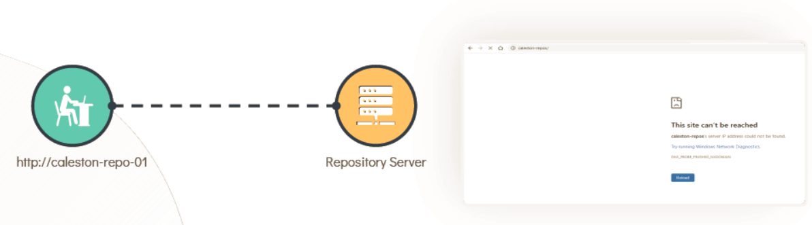
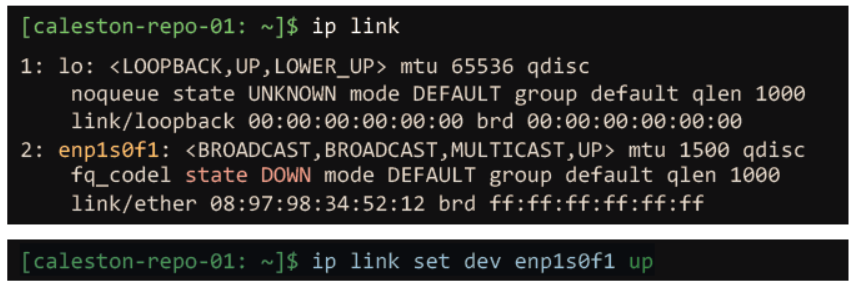

# Network Troubleshooting | 网络故障排查

- Take me to the [Tutorial](https://kodekloud.com/topic/troubleshooting/)
- 前往 [视频教程](https://kodekloud.com/topic/troubleshooting/)

---

## Overview | 概述

In this section, we will systematically troubleshoot the connectivity issue that **Bob** is facing. Bob cannot reach the repository server `caleston-repo-01` and sees the error shown below. We'll work through a structured, layer-by-layer approach that can be applied to almost any Linux network problem.

在本节中，我们将系统地排查 **Bob** 所面临的连通性问题。Bob 无法访问代码仓库服务器 `caleston-repo-01`，并看到了如下所示的错误。我们将采用一种结构化的逐层排查方法，这种方法几乎适用于任何 Linux 网络问题。



---

## The Troubleshooting Methodology | 排查方法论

Network issues can originate at many different layers. A reliable approach is to follow the **OSI model from the bottom up**:

网络问题可能源于许多不同的层次。一种可靠的方法是**从底层向上按 OSI 模型逐层排查**：

```
Layer 7 — Application  →  Is the service running? Is the port open?
Layer 4 — Transport    →  Is TCP/UDP traffic getting through?
Layer 3 — Network      →  Is the route correct? Can we ping?
Layer 2 — Data Link    →  Is the interface up? Is it getting an IP?
Layer 1 — Physical     →  Is the cable plugged in?
```

```
第 7 层 — 应用层  →  服务是否在运行？端口是否开放？
第 4 层 — 传输层  →  TCP/UDP 流量是否能通过？
第 3 层 — 网络层  →  路由是否正确？能否 Ping 通？
第 2 层 — 数据链路层  →  接口是否启动？是否获得了 IP？
第 1 层 — 物理层  →  网线是否插好？
```

---

## Step 1: Check Network Interfaces | 第一步：检查网络接口

The first thing to verify is whether the network interface is **UP** and has an IP address assigned. A down interface means no packets can flow at all.

首先要验证的是网络接口是否**已启动**并分配了 IP 地址。接口处于 DOWN 状态意味着根本没有数据包可以流通。

```bash
[~]$ ip link
1: lo: <LOOPBACK,UP,LOWER_UP> mtu 65536 qdisc
    noqueue state UNKNOWN mode DEFAULT group default qlen 1000
    link/loopback 00:00:00:00:00:00 brd 00:00:00:00:00:00
2: enp1s0f1: <BROADCAST,MULTICAST,UP,LOWER_UP> mtu 1500 qdisc
    fq_codel state UP mode DEFAULT group default qlen 1000
    link/ether 08:97:98:6e:55:4d brd ff:ff:ff:ff:ff:ff
```

**What to look for | 关注点：**

- `state UP` — interface is active. Good.
- `state DOWN` — interface is down. This is your problem. Bring it up with:

- `state UP` — 接口已激活，正常。
- `state DOWN` — 接口处于关闭状态，这就是问题所在。通过以下命令启动它：

```bash
[~]$ ip link set dev enp1s0f1 up
```

**Also verify an IP address is assigned | 同时验证是否已分配 IP 地址：**

```bash
[~]$ ip addr show enp1s0f1
# You should see an "inet" line with an IP address
# 你应该看到一行带有 IP 地址的 "inet" 行
```

If no IP is shown, either configure one manually or check that DHCP is working:

如果没有显示 IP，可以手动配置一个，或检查 DHCP 是否正常工作：

```bash
# Request an IP via DHCP | 通过 DHCP 请求 IP
[~]$ dhclient enp1s0f1
```

---

## Step 2: Check DNS Resolution | 第二步：检查 DNS 解析

Once the interface is up, verify that the hostname resolves to the correct IP address. Use `nslookup` for this — it queries DNS directly, bypassing the local hosts file.

接口启动后，验证主机名是否能解析为正确的 IP 地址。使用 `nslookup` 来完成这一步——它直接查询 DNS，绕过本地 hosts 文件。

```bash
[~]$ nslookup caleston-repo-01
Server:      192.168.1.100
Address:     192.168.1.100 #53

Non-authoritative answer:
Name:  caleston-repo-01
Address: 192.168.2.5
```

**Good sign | 好迹象：** DNS resolution worked — `caleston-repo-01` resolves to `192.168.2.5`.

**好迹象：** DNS 解析成功——`caleston-repo-01` 解析为 `192.168.2.5`。

**If DNS fails | 如果 DNS 失败：**

```bash
# Check your configured DNS server | 检查你配置的 DNS 服务器
[~]$ cat /etc/resolv.conf
nameserver 192.168.1.100

# Test the DNS server directly | 直接测试 DNS 服务器
[~]$ dig @192.168.1.100 caleston-repo-01

# Check if the DNS server itself is reachable | 检查 DNS 服务器本身是否可达
[~]$ ping 192.168.1.100
```

---

## Step 3: Test Basic Connectivity with `ping` | 第三步：用 `ping` 测试基本连通性

Now that we know the IP (`192.168.2.5`), let's check if the host is actually reachable at the network layer using ICMP echo requests.

现在我们知道了 IP 地址（`192.168.2.5`），让我们使用 ICMP 回显请求检查主机在网络层是否实际可达。

```bash
[~]$ ping caleston-repo-01
PING caleston-repo-01 (192.168.2.5) 56(84) bytes of data.

--- caleston-repo-01 ping statistics ---
3 packets transmitted, 0 received, 100% packet loss, time 2034ms
```

**Result | 结果：** 100% packet loss — the host is not reachable. The problem is at the network layer (routing) or the remote host is not responding to ICMP.

**结果：** 100% 丢包——主机不可达。问题出在网络层（路由），或者远程主机不响应 ICMP。

**Possible reasons for ping failure | Ping 失败的可能原因：**

| Reason | Next Step | 原因 | 下一步 |
|--------|-----------|------|--------|
| No route to host | Check routing table | 无到达主机的路由 | 检查路由表 |
| Firewall blocking ICMP | Try `traceroute` or `curl` instead | 防火墙阻止了 ICMP | 改用 `traceroute` 或 `curl` |
| Remote host is down | Contact server admin | 远程主机已关机 | 联系服务器管理员 |
| Wrong IP in DNS | Verify DNS record | DNS 中的 IP 错误 | 验证 DNS 记录 |

---

## Step 4: Trace the Route with `traceroute` | 第四步：用 `traceroute` 追踪路由

When `ping` fails, `traceroute` helps you see **exactly where in the network path** packets are being dropped. It works by sending packets with increasing TTL (Time To Live) values, forcing each router along the path to respond.

当 `ping` 失败时，`traceroute` 可以帮助你看到**数据包在网络路径的哪个位置**被丢弃。它通过发送 TTL（生存时间）值递增的数据包来工作，迫使路径上的每台路由器响应。

```bash
[~]$ traceroute 192.168.2.5

Tracing route to caleston-repo-01 [192.168.2.5]
over a maximum of 30 hops:

  1   <1 ms   <1 ms   <1 ms  192.168.1.1     ← Local gateway (reached OK)
  2   <2 ms   <1 ms   <1 ms  192.168.2.1     ← Router between networks (reached OK)
  3   *       *       *      Request timed out.  ← Lost here!
```

**Interpreting the output | 解读输出：**

- **Hop 1 (`192.168.1.1`)** — Your local gateway responds. Local networking is fine.
- **Hop 2 (`192.168.2.1`)** — The inter-network router responds. Cross-network routing works.
- **Hop 3 (`* * *`)** — Timeout. The destination `192.168.2.5` is not responding to `traceroute` probes. Either the host is down, a firewall is blocking traffic, or the route is broken after hop 2.

- **第 1 跳（`192.168.1.1`）** — 你的本地网关有响应，本地网络正常。
- **第 2 跳（`192.168.2.1`）** — 跨网络路由器有响应，跨网络路由正常。
- **第 3 跳（`* * *`）** — 超时。目标 `192.168.2.5` 不响应 `traceroute` 探测包。可能是主机已关机、防火墙阻止了流量，或者第 2 跳之后的路由断了。

**Check that the correct route exists | 检查正确的路由是否存在：**

```bash
[~]$ ip route show
default via 192.168.1.1 dev enp1s0f1
192.168.1.0/24 dev enp1s0f1 proto kernel scope link src 192.168.1.10
192.168.2.0/24 via 192.168.1.1 dev enp1s0f1
```

If the route to `192.168.2.0/24` is missing, add it:

如果缺少到 `192.168.2.0/24` 的路由，添加它：

```bash
[~]$ ip route add 192.168.2.0/24 via 192.168.1.1
```

---

## Step 5: Check if the Service is Listening | 第五步：检查服务是否在监听

Even if the host is reachable at the network level, the **application service** (e.g., a web server or git server) might not be running or might be listening on the wrong port. Use `netstat` to check.

即使主机在网络层可达，**应用服务**（如 Web 服务器或 Git 服务器）也可能没有运行，或者在错误的端口上监听。使用 `netstat` 来检查。

**On the repo server (`caleston-repo-01`) | 在代码仓库服务器（`caleston-repo-01`）上：**

```bash
# Check if anything is listening on port 80 (HTTP)
# 检查是否有任何程序在端口 80（HTTP）上监听
[caleston-repo-01: ~]$ netstat -an | grep 80 | grep -i LISTEN
tcp   0   0 0.0.0.0:80   0.0.0.0:*   LISTEN
```


**`netstat` flags explained | `netstat` 标志解析：**

| Flag | Meaning | 含义 |
|------|---------|------|
| `-a` | Show all sockets (listening and non-listening) | 显示所有套接字（监听和非监听） |
| `-n` | Show numeric addresses and ports (faster, no DNS lookups) | 显示数字地址和端口（更快，不进行 DNS 查找） |
| `-t` | Show TCP connections only | 仅显示 TCP 连接 |
| `-u` | Show UDP connections only | 仅显示 UDP 连接 |
| `-l` | Show only listening sockets | 仅显示监听套接字 |
| `-p` | Show the PID and program name | 显示 PID 和程序名称 |

**A more detailed alternative using `ss` | 使用 `ss` 的更详细替代方案：**

```bash
# ss is the modern replacement for netstat | ss 是 netstat 的现代替代品
[caleston-repo-01: ~]$ ss -tlnp | grep 80
LISTEN  0  128  0.0.0.0:80  0.0.0.0:*  users:(("nginx",pid=1234,fd=6))
```

**If the service is not listening | 如果服务没有在监听：**

```bash
# Check if the service is running | 检查服务是否在运行
[caleston-repo-01: ~]$ systemctl status nginx

# Start the service if it's stopped | 如果服务已停止，启动它
[caleston-repo-01: ~]$ systemctl start nginx

# Enable it to start on boot | 设置开机自启动
[caleston-repo-01: ~]$ systemctl enable nginx
```

---

## Step 6: Bring Up a Down Interface | 第六步：启动已关闭的接口

If you discover that the interface on the **server side** is down, use this command to bring it back up:

如果发现**服务器端**的接口处于关闭状态，使用以下命令将其重新启动：

```bash
[caleston-repo-01: ~]$ ip link set dev enp1s0f1 up
```



After bringing the interface up, repeat the `ping` test from the client to confirm connectivity is restored:

将接口启动后，从客户端重新执行 `ping` 测试，确认连通性已恢复：

```bash
[~]$ ping caleston-repo-01
PING caleston-repo-01 (192.168.2.5) 56(84) bytes of data.
64 bytes from caleston-repo-01 (192.168.2.5): icmp_seq=1 ttl=63 time=1.24 ms
64 bytes from caleston-repo-01 (192.168.2.5): icmp_seq=2 ttl=63 time=0.98 ms
```

---

## Complete Troubleshooting Checklist | 完整排查清单

Here's a quick reference checklist for diagnosing connectivity issues:

以下是诊断连通性问题的快速参考清单：

```
☐ 1. ip link           → Is the interface UP?
☐ 2. ip addr           → Does the interface have an IP address?
☐ 3. ip route          → Is there a default gateway and route to the destination?
☐ 4. nslookup <host>   → Does the hostname resolve to the correct IP?
☐ 5. ping <ip>         → Is the remote host reachable at Layer 3?
☐ 6. traceroute <ip>   → Where does the path break?
☐ 7. netstat / ss      → Is the service listening on the expected port?
☐ 8. curl / wget       → Does the application respond correctly?
☐ 9. systemctl status  → Is the remote service running?
```

```
☐ 1. ip link           → 接口是否已启动？
☐ 2. ip addr           → 接口是否有 IP 地址？
☐ 3. ip route          → 是否有默认网关和到达目标的路由？
☐ 4. nslookup <主机>   → 主机名是否解析为正确的 IP？
☐ 5. ping <ip>         → 远程主机在第 3 层是否可达？
☐ 6. traceroute <ip>   → 路径在哪里断了？
☐ 7. netstat / ss      → 服务是否在预期端口上监听？
☐ 8. curl / wget       → 应用程序响应是否正确？
☐ 9. systemctl status  → 远程服务是否在运行？
```

---

## Root Cause in Bob's Case | Bob 案例的根本原因

By following the steps above, Jackie and Bob discovered:

通过按照上述步骤排查，Jackie 和 Bob 发现：

1. **DNS worked** — `caleston-repo-01` resolved correctly to `192.168.2.5`.
2. **Ping failed** — 100% packet loss to `192.168.2.5`.
3. **Traceroute showed** the path reached `192.168.2.1` but timed out at the final hop.
4. **On the server**, `ip link` revealed that interface `enp1s0f1` was **DOWN**.
5. **Fix:** Running `ip link set dev enp1s0f1 up` on the server restored connectivity immediately.

1. **DNS 正常** — `caleston-repo-01` 正确解析到 `192.168.2.5`。
2. **Ping 失败** — 到 `192.168.2.5` 的数据包 100% 丢失。
3. **Traceroute 显示** 路径到达了 `192.168.2.1`，但在最后一跳超时。
4. **在服务器上**，`ip link` 显示接口 `enp1s0f1` 处于 **DOWN** 状态。
5. **修复：** 在服务器上运行 `ip link set dev enp1s0f1 up` 后，连通性立即恢复。

> **Lesson | 经验教训：** Network problems often have simple causes — a disabled interface, a missing route, or a stopped service. A systematic, step-by-step approach saves time and prevents guesswork.
>
> 网络问题通常有简单的原因——接口被禁用、缺少路由或服务停止。系统化的逐步排查方法节省时间，避免盲目猜测。
