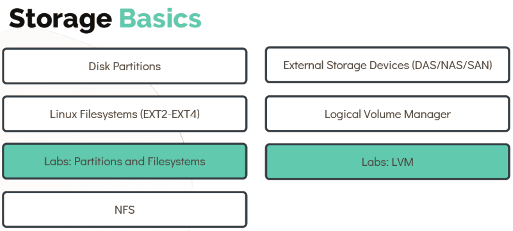
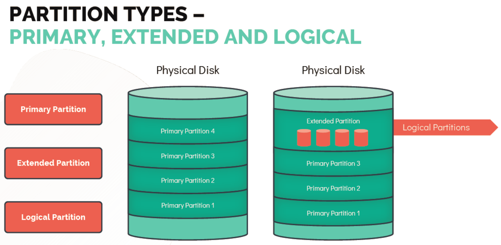

# Disks & Partitions
# 磁盘与分区

> In this section we will learn about disk partitions, block devices, and how to manage them in Linux using tools like `lsblk`, `fdisk`, and `gdisk`.
>
> 本节将学习磁盘分区、块设备的基本概念，以及如何在 Linux 中使用 `lsblk`、`fdisk` 和 `gdisk` 等工具进行管理。

- Take me to the [Tutorial](https://kodekloud.com/topic/disk-partitions/)

---

## Overview
## 概述

In this lecture we will learn about Disk Partitions. We will look at File Systems such as the EXT series and NFS, External Storage Devices such as DAS, NAS, and SAN, and finally LVM in action.

本节课我们将学习磁盘分区的相关知识，涵盖 EXT 系列和 NFS 等文件系统、DAS/NAS/SAN 等外部存储设备，以及 LVM 的实际应用。



---

## Block Devices
## 块设备

Block devices are special files that represent a hardware storage device — anything from a hard drive and SSD to a USB drive or SD card. Unlike character devices (which transfer data byte by byte), block devices transfer data in fixed-size chunks called **blocks**, making them suitable for random-access file systems.

块设备是代表硬件存储设备的特殊文件，涵盖机械硬盘、固态硬盘、USB 闪存和 SD 卡等。与按字节传输数据的字符设备不同，块设备以固定大小的**数据块**为单位传输数据，因此适合用于支持随机访问的文件系统。

Each block device is identified by two numbers:

每个块设备都通过两个数字来标识：

- **Major Number** — Identifies the **type** of device. For example, `8` represents a SCSI/SATA disk (names starting with `sd`).
- **主设备号** — 标识设备的**类型**。例如，`8` 代表 SCSI/SATA 磁盘（设备名以 `sd` 开头）。

- **Minor Number** — Distinguishes individual physical or logical devices of the same type. For instance, `sda` is `8:0`, `sda1` is `8:1`, `sdb` is `8:16`, and so on.
- **次设备号** — 区分同一类型下不同的物理或逻辑设备。例如，`sda` 对应 `8:0`，`sda1` 对应 `8:1`，`sdb` 对应 `8:16`，依此类推。

### List All Block Devices
### 列出所有块设备

Use `lsblk` to display a tree view of all block devices and their mount points:

使用 `lsblk` 命令以树状视图显示所有块设备及其挂载点：

```bash
[~]$ lsblk
NAME   MAJ:MIN RM  SIZE RO TYPE MOUNTPOINT
sda      8:0    0   20G  0 disk
├─sda1   8:1    0   18G  0 part /
└─sda2   8:2    0    2G  0 part [SWAP]
sdb      8:16   0   20G  0 disk
```

Use `ls -l /dev/ | grep "^b"` to list block devices with their major/minor numbers:

使用 `ls -l /dev/ | grep "^b"` 列出块设备及其主次设备号：

```bash
[~]$ ls -l /dev/ | grep "^b"
brw-rw----. 1 root disk 8, 0 Mar 10 08:00 sda
brw-rw----. 1 root disk 8, 1 Mar 10 08:00 sda1
brw-rw----. 1 root disk 8, 2 Mar 10 08:00 sda2
brw-rw----. 1 root disk 8,16 Mar 10 08:00 sdb
```

To print, create and delete the partition table, use the `fdisk` command:

使用 `fdisk` 命令查看、创建和删除分区表：

```bash
[~]$ sudo fdisk -l /dev/sda
Disk /dev/sda: 20 GiB, 21474836480 bytes, 41943040 sectors
Units: sectors of 1 * 512 = 512 bytes
Sector size (logical/physical): 512 bytes / 512 bytes
I/O size (minimum/optimal): 512 bytes / 512 bytes
Disklabel type: gpt
Disk identifier: A1B2C3D4-E5F6-7890-ABCD-EF1234567890

Device     Start      End  Sectors Size Type
/dev/sda1   2048 37750783 37748736  18G Linux filesystem
/dev/sda2 37750784 41940991  4190208   2G Linux swap
```

---

## Partition Types
## 分区类型



Understanding partition types is essential for disk management. There are three classic types under the MBR (Master Boot Record) scheme:

理解分区类型对磁盘管理至关重要。在 MBR（主引导记录）方案下，有三种经典分区类型：

| Type | Description | 类型 | 说明 |
|------|-------------|------|------|
| **PRIMARY** | Used to boot an operating system. A disk can have at most 4 primary partitions under MBR. | **主分区** | 用于引导操作系统。在 MBR 方案下，一块磁盘最多可以有 4 个主分区。 |
| **EXTENDED** | A special primary partition that acts as a container for logical partitions. Cannot be directly formatted or used on its own. | **扩展分区** | 一种特殊的主分区，用作逻辑分区的容器，不能直接格式化或单独使用。 |
| **LOGICAL** | Created within an extended partition. Allows bypassing the 4-partition MBR limit. | **逻辑分区** | 在扩展分区内创建，可突破 MBR 最多 4 个分区的限制。 |

> **Note:** The modern **GPT (GUID Partition Table)** standard supports up to 128 primary partitions per disk and is required for disks larger than 2 TB. GPT is the recommended standard for all new systems.
>
> **注意：** 现代 **GPT（GUID 分区表）** 标准每块磁盘最多支持 128 个主分区，并且是 2 TB 以上磁盘的必要选择。GPT 是所有新系统的推荐标准。

---

## Creating Partitions with gdisk
## 使用 gdisk 创建分区

`gdisk` is an improved version of `fdisk` that works with the **GPT** partition table. It is the preferred tool for modern systems.

`gdisk` 是 `fdisk` 的改进版本，专为 **GPT** 分区表设计，是现代系统的首选工具。

To create a partition on `/dev/sdb`:

在 `/dev/sdb` 上创建分区：

```bash
[~]$ gdisk /dev/sdb
GPT fdisk (gdisk) version 1.0.1

Partition table scan:
  MBR: protective
  BSD: not present
  APM: not present
  GPT: present
Found valid GPT with protective MBR; using GPT.

Command (? for help): ?
b  back up GPT data to a file
c  change a partition's name
d  delete a partition
i  show detailed information on a partition
l  list known partition types
n  add a new partition
o  create a new empty GUID partition table (GPT)
p  print the partition table
q  quit without saving changes
r  recovery and transformation options (experts only)
s  sort partitions
t  change a partition's type code
v  verify disk
w  write table to disk and exit
x  extra functionality (experts only)
?  print this menu

Command (? for help): n
Partition number (1-128, default 1): 1
First sector (34-41943006, default = 2048) or {+-}size{KMGTP}: 2048
Last sector (2048-41943006, default = 41943006) or {+-}size{KMGTP}: 41943006
Current type is 'Linux filesystem'
Hex code or GUID (L to show codes, Enter = 8300):
Changed type of partition to 'Linux filesystem'

Command (? for help): w
Final checks complete. About to write GPT data. THIS WILL OVERWRITE EXISTING
PARTITIONS!!
Do you want to proceed? (Y/N): Y
OK; writing new GUID partition table (GPT) to /dev/sdb.
The operation has completed successfully.
```

> **Key gdisk commands / 常用 gdisk 命令：**
> - `n` — Add a new partition / 新建分区
> - `d` — Delete a partition / 删除分区
> - `p` — Print the partition table / 打印分区表
> - `w` — Write changes and exit / 写入更改并退出
> - `q` — Quit without saving / 退出但不保存

Verify the new partition with `fdisk`:

使用 `fdisk` 验证新分区：

```bash
[~]$ sudo fdisk -l /dev/sdb
Disk /dev/sdb: 20 GiB, 21474836480 bytes, 41943040 sectors
Units: sectors of 1 * 512 = 512 bytes
Sector size (logical/physical): 512 bytes / 512 bytes
I/O size (minimum/optimal): 512 bytes / 512 bytes
Disklabel type: gpt
Disk identifier: 7CABF26E-9723-4406-AEA1-C2B9B6270A23

Device     Start      End  Sectors Size Type
/dev/sdb1   2048 41943006 41940959  20G Linux filesystem
```

---

## Quick Reference
## 快速参考

| Command | Purpose | 命令 | 用途 |
|---------|---------|------|------|
| `lsblk` | List block devices in tree view | `lsblk` | 以树状视图列出块设备 |
| `sudo fdisk -l /dev/sdX` | View partition table | `sudo fdisk -l /dev/sdX` | 查看分区表 |
| `gdisk /dev/sdX` | Interactive GPT partition editor | `gdisk /dev/sdX` | 交互式 GPT 分区编辑器 |
| `ls -l /dev/ \| grep "^b"` | List block device files | `ls -l /dev/ \| grep "^b"` | 列出块设备文件 |
| `blkid` | Show UUIDs of all partitions | `blkid` | 显示所有分区的 UUID |

---

# Hands-On Labs
# 动手实验

- [Troubleshoot](https://kodekloud.com/courses/873064/lectures/17074602) why **Bob's** system is not displaying the entire size of the physical disk.
- 动手排查：为什么 **Bob** 的系统没有显示物理磁盘的完整容量。
