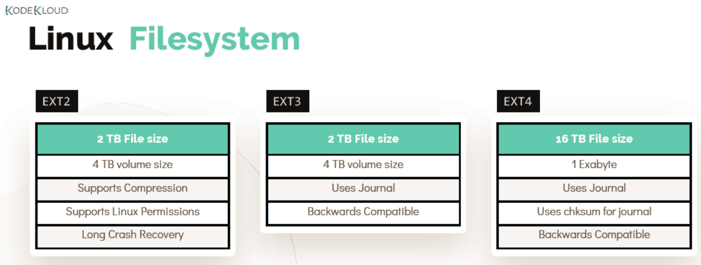
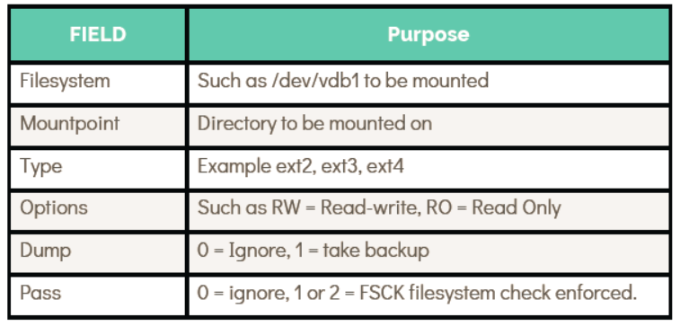

# File Systems in Linux
# Linux 文件系统

> In this section, we cover the most commonly used Linux file systems from EXT2 to EXT4, including how to create, mount, and persist file systems across reboots.
>
> 本节介绍 Linux 中最常用的文件系统，从 EXT2 到 EXT4，包括如何创建、挂载文件系统，以及如何在系统重启后保持挂载状态。

- Take me to the [Tutorial](https://kodekloud.com/topic/file-systems-in-linux/)

---

## What Is a File System?
## 什么是文件系统？

A **file system** defines how data is stored and organized on a storage device. Without a file system, a raw disk partition is just a sequence of bytes with no structure — the operating system wouldn't know where one file ends and another begins.

**文件系统**定义了数据在存储设备上的存储和组织方式。没有文件系统，原始磁盘分区只是一串毫无结构的字节序列——操作系统无法判断一个文件在哪里结束、另一个文件从哪里开始。

Linux supports dozens of file systems. The most widely used for local storage is the **EXT (Extended File System)** family:

Linux 支持数十种文件系统。本地存储中最广泛使用的是 **EXT（扩展文件系统）**系列：



| File System | Year | Key Feature | 文件系统 | 年份 | 主要特性 |
|-------------|------|-------------|----------|------|----------|
| **EXT2** | 1993 | No journaling; simple and fast | **EXT2** | 1993 | 无日志功能；简单快速 |
| **EXT3** | 2001 | Added journaling for crash recovery | **EXT3** | 2001 | 增加了日志功能，支持崩溃恢复 |
| **EXT4** | 2008 | Larger volumes, extents, faster fsck | **EXT4** | 2008 | 支持更大分区、extent 特性、更快的磁盘检查 |

> **Journaling** records file system changes to a journal before committing them to disk. This dramatically reduces corruption risk after an unclean shutdown (e.g., a power failure).
>
> **日志功能**在将更改正式写入磁盘之前，先将其记录到日志中。这大大降低了系统意外关机（如断电）后文件系统损坏的风险。

---

## Working with EXT4
## 使用 EXT4 文件系统

### Step 1 — Create the File System
### 第一步——创建文件系统

Use `mkfs.ext4` to format a partition with the EXT4 file system. **This operation destroys all existing data on the partition.**

使用 `mkfs.ext4` 命令将分区格式化为 EXT4 文件系统。**此操作会销毁分区上所有现有数据。**

```bash
[~]$ sudo mkfs.ext4 /dev/sdb1
mke2fs 1.45.5 (07-Jan-2020)
Creating filesystem with 5242880 4k blocks and 1310720 inodes
Filesystem UUID: a1b2c3d4-e5f6-7890-abcd-ef1234567890
Superblock backups stored on blocks:
        32768, 98304, 163840, 229376, 294912

Allocating group tables: done
Writing inode tables: done
Creating journal (32768 blocks): done
Writing superblocks and filesystem accounting information: done
```

### Step 2 — Create a Mount Point and Mount the File System
### 第二步——创建挂载点并挂载文件系统

A **mount point** is simply an empty directory in the existing file system tree where the new file system will be attached.

**挂载点**就是现有文件系统目录树中的一个空目录，新文件系统将被附加到这里。

```bash
# 创建挂载点目录 / Create the mount point directory
[~]$ sudo mkdir /mnt/ext4

# 挂载文件系统 / Mount the file system
[~]$ sudo mount /dev/sdb1 /mnt/ext4
```

### Step 3 — Verify the Mount
### 第三步——验证挂载

Use either `mount` or `df` to confirm the file system is correctly mounted:

使用 `mount` 或 `df` 命令确认文件系统已正确挂载：

```bash
# 方法一：使用 mount 过滤 / Method 1: filter with mount
[~]$ mount | grep /dev/sdb1
/dev/sdb1 on /mnt/ext4 type ext4 (rw,relatime)

# 方法二：使用 df 查看磁盘使用情况 / Method 2: use df for disk usage
[~]$ df -hP | grep /dev/sdb1
/dev/sdb1       20G   45M   19G   1% /mnt/ext4
```

> **Note:** Mounts created with the `mount` command are **temporary** — they will not survive a system reboot. To make them persistent, you must add an entry to `/etc/fstab`.
>
> **注意：** 使用 `mount` 命令创建的挂载是**临时的**——系统重启后将会失效。要使挂载持久化，必须在 `/etc/fstab` 中添加相应条目。

---

## Persistent Mounts with /etc/fstab
## 使用 /etc/fstab 实现持久挂载

The `/etc/fstab` file defines all file systems that should be automatically mounted at boot time. Each line represents one file system.

`/etc/fstab` 文件定义了系统启动时应自动挂载的所有文件系统，每一行代表一个文件系统。

```bash
# /etc/fstab: static file system information.
#
# Use 'blkid' to print the universally unique identifier for a
# device; this may be used with UUID= as a more robust way to name devices
# that works even if disks are added and removed. See fstab(5).
#
# <file system>  <mount point>  <type>  <options>          <dump>  <pass>
/dev/sda1        /              ext4    defaults,relatime,errors=panic  0  1
UUID=a1b2c3d4-e5f6-7890-abcd-ef1234567890  /mnt/ext4  ext4  rw,defaults  0  2
```

Add the entry for the new partition:

为新分区添加条目：

```bash
[~]$ echo "/dev/sdb1 /mnt/ext4 ext4 rw 0 0" | sudo tee -a /etc/fstab
```

### fstab Field Explanations
### fstab 字段说明



| Field | Description | 字段 | 说明 |
|-------|-------------|------|------|
| `<file system>` | Device path or UUID | `<文件系统>` | 设备路径或 UUID |
| `<mount point>` | Where to mount it | `<挂载点>` | 挂载到哪个目录 |
| `<type>` | File system type (e.g., `ext4`, `xfs`, `nfs`) | `<类型>` | 文件系统类型（如 `ext4`、`xfs`、`nfs`）|
| `<options>` | Mount options (e.g., `rw`, `ro`, `defaults`) | `<选项>` | 挂载选项（如 `rw`、`ro`、`defaults`）|
| `<dump>` | Backup utility flag; `0` = disabled | `<dump>` | 备份标志；`0` 表示禁用 |
| `<pass>` | `fsck` order at boot; `1` = root, `2` = others, `0` = skip | `<pass>` | 启动时 `fsck` 检查顺序；`1` 为根分区，`2` 为其他，`0` 跳过 |

> **Best Practice:** Use UUIDs instead of device names in `/etc/fstab`. Device names like `/dev/sdb1` can change when hardware is added or removed, but UUIDs remain stable. Find a partition's UUID with `blkid /dev/sdb1`.
>
> **最佳实践：** 在 `/etc/fstab` 中使用 UUID 而非设备名称。`/dev/sdb1` 这样的设备名在添加或移除硬件时可能会改变，而 UUID 则保持稳定。使用 `blkid /dev/sdb1` 可查询分区的 UUID。

---

## Quick Reference
## 快速参考

| Command | Purpose | 命令 | 用途 |
|---------|---------|------|------|
| `mkfs.ext4 /dev/sdXN` | Format partition as EXT4 | `mkfs.ext4 /dev/sdXN` | 将分区格式化为 EXT4 |
| `mkdir /mnt/point` | Create a mount point | `mkdir /mnt/point` | 创建挂载点 |
| `mount /dev/sdXN /mnt/point` | Mount a file system | `mount /dev/sdXN /mnt/point` | 挂载文件系统 |
| `umount /mnt/point` | Unmount a file system | `umount /mnt/point` | 卸载文件系统 |
| `df -hP` | Show mounted file system usage | `df -hP` | 显示已挂载文件系统的使用情况 |
| `blkid` | Show UUIDs of partitions | `blkid` | 显示分区 UUID |
| `mount -a` | Mount all entries in /etc/fstab | `mount -a` | 挂载 /etc/fstab 中的所有条目 |

---

# Hands-On Labs
# 动手实验

- [Play around with File Systems](https://kodekloud.com/courses/873064/lectures/17074604) — practice creating, mounting, and configuring persistent mounts.
- [动手实验：文件系统](https://kodekloud.com/courses/873064/lectures/17074604) — 练习创建、挂载和配置持久化挂载。
