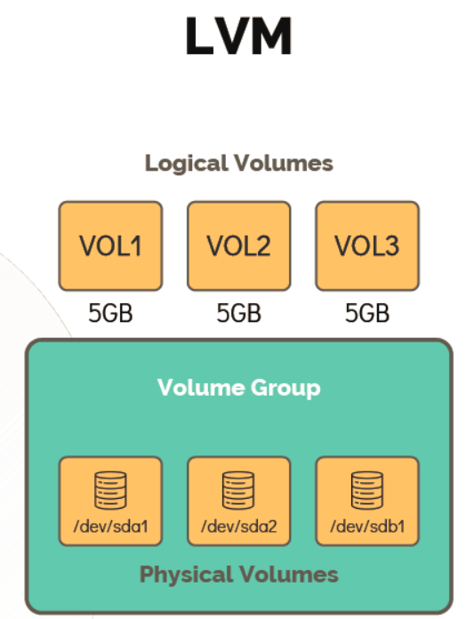
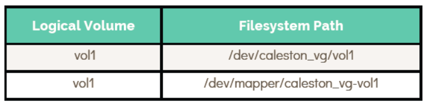

# Logical Volume Manager (LVM)
# 逻辑卷管理器（LVM）

> LVM provides a flexible abstraction layer between physical storage and the file systems that use it, enabling dynamic resizing, snapshots, and pooling of disks without downtime.
>
> LVM 在物理存储与使用它的文件系统之间提供了一个灵活的抽象层，支持在不停机的情况下动态调整大小、创建快照以及磁盘池化。

- Take me to the [Tutorial](https://kodekloud.com/topic/lvm/)

---

## What Is LVM?
## 什么是 LVM？

**LVM (Logical Volume Manager)** allows you to group multiple physical disks or partitions into a single **Volume Group (VG)**, then carve that pool of space into **Logical Volumes (LVs)** of any size — regardless of the underlying physical disk boundaries.

**LVM（逻辑卷管理器）**允许你将多块物理磁盘或分区合并为一个**卷组（VG）**，然后从这个存储池中划分出任意大小的**逻辑卷（LV）**——不受底层物理磁盘边界的限制。



### The Three Layers of LVM
### LVM 的三层架构

```
Physical Volumes (PV)  →  Volume Group (VG)  →  Logical Volumes (LV)
物理卷 (PV)            →  卷组 (VG)          →  逻辑卷 (LV)

[/dev/sdb] [/dev/sdc]  →  [caleston_vg 40G]  →  [vol1 10G] [vol2 15G]
```

| Layer | Description | 层次 | 说明 |
|-------|-------------|------|------|
| **Physical Volume (PV)** | A raw disk or partition registered with LVM | **物理卷 (PV)** | 向 LVM 注册的原始磁盘或分区 |
| **Volume Group (VG)** | A pool of storage assembled from one or more PVs | **卷组 (VG)** | 由一个或多个 PV 组成的存储池 |
| **Logical Volume (LV)** | A virtual partition carved from a VG, used like a regular disk partition | **逻辑卷 (LV)** | 从 VG 中划分出的虚拟分区，使用方式与普通磁盘分区相同 |

**Key advantages of LVM / LVM 的主要优势：**
- Resize volumes online without unmounting them. / 在不卸载的情况下在线调整卷的大小。
- Combine multiple physical disks into one logical pool. / 将多块物理磁盘合并为一个逻辑存储池。
- Take point-in-time snapshots of volumes. / 对卷进行时间点快照。
- Move data between physical volumes non-disruptively. / 无中断地在物理卷之间迁移数据。

---

## Working with LVM
## LVM 操作实践

### Step 0 — Install LVM Tools
### 第零步——安装 LVM 工具

```bash
# Debian/Ubuntu 系统 / For Debian/Ubuntu
[~]$ sudo apt-get install lvm2

# RHEL/CentOS/Fedora 系统 / For RHEL/CentOS/Fedora
[~]$ sudo yum install lvm2
```

### Step 1 — Create Physical Volumes (PV)
### 第一步——创建物理卷（PV）

Use `pvcreate` to register a disk or partition as an LVM Physical Volume:

使用 `pvcreate` 命令将磁盘或分区注册为 LVM 物理卷：

```bash
[~]$ sudo pvcreate /dev/sdb
  Physical volume "/dev/sdb" successfully created.

# 也可以同时创建多个 PV / You can create multiple PVs at once
[~]$ sudo pvcreate /dev/sdb /dev/sdc
  Physical volume "/dev/sdb" successfully created.
  Physical volume "/dev/sdc" successfully created.
```

### Step 2 — Create a Volume Group (VG)
### 第二步——创建卷组（VG）

Use `vgcreate` to assemble one or more PVs into a Volume Group:

使用 `vgcreate` 命令将一个或多个 PV 组合成卷组：

```bash
[~]$ sudo vgcreate caleston_vg /dev/sdb
  Volume group "caleston_vg" successfully created.

# 添加多块磁盘以扩大存储池 / Add multiple disks to create a larger pool
[~]$ sudo vgcreate caleston_vg /dev/sdb /dev/sdc
  Volume group "caleston_vg" successfully created.
```

### Step 3 — Inspect PVs and VGs
### 第三步——查看 PV 和 VG 信息

```bash
# 查看所有物理卷详情 / Show detailed info about all Physical Volumes
[~]$ sudo pvdisplay
  --- Physical volume ---
  PV Name               /dev/sdb
  VG Name               caleston_vg
  PV Size               20.00 GiB / not usable 3.00 MiB
  Allocatable           yes
  PE Size               4.00 MiB
  Total PE              5119
  Free PE               5119
  Allocated PE          0
  PV UUID               iDCXIN-En2h-5ilJ-Yjqv-GcsR-gDfV-zaf66E

# 查看所有卷组详情 / Show detailed info about all Volume Groups
[~]$ sudo vgdisplay
  --- Volume group ---
  VG Name               caleston_vg
  System ID
  Format                lvm2
  Metadata Areas        1
  VG Access             read/write
  VG Status             resizable
  Cur LV                0
  Cur PV                1
  Act PV                1
  VG Size               20.00 GiB
  PE Size               4.00 MiB
  Total PE              5119
  Alloc PE / Size       0 / 0
  Free PE / Size        5119 / 20.00 GiB
  VG UUID               VzmIAn-9cEl-5bAl-Vtmw-HKXi-QaOb-Rxxxxx
```

### Step 4 — Create Logical Volumes (LV)
### 第四步——创建逻辑卷（LV）

Use `lvcreate` to carve out a Logical Volume from the VG:

使用 `lvcreate` 命令从卷组中划分逻辑卷：

```bash
# 创建一个 1 GB 的逻辑卷 / Create a 1 GB logical volume
[~]$ sudo lvcreate -L 1G -n vol1 caleston_vg
  Logical volume "vol1" created.

# 创建占用剩余所有空间的逻辑卷 / Create an LV using all remaining free space
[~]$ sudo lvcreate -l 100%FREE -n vol2 caleston_vg
  Logical volume "vol2" created.
```

View Logical Volumes:

查看逻辑卷：

```bash
[~]$ sudo lvdisplay
  --- Logical volume ---
  LV Path                /dev/caleston_vg/vol1
  LV Name                vol1
  VG Name                caleston_vg
  LV UUID                LueYC3-VWpE-31Ua-Ykwj-IRFJ-AOyL-xxxxxx
  LV Write Access        read/write
  LV Status              available
  LV Size                1.00 GiB
  Current LE             256
  Segments               1
  Allocation             inherit
  Block device           252:0

# 快速列表视图 / Quick list view
[~]$ sudo lvs
  LV   VG           Attr       LSize
  vol1 caleston_vg  -wi-a-----  1.00g
  vol2 caleston_vg  -wi-a-----  19.00g
```

### Step 5 — Format and Mount the Logical Volume
### 第五步——格式化并挂载逻辑卷

Logical volumes are used exactly like regular partitions:

逻辑卷的使用方式与普通分区完全相同：

```bash
# 格式化为 EXT4 / Format as EXT4
[~]$ sudo mkfs.ext4 /dev/caleston_vg/vol1

# 创建挂载点并挂载 / Create mount point and mount
[~]$ sudo mkdir /mnt/vol1
[~]$ sudo mount -t ext4 /dev/caleston_vg/vol1 /mnt/vol1

# 验证 / Verify
[~]$ df -hP /mnt/vol1
Filesystem                        Size  Used Avail Use% Mounted on
/dev/mapper/caleston_vg-vol1      976M  1.3M  908M   1% /mnt/vol1
```

---

## Resizing Logical Volumes Online
## 在线调整逻辑卷大小

One of LVM's greatest strengths is the ability to **resize volumes while they are mounted** — no downtime required.

LVM 最强大的特性之一是能够**在卷挂载期间调整其大小**——无需停机。

### Check Available Free Space in VG
### 检查 VG 中的可用空间

```bash
[~]$ sudo vgs
  VG          #PV #LV #SN Attr   VSize   VFree
  caleston_vg   1   1   0 wz--n- 20.00g  19.00g
```

### Extend the Logical Volume
### 扩展逻辑卷

```bash
# 将 vol1 增加 1 GB / Extend vol1 by 1 GB
[~]$ sudo lvresize -L +1G -n /dev/caleston_vg/vol1
  Size of logical volume caleston_vg/vol1 changed from 1.00 GiB to 2.00 GiB.
  Logical volume vol1 successfully resized.
```

### Grow the File System to Fill the New LV Size
### 扩展文件系统以填满新的 LV 大小

After resizing the LV, the **file system** must also be extended — the LV resize only adds raw capacity, it doesn't automatically grow the file system.

调整 LV 大小后，**文件系统**也必须相应扩展——LV 调整只是增加了原始容量，并不会自动扩展文件系统。

```bash
# 当前文件系统大小（扩展 LV 后但扩展 FS 前）
# Current FS size (after LV resize, before FS resize)
[~]$ df -hP /mnt/vol1
Filesystem                        Size  Used Avail Use% Mounted on
/dev/mapper/caleston_vg-vol1      976M  1.3M  908M   1% /mnt/vol1

# 扩展 EXT4 文件系统 / Resize the EXT4 file system
[~]$ sudo resize2fs /dev/caleston_vg/vol1
resize2fs 1.42.13 (17-May-2015)
Filesystem at /dev/mapper/caleston_vg-vol1 is mounted on /mnt/vol1;
on-line resizing required
The filesystem on /dev/mapper/caleston_vg-vol1 is now 524288 (4k) blocks long.

# 验证文件系统现在已使用新的大小 / Verify the FS now uses the new size
[~]$ df -hP /mnt/vol1
Filesystem                        Size  Used Avail Use% Mounted on
/dev/mapper/caleston_vg-vol1      2.0G  1.6M  1.9G   1% /mnt/vol1
```



> **Pro Tip:** You can combine `lvresize` and `resize2fs` into a single step with:
> `sudo lvresize -L +1G --resizefs /dev/caleston_vg/vol1`
>
> **进阶提示：** 可以将 `lvresize` 和 `resize2fs` 合并为一步：
> `sudo lvresize -L +1G --resizefs /dev/caleston_vg/vol1`

---

## Quick Reference
## 快速参考

| Command | Purpose | 命令 | 用途 |
|---------|---------|------|------|
| `pvcreate /dev/sdX` | Create a Physical Volume | `pvcreate /dev/sdX` | 创建物理卷 |
| `vgcreate vg_name /dev/sdX` | Create a Volume Group | `vgcreate vg_name /dev/sdX` | 创建卷组 |
| `lvcreate -L <size> -n <name> <vg>` | Create a Logical Volume | `lvcreate -L <size> -n <name> <vg>` | 创建逻辑卷 |
| `pvdisplay` / `pvs` | List Physical Volumes | `pvdisplay` / `pvs` | 列出物理卷 |
| `vgdisplay` / `vgs` | List Volume Groups | `vgdisplay` / `vgs` | 列出卷组 |
| `lvdisplay` / `lvs` | List Logical Volumes | `lvdisplay` / `lvs` | 列出逻辑卷 |
| `lvresize -L +<size> <lv_path>` | Extend a Logical Volume | `lvresize -L +<size> <lv_path>` | 扩展逻辑卷 |
| `resize2fs <lv_path>` | Resize EXT2/3/4 file system | `resize2fs <lv_path>` | 调整 EXT2/3/4 文件系统大小 |
| `vgextend vg_name /dev/sdY` | Add a PV to a VG | `vgextend vg_name /dev/sdY` | 向卷组中添加物理卷 |

---

# Hands-On Labs
# 动手实验

- [LVM Hands-On Labs](https://kodekloud.com/courses/873064/lectures/17074607) — practice creating PVs, VGs, LVs, and resizing volumes online.
- [LVM 动手实验](https://kodekloud.com/courses/873064/lectures/17074607) — 练习创建 PV、VG、LV 以及在线调整卷的大小。
