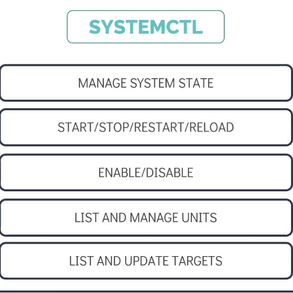
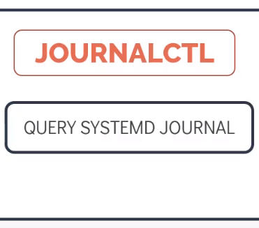

# SYSTEMD Tools to Manage Services

# 使用 SYSTEMD 工具管理服务

- Take me to the [Tutorial](https://kodekloud.com/topic/systemd-tools/)
- 前往 [教程视频](https://kodekloud.com/topic/systemd-tools/)

In this lecture we will explore two major SYSTEMD tools:

本讲将深入探讨两个核心 SYSTEMD 工具：

- **SYSTEMCTL** — for managing services and system state / 用于管理服务和系统状态
- **JOURNALCTL** — for viewing and filtering logs / 用于查看和过滤日志

---

## SYSTEMCTL

`systemctl` is the primary command-line interface for controlling and inspecting the systemd system and service manager. Virtually all service management tasks on a modern Linux system go through `systemctl`.

`systemctl` 是与 systemd 系统和服务管理器交互的主要命令行工具。现代 Linux 系统上几乎所有的服务管理任务都通过 `systemctl` 完成。

It can be used to:

它可以用于：

- **Start / Stop / Restart / Reload** services — 启动 / 停止 / 重启 / 重载服务
- **Enable / Disable** services at boot — 设置服务开机自启动或禁用
- **List and inspect** loaded units — 列出并检查已加载的单元
- **Manage system targets** (runlevels) — 管理系统目标（运行级别）
- **View and edit** unit file configuration — 查看并编辑单元文件配置



---

### Systemctl Commands

### Systemctl 命令详解

#### Starting a Service / 启动服务

Use the `start` command to start a service immediately. This does **not** configure it to start at boot.

使用 `start` 命令立即启动一个服务。这**不会**配置它在开机时自动启动。

```bash
[~]$ systemctl start docker
```

#### Stopping a Service / 停止服务

Use the `stop` command to stop a running service gracefully.

使用 `stop` 命令优雅地停止一个正在运行的服务。

```bash
[~]$ systemctl stop docker
```

#### Restarting a Service / 重启服务

Use the `restart` command to stop and then start a service again. Useful when you need to apply configuration changes that require a full process restart.

使用 `restart` 命令停止并重新启动服务。当需要应用需要完整重启才能生效的配置变更时非常有用。

```bash
[~]$ systemctl restart docker
```

#### Reloading a Service / 重载服务

Use the `reload` command to ask a service to reload its configuration **without interrupting** active connections or ongoing work. Not all services support this.

使用 `reload` 命令让服务重新加载配置，**不中断**现有连接或正在进行的工作。并非所有服务都支持此操作。

```bash
[~]$ systemctl reload docker
```

> **Tip / 提示：** When in doubt about whether to use `restart` or `reload`, use `reload-or-restart` — it will reload if supported, otherwise it restarts.
>
> 不确定使用 `restart` 还是 `reload` 时，可以使用 `reload-or-restart`——如果服务支持，则重载；否则重启。

```bash
[~]$ systemctl reload-or-restart docker
```

#### Enabling a Service at Boot / 设置服务开机自启

Use the `enable` command to configure a service to start automatically at boot. This creates a symlink from the service file into the appropriate `.wants` directory.

使用 `enable` 命令将服务配置为开机自动启动。这会从服务文件到对应的 `.wants` 目录创建一个符号链接。

```bash
[~]$ systemctl enable docker
```

To both enable and start a service in one command:

若要同时启用并立即启动服务，可使用一条命令完成：

```bash
[~]$ systemctl enable --now docker
```

#### Disabling a Service at Boot / 禁用服务开机自启

Use the `disable` command to prevent a service from starting automatically at boot.

使用 `disable` 命令阻止服务在开机时自动启动。

```bash
[~]$ systemctl disable docker
```

#### Checking Service Status / 检查服务状态

Use the `status` command to get a detailed overview of a service's current state, including its enabled/disabled status, recent log output, and process information.

使用 `status` 命令获取服务当前状态的详细概览，包括启用/禁用状态、近期日志输出和进程信息。

```bash
[~]$ systemctl status docker
```

A healthy service shows:

健康运行中的服务输出示例：

```
● docker.service - Docker Application Container Engine
     Loaded: loaded (/lib/systemd/system/docker.service; enabled; vendor preset: enabled)
     Active: active (running) since Mon 2024-01-15 09:23:11 UTC; 2h 14min ago
   Main PID: 1234 (dockerd)
      Tasks: 42 (limit: 4915)
     Memory: 98.2M
     CGroup: /system.slice/docker.service
             └─1234 /usr/bin/dockerd -H fd://
```

---

### Service States

### 服务状态说明

Besides `active (running)`, there are several other states you should be aware of:

除了 `active (running)` 之外，还有几种你应该了解的状态：

| State | Description |
|-------|-------------|
| `active (running)` | Service is running with one or more active processes / 服务正在运行，有一个或多个活跃进程 |
| `active (exited)` | Service ran successfully and exited (e.g., oneshot services) / 服务成功运行后退出（如 oneshot 类型服务） |
| `active (waiting)` | Service is running but waiting for an event / 服务正在运行，但等待某个事件触发 |
| `inactive (dead)` | Service is not running / 服务未运行 |
| `failed` | Service exited with an error or was killed by a signal / 服务因错误退出或被信号杀死 |
| `enabled` | Service is configured to start at boot / 服务已配置为开机自启 |
| `disabled` | Service is not configured to start at boot / 服务未配置开机自启 |
| `masked` | Service is completely disabled and cannot be started manually / 服务被完全屏蔽，无法手动启动 |
| `static` | Service cannot be enabled but may be started by another unit / 服务无法被启用，但可由其他单元启动 |


---

### Reloading Daemon Configuration

### 重新加载守护进程配置

After manually editing a unit file, you must run `daemon-reload` to make systemd re-read all unit files from disk. Without this step, your changes will not take effect.

手动编辑单元文件后，必须运行 `daemon-reload`，让 systemd 从磁盘重新读取所有单元文件。不执行此步骤，更改将不会生效。

```bash
[~]$ systemctl daemon-reload
```

---

### Editing a Service File

### 编辑服务文件

The recommended way to edit a service file is using `systemctl edit`. Using `--full` opens the entire unit file for editing, and changes are applied immediately without needing a separate `daemon-reload`.

编辑服务文件的推荐方式是使用 `systemctl edit`。使用 `--full` 参数可打开完整的单元文件进行编辑，更改立即生效，无需单独运行 `daemon-reload`。

```bash
[~]$ systemctl edit project-mercury.service --full
```

Without `--full`, `systemctl edit` creates a **drop-in override file** at `/etc/systemd/system/<service>.d/override.conf`, which only overrides specific options while preserving the original file.

不带 `--full` 时，`systemctl edit` 会在 `/etc/systemd/system/<service>.d/override.conf` 创建一个**覆盖片段文件**，仅覆盖特定选项，同时保留原始文件不变。

---

### Viewing a Unit File

### 查看单元文件

To quickly view the full content and source path of any unit file:

快速查看任意单元文件的完整内容和源文件路径：

```bash
[~]$ systemctl cat project-mercury.service
```

This prints the file contents with a comment header showing its path — very useful when a unit is composed of multiple drop-in files.

这会打印文件内容，并在开头注释中显示其路径——当一个单元由多个覆盖片段文件组成时非常有用。

---

### Managing System Targets (Runlevels)

### 管理系统目标（运行级别）

SYSTEMD uses **targets** to group units and define system states, replacing the traditional SysV runlevels.

SYSTEMD 使用**目标（targets）**来分组单元并定义系统状态，取代了传统的 SysV 运行级别。

| SysV Runlevel | Systemd Target | Description |
|--------------|----------------|-------------|
| 0 | `poweroff.target` | Shutdown the system / 关机 |
| 1 | `rescue.target` | Single-user rescue mode / 单用户救援模式 |
| 3 | `multi-user.target` | Multi-user, no GUI / 多用户，无图形界面 |
| 5 | `graphical.target` | Multi-user with GUI / 多用户，带图形界面 |
| 6 | `reboot.target` | Reboot the system / 重启系统 |

To check the current default target:

查看当前默认目标：

```bash
[~]$ systemctl get-default
```

To change the default target (e.g., switch to non-graphical multi-user mode):

更改默认目标（例如，切换到无图形界面的多用户模式）：

```bash
[~]$ systemctl set-default multi-user.target
```

To switch to a target immediately (without rebooting):

立即切换到某个目标（无需重启）：

```bash
[~]$ systemctl isolate multi-user.target
```

---

### Listing Units

### 列出单元

To list all units that systemd has loaded (active, inactive, failed):

列出 systemd 已加载的所有单元（包括活跃、非活跃、失败状态）：

```bash
[~]$ systemctl list-units --all
```

To list only active units:

仅列出活跃的单元：

```bash
[~]$ systemctl list-units
```

To filter by unit type (e.g., only services):

按单元类型过滤（例如，仅显示服务）：

```bash
[~]$ systemctl list-units --type=service
```

To list all installed unit files and their enabled/disabled state:

列出所有已安装的单元文件及其启用/禁用状态：

```bash
[~]$ systemctl list-unit-files
```

---

## JOURNALCTL

`journalctl` is the command-line tool for querying and displaying logs collected by **systemd-journald**, the systemd logging daemon. It aggregates logs from the kernel, systemd services, and other sources into a single, structured, indexed journal.

`journalctl` 是查询和显示由 **systemd-journald**（systemd 日志守护进程）收集的日志的命令行工具。它将来自内核、systemd 服务和其他来源的日志汇聚成一个结构化、已索引的统一日志库。

Key advantages over traditional log files:

相比传统日志文件的主要优势：

- **Structured data**: each log entry has metadata (unit name, PID, priority, timestamp) / **结构化数据**：每条日志都有元数据（单元名称、PID、优先级、时间戳）
- **Binary format**: prevents log tampering and enables fast indexed lookups / **二进制格式**：防止日志篡改，支持快速索引查找
- **Automatic rotation**: manages disk space automatically / **自动轮转**：自动管理磁盘空间



---

### Journalctl Commands

### Journalctl 命令详解

#### View All Logs / 查看所有日志

Print all journal entries from oldest to newest:

从最旧到最新打印所有日志条目：

```bash
[~]$ journalctl
```

To show the newest entries first:

以最新条目优先显示：

```bash
[~]$ journalctl -r
```

#### View Logs from Current Boot / 查看当前启动的日志

Print all logs since the current system boot:

打印自当前系统启动以来的所有日志：

```bash
[~]$ journalctl -b
```

To view logs from a previous boot (e.g., the one before the last):

查看之前某次启动的日志（例如上上次启动）：

```bash
[~]$ journalctl -b -1
```

To list all available boots:

列出所有可用的启动记录：

```bash
[~]$ journalctl --list-boots
```

#### View Logs for a Specific Service / 查看特定服务的日志

Filter logs for a specific systemd unit:

过滤特定 systemd 单元的日志：

```bash
[~]$ journalctl -u docker.service
```

#### View Logs Since a Specific Time / 查看特定时间范围的日志

Show logs from a specific timestamp onwards:

显示从指定时间戳开始的日志：

```bash
[~]$ journalctl -u docker.service --since "2022-01-01 13:45:00"
```

Combine `--since` and `--until` to define a time range:

结合 `--since` 和 `--until` 定义时间范围：

```bash
[~]$ journalctl -u docker.service --since "2022-01-01 00:00:00" --until "2022-01-01 23:59:59"
```

You can also use relative time expressions:

也可以使用相对时间表达式：

```bash
# Logs from the last hour / 最近一小时的日志
[~]$ journalctl --since "1 hour ago"

# Logs from yesterday / 昨天的日志
[~]$ journalctl --since yesterday
```

#### Follow Logs in Real Time / 实时跟踪日志

Like `tail -f`, but for the systemd journal:

类似 `tail -f`，但用于 systemd 日志：

```bash
[~]$ journalctl -u project-mercury.service -f
```

#### Filter by Priority / 按优先级过滤

Show only error-level and more critical messages:

仅显示错误级别及更严重的消息：

```bash
[~]$ journalctl -p err
```

Priority levels (from most to least severe):

优先级级别（从最严重到最轻微）：

| Level | Name | Description |
|-------|------|-------------|
| 0 | `emerg` | System is unusable / 系统不可用 |
| 1 | `alert` | Immediate action required / 需要立即处理 |
| 2 | `crit` | Critical conditions / 严重状况 |
| 3 | `err` | Error conditions / 错误状况 |
| 4 | `warning` | Warning conditions / 警告状况 |
| 5 | `notice` | Normal but significant / 正常但值得注意 |
| 6 | `info` | Informational messages / 信息性消息 |
| 7 | `debug` | Debug-level messages / 调试级别消息 |

#### View Logs Without Paging / 不分页显示日志

By default, `journalctl` uses a pager. To pipe output to another command:

默认情况下，`journalctl` 使用分页器显示。若要将输出传送到另一个命令：

```bash
[~]$ journalctl --no-pager -u docker.service
```

#### Disk Usage of Journal / 查看日志占用磁盘空间

```bash
[~]$ journalctl --disk-usage
```

---

## Troubleshooting Services: A Practical Workflow

## 服务故障排查：实用工作流

When a service fails, follow this systematic approach:

当服务出现故障时，遵循以下系统化排查步骤：

```bash
# Step 1: Check the service status for quick overview
# 步骤1：检查服务状态以获取快速概览
[~]$ systemctl status project-mercury.service

# Step 2: View recent logs for the service
# 步骤2：查看该服务的近期日志
[~]$ journalctl -u project-mercury.service -n 50

# Step 3: Follow live logs while attempting to start the service
# 步骤3：在尝试启动服务的同时实时跟踪日志
[~]$ journalctl -u project-mercury.service -f &
[~]$ systemctl start project-mercury.service

# Step 4: Check system-level errors around the failure time
# 步骤4：检查故障时间附近的系统级错误
[~]$ journalctl -p err --since "10 minutes ago"
```

---

## HANDS-ON LABS

## 动手实验

Now let's troubleshoot and help **Bob** apply what we've learned!

现在让我们实际操练，帮助 **Bob** 解决遇到的问题！

- [Let's Help Bob](https://kodekloud.com/courses/the-linux-basics-course/lectures/17074647)
